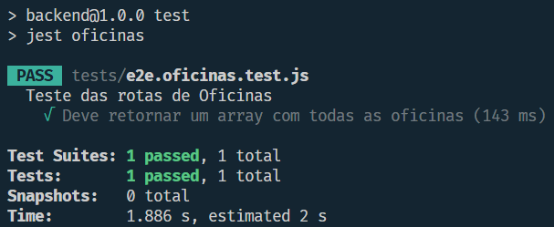

<table>
<tr>
<Table>
  <tr>
    <td><a href= "https://gerandofalcoes.com//"></td>
    <td>
      <a href= "https://www.inteli.edu.br/"></a>
    </td>
  </tr>
</table>

# ASAS - Aplicação de Software Ágil e Simples

## Grupo ASAS

## :student: Integrantes:

- <a href="https://www.linkedin.com/in/davi-ferreira-arantes/">Davi Arantes</a>
- <a href="https://www.linkedin.com/in/kaiane-souza/">Kaiane Souza</a>
- <a href="https://www.linkedin.com/in/kaleb-carvalho/">Kaleb Isaias</a>
- <a href="https://www.linkedin.com/in/leandro-dos-santos-gomes/">Leando dos Santos Gomes</a>
- <a href="https://www.linkedin.com/in/victor-gabriel-marques/">Victor Gabriel Marques</a>

## Sumário

- [1. Termos e Abreviações](#1-termos-e-abreviações)
- [2. Visão Geral do Projeto](#2-visão-geral-do-projeto)
  - [2.1 Entendimento da Demanda](#21-entendimento-da-demanda)
    - [2.1.1 Partes Interessadas](#211-partes-interessadas)
    - [2.1.2 Análise da Indústria](#212-análise-da-indústria)
  - [2.2 Problema](#22-problema)
    - [2.2.1 Análise do Problema](#221-análise-do-problema)
    - [2.2.2 Análise do Cenário (Matriz SWOT)](#222-análise-do-cenário-matriz-swot)
- [3. Proposta da Solução](#3-proposta-da-solução)
  - [3.1 Descritivo Geral da Solução](#31-descritivo-geral-da-solução)
  - [3.2 Proposta Tecnológica e Benefícios](#32-proposta-tecnológica-e-benefícios)
    - [3.2.1 Tipo de arquitetura de nuvem escolhida](#321-tipo-de-arquitetura-de-nuvem-escolhida)
    - [3.2.2 Arquitetura de nuvem escolhida](#322-arquitetura-de-nuvem-escolhida)
    - [3.2.3 Benefícios trazidos pela arquitetura de nuvem proposta](#323-benefícios-trazidos-pela-arquitetura-de-nuvem-proposta)
  - [3.3 Proposta de Valor (Value Proposition Canvas)](#33-proposta-de-valor-value-proposition-canvas)
  - [3.4 Matriz de Risco](#34-matriz-de-risco)
- [4. Análise de experiência do usuário](#4-análise-de-experiência-do-usuário)
  - [4.1 Perfis de Usuários](#41-perfis-de-usuários)
  - [4.2 Personas](#42-personas)
  - [4.3 Mapa de jornada do usuário](#43-mapa-de-jornada-do-usuário)
- [5. Requisitos](#5-requisitos)
  - [5.1 Requisitos Funcionais](#51-requisitos-funcionais-requisitos-funcionai)
  - [5.2 Requisitos não Funcionais](#52-requisitos-não-funcionais)
  - [5.3 Casos de Uso](#53-casos-de-uso)
- [6. Projeto de Solução](#6-projeto-de-solução)
  - [6.1 Diagrama de Classes](#61-diagrama-de-classes)
    - [6.1.1 Diagrama de Classes de Domínio](#611-diagrama-de-classes-de-domínio)
    - [6.1.2 Diagrama de Classes de Implementação](#612-diagrama-de-classes-de-implementação)
  - [6.2 Diagrama de Componentes da Arquitetura](#62-diagrama-de-componentes-da-arquitetura)
  - [6.3 Diagrama de Implantação](#63-diagrama-de-implantação)
  - [6.4 Tecnologias e Ferramentas](#64-tecnologias-e-ferramentas)
- [7. Interface](#7-interface)
  - [7.1 Design System](#71-design-system)
  - [7.2 Projeto de Interface (Wireframes)](#72-projeto-de-interface-wireframes)
  - [7.3 Frontend](#73-frontend)
- [8. Projeto de Banco de Dados](#8-projeto-de-banco-de-dados)
  - [Modelo Conceitual](#81-modelo-conceitual)
  - [Modelo Lógico](#82-modelo-lógico)
- [9. Testes de Software](#9-testes-de-software)
  - [9.1 Demonstração da integração](#91-testes-iniciais)
  - [9.2 Teste de Integração](#92-teste-de-integração)
  - [9.3 Testes automatizados](#93-testes-automatizados)
  - [9.4 Testes de Usabilidade](#94-testes-de-usabilidade)
  - [9.5 Simulação de Carga](#95-simulação-de-carga)
- [10. Procedimento de Implantação da Solução](#10-procedimento-de-implantação-da-solução)
  - [10.1 Procedimento de Implantação do Sistema](#101-procedimento-de-implantação-do-sistema)
  - [10.2 Procedimento de Implantação do Banco de Dados](#102-procedimento-de-implantação-do-banco-de-dados)
  - [10.3 Documentação Automática do Sistema (Swagger)](#103-documentação-automática-do-sistema-swagger)
- [Referências](#referências)
- [Apêndice](#apêndice)

# 1. Termos e Abreviações

&emsp;&emsp;A tabela a seguir apresenta os termos e abreviações utilizados neste documento.

| Termo/Abreviação  | Descrição                                                                                                                                                                                                                                    |
| ----------------- | -------------------------------------------------------------------------------------------------------------------------------------------------------------------------------------------------------------------------------------------- |
| **ONG**           | Organização Não Governamental                                                                                                                                                                                                                |
| **GF**            | Gerando Falcões                                                                                                                                                                                                                              |
| **ESG**           | Sigla para _Environmental_, _Social and Governance_, que se refere a critérios ambientais, sociais e de governança que são utilizados para avaliar o impacto social e ambiental de uma empresa ou organização.                               |
| **SWOT**          | Sigla para _Strengths_, _Weaknesses_, _Opportunities_ e _Threats_, que se refere a uma ferramenta de planejamento estratégico utilizada para avaliar as forças, fraquezas, oportunidades e ameaças envolvidas no negócio de uma organização. |
| **B2B**           | Sigla para \*Business-to-Business, a qual se refere a transações comerciais entre empresas, como a Gerando Falcões e suas ONGs parceiras.                                                                                                    |
| **B2C**           | Sigla para _Business-to-Consumer_, a qual se refere a transações comerciais entre empresas e consumidores, como a Gerando Falcões e os beneficiados de suas ações sociais.                                                                   |
| **KPI**           | Sigla para _Key Performance Indicator_, que se refere a indicadores-chave de desempenho, que são métricas utilizadas para avaliar o desempenho de uma organização em relação a seus objetivos.                                               |
| **MVP**           | Sigla para _Minimum Viable Product_, que se refere a um produto mínimo viável, que é uma versão simplificada de um produto que é lançada no mercado para testar sua aceitação e coletar feedback dos usuários.                               |
| **UX**            | Sigla para _User Experience_, que se refere à experiência do usuário, que é a percepção e a resposta de uma pessoa ao uso de um produto, sistema ou serviço.                                                                                 |
| **UI**            | Sigla para _User Interface_, que se refere à interface do usuário, que é o meio pelo qual o usuário interage com um produto, sistema ou serviço.                                                                                             |
| **API**           | Sigla para _Application Programming Interface_, que se refere a um conjunto de regras e protocolos que permite que diferentes softwares se comuniquem entre si.                                                                              |
| **CRUD**          | Sigla para _Create, Read, Update and Delete_, que se refere às quatro operações básicas de um sistema de gerenciamento de banco de dados.                                                                                                    |
| **Aplicação Web** | Sistemas de informática projetados para utilização através de um navegador, através da internet ou aplicativos desenvolvidos.                                                                                                                |
| **ISO**           | Sigla para _International Organization for Standardization_, que é uma organização internacional que desenvolve e publica normas técnicas para garantir a qualidade, segurança e eficiência de produtos e serviços.                          |

# 2. Visão Geral do Projeto

&emsp;&emsp;Este documento descreve o desenvolvimento da aplicação Web [^Aplicação-Web] de acordo com as demandas definidas no escopo do projeto. Com o objetivo de fornecer uma solução inovadora e acessível que aborde a lacuna na gestão de atendimentos das ONGs nos territórios atendidos pela rede Gerando Falcões. Dessa maneira, pretende-se capacitar os líderes das comunidades a gerenciarem de forma eficaz suas atividades, proporcionando-lhes uma plataforma intuitiva e de fácil utilização, mesmo para aqueles com baixo letramento digital. Assim, ao oferecer ferramentas para a gestão de atendimentos e visualização de dados relevantes, o projeto visa não apenas mitigar as dores enfrentadas pela falta de controle e visibilidade, mas também impulsionar o desenvolvimento das ONGs participantes, fornecendo-lhes os recursos necessários para avaliar, aprimorar e comunicar seu impacto social de forma mais eficiente.

&emsp;&emsp;Além disso, a solução busca fortalecer a colaboração e a transparência dentro da rede Gerando Falcões, facilitando o monitoramento do progresso e o desenvolvimento de melhores práticas entre as ONGs participantes. Nesse cenário, ao promover a autonomia dos beneficiados das ONGs e a capacidade de autoavaliação, o projeto visa criar um ecossistema mais resiliente e capacitado para enfrentar os desafios sociais das comunidades atendidas. Com uma visão centrada na melhoria contínua e no empoderamento dos agentes de mudança locais, a solução visa não apenas resolver problemas imediatos de gestão, mas também catalisar um impacto transformador e sustentável nas comunidades marginalizadas em todo o país.

## 2.1 Entendimento da Demanda

&emsp;&emsp;O entendimento da demanda é solidificado pela identificação das necessidades tanto dos líderes de comunidades assistidos pela Gerando Falcões quanto da própria organização. Dentro desses requerimentos, ao reconhecer a ausência de soluções adequadas para a gestão de atendimentos e avaliação de impacto, o projeto busca preencher uma lacuna crítica que compromete a gestão e metrificação das atividades sociais desenvolvidas. Nesse cenário, ao listar as dores enfrentadas pelos líderes e pela Gerando Falcões, a solução desenvolvida atente à demanda do desenvolvimento de uma solução adaptada às suas realidades, priorizando a simplicidade de uso e a relevância dos dados apresentados, bem como sanar a falha de controle e transparência.

### 2.1.1 Partes Interessadas

&emsp;&emsp;Dentre as partes interessadas no projeto, se encontram:

- **Inteli - Instituto de Tecnologia e Liderança**: O instituto se relaciona ao desenvolvimento do projeto como um dos _stakeholders_ através do desenvolvimento de competências dos alunos, parceria acadêmicas com a Gerando Falcões e fortalecimento da reputação institucional como uma entidade comprometida com a inovação e responsabilidade social.
- **Grupo ASAS**: Como os desenvolvedores e implementadores da solução, são responsáveis por criar a solução que atenda às necessidades da Gerando Falcões.
- **Gerando Falcões**: Como a organização que solicitou a solução, são um dos beneficiados finais da aplicação.
- **Líderes de Comunidades**: Os líderes de comunidades atendidas pela Gerando Falcões também são um dos usuários finais da solução. Isso acontece porque serão atingidos positivamente pelo gerenciamento e controle de dados que a aplicação proporciona.
- **ONGs parceiras da Gerando Falcões**: As ONGs que fazem parte da rede da Gerando Falcões também são partes interessadas, pois a solução afetará a forma como gerenciam seus atendimentos e interagem tanto com a organização coordenadora como com os líderes locais.
- **Professores de oficinas**: como gerenciadores de oficinas proporcionadas em ações sociais, terão acesso a solução para melhor controle de fluxo de pessoas e organização.
- **Beneficiados das ações sociais**: Os indivíduos e comunidades que são beneficiados pelas ações sociais são partes interessadas tanto diretamente em relação ao uso da solução quanto indiretamente pelo aprimoramento do impacto alcançado.

&emsp;&emsp;Nesse contexto, é interessante apontar que apesar de diferentes, todas as partes interessadas possuem algum nível de interação com o projeto construído. Dessa maneira, a solução aborda cada uma das especificidades, mesmo que construídas a partir de distintas partes interessadas.

### 2.1.2 Análise da Indústria

&emsp;&emsp;A análise do contexto da indústria é uma prática essencial para compreender o ambiente em a solução opera. Isso é consequência do olhar preciso voltado para vários aspectos do setor de mercado do parceiro, incluindo tópicos que serão explorados a seguir como: o contexto geral da indústria, o modelo de negócio predominante, tendências emergentes e os principais players do mercado.

#### 2.1.2.1 Contexto da Indústria

&emsp;&emsp;O setor de desenvolvimento social e tecnológico representa o contexto da indústria do projeto. Esse setor abrange organizações e iniciativas que buscam utilizar a tecnologia para promover o desenvolvimento social e o empoderamento de comunidades marginalizadas. Dessa maneira, os principais produtos disponíveis se encontram entre aplicativos de gestão de ONGs e plataformas de impacto social.

&emsp;&emsp;Nesse cenário, é importante ressaltar que as soluções disponíveis no mercado, muitas vezes são consideradas complexas e podem representar desafios na gestão de organizações e ONGs. Essas soluções frequentemente são consideradas complexas e podem exigir recursos significativos em termos de treinamento e capacitação para serem plenamente utilizadas. Além disso, a integração dessas soluções aos processos existentes das organizações pode representar um desafio adicional, resultando em dificuldades na gestão eficaz das operações e na mensuração do impacto social. Portanto, embora haja uma variedade de produtos disponíveis para apoiar o desenvolvimento social e o trabalho das ONGs, a complexidade dessas soluções pode representar uma barreira significativa para sua adoção e utilização eficaz.

&emsp;&emsp;Um exemplo de produto que se aplica a esse contexto é a plataforma “Bússola Social”:

> Ajudando organizações que transformam a sociedade, oferecemos tecnologia para potencializar o impacto de ações e investimentos sociais.

&emsp;&emsp;Porém, é importante ressaltar novamente a necessidade premente de soluções que sejam acessíveis e intuitivas para as organizações e ONGs. Além disso, deve-se considerar a importância de uma solução que pressuponha um baixo letramento digital partindo do usuário final, bem como oferecer uma interface simples e direta.

&emsp;&emsp;Dessa forma, é possível entender quais as possíveis oportunidades e tendências desse contexto da indústria e modelar os princípios do modelo de negócio em cima de análises concretas.

#### 2.1.2.2 Tendências

&emsp;&emsp;À medida que o setor de desenvolvimento social e tecnológico continua a evoluir, algumas tendências emergentes moldam o cenário atual. Conforme analisado anteriormente, uma dessas tendências é o crescente foco na acessibilidade e usabilidade das soluções tecnológicas. As organizações e ONGs estão cada vez mais exigindo plataformas e aplicativos que sejam intuitivos e fáceis de usar, mesmo para aqueles com pouca experiência tecnológica.

&emsp;&emsp;Além disso, há uma demanda crescente por soluções integradas que possam se adaptar às necessidades variadas em relação ao armazenamento de dados de cada ONG ou organização, o que impacta diretamente transparência requisitada para tal tipo de gerenciamento de dados.

&emsp;&emsp;Nesse sentido, as partes interessadas, incluindo doadores, financiadores e beneficiados, estão cada vez mais exigindo evidências tangíveis do impacto social das iniciativas, impulsionando a necessidade de ferramentas de mensuração de impacto robustas e transparentes. Essas tendências estão moldando o desenvolvimento futuro da indústria, influenciando a maneira como as soluções são projetadas, implementadas e adotadas pelas organizações e comunidades.

#### 2.1.2.3 Modelo de negócio

&emsp;&emsp;Um modelo de negócios é uma descrição abrangente da maneira como uma empresa cria, entrega e captura valor. Ele define os elementos-chave, como os produtos ou serviços oferecidos, o público-alvo, as fontes de receita, os canais de distribuição, as parcerias estratégicas e os recursos necessários para operar. Existem diferentes tipos de modelos de negócios, dois dos quais são B2C (business-to-consumer) e B2B (business-to-business):

&emsp;&emsp;O modelo de negócio da Gerando Falcões é enraizado na ideia de capacitação e transformação social. Assim, a organização se concentra em oferecer oportunidades e recursos para comunidades em situação de vulnerabilidade, apoiando outras ONGs e oferecendo cursos de capacitação voltados para a gestão de negócios. Por isso, a organização segue um modelo que visa maximizar o potencial de transformação das comunidades mais vulneráveis, disponibilizando ferramentas de organização e coordenação de atividades e pessoas.

&emsp;&emsp;O modelo de negócios da ONG Gerando Falcões também se destaca por sua natureza B2B (business-to-business), que atende não apenas indivíduos, mas também outras organizações não governamentais. Ao estabelecer parcerias colaborativas com outras ONGs, a Gerando Falcões amplia seu alcance e impacto, compartilhando melhores práticas, recursos e conhecimentos para promover mudanças positivas em escala. Sendo assim, essa abordagem B2B fortalece ainda mais a rede de apoio e solidariedade necessária para enfrentar desafios sociais complexos e impulsionar o desenvolvimento comunitário de forma sustentável.

#### 2.1.2.4 3 Players

&emsp;&emsp;Na análise do ecossistema de organizações que atuam no desenvolvimento social de favelas e comunidades carentes no Brasil, como a Gerando Falcões e a CUFA (Central Única das Favelas), torna-se evidente que o conceito de "concorrência" pode não ser o mais adequado para descrever a dinâmica entre essas entidades. Ambas as organizações, embora atuem em esferas semelhantes de impacto social, têm abordagens complementares e distintas, focando em diferentes aspectos do desenvolvimento comunitário. A Gerando Falcões, com sua ênfase em educação, desenvolvimento econômico e cidadania, e a CUFA, com seu forte envolvimento em cultura, esporte e ações de apoio direto, demonstram que o trabalho no setor social é multifacetado e requer a colaboração de várias partes interessadas com diferentes especializações e focos. Portanto, a noção de competição é substituída por uma de colaboração, onde o objetivo comum é a transformação social e a melhoria das condições de vida nas favelas, tornando a ideia de "concorrentes" menos relevante neste contexto​​​​.

#### 2.1.2.5 Modelo de Porter

&emsp;&emsp;As 5 Forças de Porter oferecem uma perspectiva sobre o ambiente competitivo dentro do qual as organizações não lucrativas operam, mesmo quando o termo "competitivo" pode significar algo diferente neste contexto. Para este projeto, estas forças ajudam a compreender não apenas as tensões entre colaboração e competição por recursos, mas também como uma estratégia eficaz pode ser formulada para maximizar o impacto social.

<div align="center">
  <sub>Figura X: 5 Forças de Porter Gerando Falcões</sub>
  
  <sup>Fonte: Os autores (2024)</sup>
</div>

| Forças                    | Quem são                                       | Ameaças                                         | Reações Possíveis                                               |
| ------------------------- | ---------------------------------------------- | ----------------------------------------------- | --------------------------------------------------------------- |
| Rivalidade Competitiva    | Não se aplica                                  | Competição por recursos e visibilidade          | Promover parcerias estratégicas e inovação colaborativa         |
| Ameaça de novos entrantes | Novas iniciativas sociais                      | Divisão de recursos e atenção dos financiadores | Diferenciação através de impacto social mensurável              |
| Ameaça de substituição    | Programas governamentais, iniciativas privadas | Redução de apoio e financiamento                | Enfatizar abordagens únicas e complementares ao desenvolvimento |
| Poder dos fornecedores    | Visa, Nestlé, Havaianas, Bitz, GPA, Starbucks  | Dependência de fontes externas de financiamento | Diversificar fontes de receita e fortalecer relacionamentos     |
| Poder dos compradores     | Comunidades atendidas                          | Necessidades em evolução das comunidades        | Adaptar-se continuamente às necessidades comunitárias           |

##### 2.1.2.5.1 Rivalidade Competitiva

Enquanto a rivalidade é típica em ambientes de mercado, no contexto da Gerando Falcões, isso é visto como uma dinâmica de colaboração competitiva. As organizações podem competir por recursos e atenção, mas também buscam alianças e parcerias. O ecossistema adota uma abordagem que prioriza a colaboração sobre a competição, buscando sinergias e alianças estratégicas que beneficiem todas as partes envolvidas e, mais importante, as comunidades atendidas.

##### 2.1.2.5.2 Ameaça de Novos Entrantes

A possibilidade de novas organizações entrarem no campo do desenvolvimento social é uma constante. Contudo, a Gerando Falcões adota uma visão de ecossistema, onde novos entrantes são potenciais parceiros que podem trazer novas ideias e abordagens. A estratégia em resposta a essa força é a colaboração e a construção de redes de apoio mútuo, potencializando o impacto através de esforços combinados.

##### 2.1.2.5.3 Ameaça de Substituição

Alternativas aos serviços oferecidos pela Gerando Falcões, como iniciativas governamentais ou programas de responsabilidade social corporativa, representam uma ameaça de substituição. Contudo, a organização responde a essa força enfatizando seu conhecimento íntimo da comunidade e sua capacidade de implementar soluções personalizadas e inovadoras que refletem as nuances e a diversidade das necessidades locais.

##### 2.1.2.5.4 Poder dos Fornecedores

Para Gerando Falcões, os fornecedores são principalmente os doadores e parceiros que oferecem recursos financeiros e suporte. A organização busca equilibrar as expectativas desses fornecedores com a necessidade de manter a autonomia na tomada de decisões sobre como melhor servir suas comunidades. Negociações e relações de confiança são essenciais para garantir um fluxo estável de recursos.

##### 2.1.2.5.5 Poder dos Compradores

No contexto de um ecossistema social, os "compradores" são os beneficiados dos programas e os doadores que financiam as iniciativas. Eles possuem um poder significativo, pois suas expectativas e satisfação direcionam as estratégias e a alocação de recursos da organização. Para atender a essa força, Gerando Falcões se compromete com a transparência total, demonstrando o impacto direto e tangível das contribuições, ao mesmo tempo em que se alinha estreitamente com as necessidades da comunidade.

## 2.2 Problema

&emsp;&emsp;Primordialmente, o principal problema enfrentado pela Gerando Falcões e, por conseguinte, o problema abordado pelo projeto, é a falta de uma solução eficaz para a gestão de atendimentos e avaliação de impacto das ONGs parceiras. A ausência de um sistema próprio confere pouca precisão para a gestão de atendimentos e avaliação de impacto das ONGs parceiras, o que compromete a eficácia e a transparência das operações da Gerando Falcões.

&emsp;&emsp;Além disso, a falta de um sistema próprio também dificulta a comunicação e a colaboração entre a Gerando Falcões e suas ONGs parceiras, o que pode resultar em uma falta de alinhamento e visibilidade sobre o progresso e o impacto das ações sociais. Dessa maneira, a solução proposta pelo projeto visa abordar esses desafios, fornecendo uma plataforma intuitiva e acessível para a gestão de atendimentos e avaliação de impacto, que promova a transparência, a colaboração e a eficácia das operações sociais.

&emsp;&emsp;Dessa forma, este tópico parte do aprofundamento deste problema, de modo a compreender a sua complexidade e as suas implicações para a Gerando Falcões e suas ONGs parceiras. Na sequência, é realizada uma análise do cenário, por meio da matriz SWOT, que visa identificar as forças, fraquezas, oportunidades e ameaças enfrentadas pela empresa parceira.

### 2.2.1 Análise do Problema

&emsp;&emsp;Conforme validado com a organização parceira deste projeto, mais de 80% das ONGs parceiras da Gerando Falcões não possuem um sistema próprio para a gestão de atendimentos e avaliação de impacto. Tal situação compromete a gestão e a mensuração do impacto social das atividades desenvolvidas, o que pode resultar em uma falta de transparência e eficácia das operações sociais.

&emsp;&emsp;Nesse viés, com a ausência de um sistema que permita a gestão de atendimentos e avaliação de impacto, as ONGs parceiras enfrentam desafios significativos na coleta, organização e análise de dados relevantes. Por exemplo, se 80% da rede de líderes não registra os atendimentos, torna-se inviável a mensuração da quantidade de atendidos na região, bem como a frequência desses atendimentos e, inclusive, a identificação do perfil dos beneficiados dessas ações.

&emsp;&emsp;Além disso, os líderes que mantém registros, muitas vezes, utilizam métodos manuais e despadronizados, o que dificulta a consolidação e a análise dos dados. Alguns, por outro lado, utilizam o sistema chamado Bússola Social, que é uma plataforma de gestão de ONGs, porém, nesse ponto inicia-se outro problema: a complexidade e a falta de acessibilidade dessa ferramenta para os líderes de comunidades, que muitas vezes possuem baixo letramento digital.

&emsp;&emsp;Portanto, ao decorrer deste projeto a equipe busca colaborar com a resolução dos dois problemas supracitados: a falta de um sistema próprio e a complexidade de uso das ferramentas disponíveis.

### 2.2.2 Análise do Cenário (Matriz SWOT)

&emsp;&emsp;A priori, a análise SWOT é uma ferramenta de planejamento estratégico utilizada para avaliar as Forças (_Strengths_), Fraquezas (_Weaknesses_), Oportunidades (_Opportunities_) e Ameaças (_Threats_) envolvidas no negócio de uma organização.

&emsp;&emsp;Destarte, as **Forças** e **Fraquezas** são pontos de análise do **ambiente interno** da empresa, mostrando como a empresa pode enfrentar dificuldades e quais são suas áreas de vantagem no mercado. Esses fatores envolvem aspectos como, por exemplo, colaboradores, tecnologia, capital, processos organizacionais e a capacidade de resiliência do time.

&emsp;&emsp;Ademais, as **Oportunidades** e **Ameaças** são pontos de análise, tanto positivos quanto negativos, do **ambiente externo** da empresa. Elas mostram como a empresa pode se beneficiar do ambiente e quais são os riscos que ela corre. Esses fatores envolvem aspectos como concorrência, mercado, economia, legislação e fatores sociais, por exemplo.

&emsp;&emsp;Nesse contexto, foi aplicada tal análise no projeto pois entende-se que a SWOT fornece uma estrutura abrangente para avaliar o ambiente interno e externo do projeto. Bem como identificar fatores críticos de sucesso e desenvolver estratégias para alcançar os objetivos do projeto.

<div align="center">
  <sub>Figura X: Análise SWOT </sub>
  
  <sup>Fonte: Os autores (2024)</sup>
</div>

&emsp;&emsp;Portanto, a análise SWOT em questão fornece uma visão geral das forças, fraquezas, oportunidades e ameaças enfrentadas pela Gerando Falcões. Dessa maneira, é possível perceber que a ausência de um sistema próprio é um fator que confere pouca precisão para a gestão de atendimentos e avaliação de impacto das ONGs parceiras, problema que a solução ASAS deseja solucionar.

&emsp;&emsp;Afim de ilustrar a análise SWOT, a listagem a seguir apresenta um resumo das principais forças, fraquezas, oportunidades e ameaças identificadas no contexto do projeto.

- **Forças**

  - **Impacto social comprovado em todo o país**: A Gerando Falcões tem um histórico comprovado de impacto social positivo em comunidades marginalizadas nos 27 estados do Brasil, de acordo com os **stakeholders** deste projeto;
  - **Rede extensa de parceiras**: A Gerando Falcões possui uma rede de ONGs parceiras que atuam em comunidades de todo o país, permitindo um alcance significativo e diversificado. Além disso, a organização tem parcerias com empresas e instituições de renome, o que fortalece sua posição no setor social;
  - **Liderança inspiradora**: O fundador e presidente da Gerando Falcões, Edu Lyra, é uma figura de destaque no setor social, com uma presença significativa na mídia e uma reputação de liderança inspiradora e inovadora;
  - **Adaptação tecnológica**: A GF tem se mostrado aberta a inovações tecnológicas, como a parceria com a Inteli para o desenvolvimento de uma solução de gestão de atendimentos e avaliação de impacto;
  - **Engajamento comunitário**: O histórico de engajamento comunitário da ONG é outro ponto forte, com uma abordagem centrada na comunidade que valoriza a participação e a colaboração dos beneficiado
    s das ações sociais.

- **Fraquezas**

  - **Barreiras tecnológicas**: A falta de familiaridade com tecnologia e a baixa alfabetização digital entre os líderes de comunidades e beneficiado
    s das ações sociais pode representar um desafio para a adoção e utilização eficaz da solução proposta;
  - **Dependência de doações e parcerias**: Enquanto organização sem fins lucrativos, a Gerando Falcões depende de doações e parcerias para financiar suas operações, o que pode representar uma vulnerabilidade em tempos de incerteza econômica;
  - **Monitoramento e Avaliação de Impacto**: A GF enfrenta desafios na mensuração e avaliação do impacto de suas ações sociais, o que pode afetar a eficácia e a transparência de suas operações;
  - **Gestão de dados e indicadores**: A falta de um sistema de gestão de atendimentos e avaliação de impacto pode representar uma fraqueza na capacidade da GF de monitorar e comunicar seu impacto social de forma eficaz.

- **Oportunidades**

  - **Tecnologia como facilitador**: A tecnologia pode ser uma ferramenta poderosa para superar barreiras e desafios, permitindo a coleta, análise e comunicação de dados de forma eficaz e acessível;
  - **Políticas públicas voltadas ao desenvolvimento social**: O aparecimento e a consolidação de políticas públicas voltadas ao desenvolvimento social e à redução da desigualdade pode representar uma oportunidade para a GF expandir seu alcance e impacto;
  - **Interesse corporativo em responsabilidade social**: O interesse crescente de empresas e instituições em responsabilidade social e investimento de impacto (aspectos relacionados à famosa sigla **ESG** - _Environmental_, _Social and Governance_) pode representar uma oportunidade para parcerias e financiamento de projetos sociais;
  - **Engajamento da população no trabalho voluntário**: A vontade da população em se envolver com trabalho voluntário e ações sociais pode representar uma oportunidade para a GF expandir sua base de apoiadores e voluntários.

- **Ameaças**
  - **Flutuações / crises econômicas**: Flutuações econômicas e crises podem afetar a capacidade da GF de arrecadar fundos e financiar suas operações, representando uma ameaça à sustentabilidade de suas ações sociais;
  - **Necessidade de doações devido a desastres naturais e crises globais**: Casos de desastres naturais e crises globais podem aumentar a demanda por doações e recursos, o que pode representar uma ameaça à capacidade da GF de atender às necessidades das comunidades atendidas;
  - **Restrições via políticas públicas**: Restrições e mudanças nas políticas públicas podem afetar a capacidade da GF de operar e implementar suas ações sociais, representando uma ameaça à sua eficácia e alcance;
  - **Variações nas necessidades comunitárias**: Mudanças nas necessidades e demandas das comunidades atendidas podem afetar a capacidade da GF de atender de forma eficaz e relevante, representando uma ameaça à sua eficácia e impacto social;
  - **Insegurança e conflitos nas áreas de atuação**: Insegurança e conflitos nas áreas de atuação da GF podem afetar a capacidade da organização de operar e implementar suas ações sociais, representando uma ameaça à segurança e eficácia de suas operações.

&emsp;&emsp;Por fim, a análise supramencionada fornece uma visão geral das forças, fraquezas, oportunidades e ameaças enfrentadas pela Gerando Falcões. Dessa maneira, é possível perceber que a ausência de um sistema próprio é um fator que confere pouca precisão para a gestão de atendimentos e avaliação de impacto das ONGs parceiras, problema que a solução ASAS deseja solucionar.

# 3. Proposta da Solução

&emsp;&emsp;A priori, este tópico aborda a proposta de solução, desenvolvida pelo grupo Asas, para o problema apresentado pelo parceiro Gerando Falcões, bem como a descrição geral da solução a proposta tecnológica e os benefícios trazidos pela arquitetura de nuvem proposta. Ademais, é apresentada a proposta de valor - fundamental para a compreensão do valor agregado da solução para o cliente - e a matriz de risco, que visa identificar e priorizar potenciais problemas no projeto, bem como estabelecer um plano de ação para cada risco elencado.

## 3.1 Descritivo Geral da Solução

&emsp;&emsp;A solução para o problema apresentado pela Gerando Falcões consiste no desenvolvimento de uma aplicação web que visa auxiliar a gestão, por parte das suas ONGs parceiras, de informações sobre os atendimentos realizados, bem como a geração de relatórios para a tomada de decisões. A aplicação deve ser capaz de armazenar informações sobre os atendimentos realizados, como o número de atendimentos, a quantidade de pessoas atendidas, a localização, a data e o tipo de atendimento. Além disso, a aplicação deve ser capaz de gerar relatórios a partir dessas informações, permitindo a análise do impacto social das ONGs parceiras da Gerando Falcões.

&emsp;&emsp;Ademais, sabendo das dificuldades oriundas de problemas de conectividade e áreas periféricas (principal foco das ONGs da rege Gerando Falcões), o grupo Asas se compromete a desenvolver uma aplicação que seja responsiva para celulares e que responda diligentemente à falta de internet nas periferias.

&emsp;&emsp;Nessa direção, no que diz respeito às tecnologias utilizadas, o grupo Asas propõe a utilização de tecnologias modernas e inovadoras, como o framework Bun e a biblioteca ElysiaJS, que permitem o desenvolvimento de aplicações web de alta performance e escalabilidade. Além disso, a aplicação será hospedada na nuvem, o que permite uma maior flexibilidade e escalabilidade, bem como a utilização de serviços gerenciados, como banco de dados e autenticação.

&emsp;&emsp;Por fim, a solução proposta pelo grupo Asas visa atender aos requisitos elementares do projeto, bem como agregar valor para o parceiro Gerando Falcões, contribuindo para o seu plano de erradicação da pobreza e para a diminuição do churn de ONGs da sua rede.

## 3.2 Proposta Tecnológica e Benefícios

&emsp;&emsp;Cloud Computing é um paradigma de computação que se destaca pelo fornecimento de uma grande variedade de recursos através da Internet, também conhecida como “nuvem”. Este modelo visa principal oferecer rápida inovação, recursos flexíveis e economia de escala para os usuários. Em essência, o Cloud Computing possibilita o acesso ágil a recursos computacionais sob demanda, eliminando a necessidade de gerenciar infraestrutura física localmente [1].

&emsp;&emsp;Nesse sentido, a nuvem oferece uma ampla gama de recursos que podem ser acessados de maneira remota e flexível. Os recursos são: armazenamento, que garante o armazenamento seguro e escalável de dados; servidores, que
fornecem poder computacional para executar aplicativos e processos; bancos de dados, que oferecem armazenamento e gerenciamento eficientes de dados
estruturados; redes, que permitem a conexão e comunicação entre diferentes
sistemas e dispositivos; e software, que pode ser oferecido como serviço, permitindo que os usuários utilizem aplicativos sem a necessidade de instalação local.

&emsp;&emsp;Esses recursos combinados tornam a computação em nuvem uma ferramenta poderosa para empresas e indivíduos, permitindo flexibilidade, escalabilidade e eficiência operacional em diversos cenários.

### 3.2.1 Tipo de arquitetura de nuvem escolhida

&emsp;&emsp;Para atender às necessidades do projeto apresentado pelo Gerando Falcões e garantir escalabilidade, flexibilidade e economia, optamos por utilizar uma arquitetura de nuvem pública. Este modelo oferece acesso a uma variedade de serviços gerenciados e escaláveis, permitindo que a aplicação seja desenvolvida, implantada e gerenciada de forma eficiente e econômica.

&emsp;&emsp;Especificamente, escolhemos a Amazon Web Services (AWS). A AWS oferece uma gama abrangente de serviços gerenciados e escaláveis que atendem precisamente às demandas da aplicação. Com a AWS, temos acesso a todos os recursos necessários para desenvolver, implantar e operar a aplicação de forma eficiente e confiável.

[Deploy Video](https://drive.google.com/file/d/1TAnq7bts8vr_YRkS44x-C_pjS9hovRqn/view?usp=sharing)

### 3.2.2 Arquitetura de nuvem escolhida

&emsp;&emsp;Na arquitetura de nuvem definida, vamos utilizar a AWS como plataforma para hospedar nossa aplicação. Planejamos usar o serviço Amazon Elastic Compute Cloud (EC2) para implantar duas instâncias: uma para o servidor (back-end) e outra para o cliente (front-end).

&emsp;&emsp;Cada instância do EC2 será configurada conforme as necessidades específicas do servidor e do cliente. Na instância do servidor, implementaremos a lógica de negócios e a manipulação dos dados, enquanto na instância do cliente, hospedaremos os recursos de interface do usuário e a lógica de interação com o usuário [3].

&emsp;&emsp;A escolha do EC2 nos permite escalar nossa aplicação, adicionando mais instâncias conforme necessário para lidar com aumentos de tráfego ou demanda. Além disso, a AWS oferece uma série de recursos e ferramentas de monitoramento e gerenciamento que nos ajudarão a garantir o desempenho e a disponibilidade da nossa aplicação na nuvem.

### 3.2.3 Benefícios trazidos pela arquitetura de nuvem proposta

&emsp;&emsp;A adoção da arquitetura de nuvem pública, utilizando a AWS, traz uma série de benefícios significativos para o nosso projeto.

&emsp;&emsp;Primeiramente, a escalabilidade oferecida pela AWS permite que nossa aplicação cresça conforme a demanda dos usuários, garantindo uma experiência consistente e sem interrupções, o que garante uma experiência consistente e sem interrupções.

&emsp;&emsp;Além disso, a flexibilidade proporcionada pela AWS nos permite adaptar rapidamente a infraestrutura da aplicação às mudanças nos requisitos do projeto e nas preferências dos usuários. Isso nos permite experimentar novas funcionalidades e otimizar recursos de forma ágil.

&emsp;&emsp;Outro ponto importante é a economia de custos obtida com a AWS. Ao utilizar serviços gerenciados e cobrar apenas pelo uso, é possível reduzir os custos operacionais e a complexidade inerente à infraestrutura de TI, permitindo uma aplicação mais eficiente dos recursos financeiros.

## 3.3 Proposta de Valor (Value Proposition Canvas)

&emsp;&emsp;O Canvas de Proposta de Valor, ou _Value Proposition Canvas_, é uma ferramenta fundamental no domínio da estratégia de negócios e inovação. Ele foi desenvolvido para auxiliar empresas a entenderem as necessidades e desejos de seus clientes, bem como a criar produtos ou serviços que atendam a essas demandas de forma eficaz. O Canvas de Proposta de Valor é uma extensão do famoso *Business Model Canvas*, e concentra-se especificamente na elaboração de propostas de valor sólidas, as quais são a essência de qualquer negócio bem-sucedido. Ao dividir a análise em dois componentes-chave, o perfil do cliente e a proposta de valor do produto desenvolvido, o Canvas oferece uma estrutura clara que ajuda as empresas a aprimorar seus produtos, definir estratégias de marketing e, em última análise, conquistar a satisfação do cliente e o sucesso nos negócios.

&emsp;&emsp;Nesse contexto, para aplicar o Canvas de Proposta de Valor ao desenvolvimento da solução “ASAS” se faz necessário entender a fundo o cenário em que o produto e o cliente estão inseridos. Assim, a análise do perfil do cliente (Gerando Falcões) permite identificar suas necessidades, dores e desejos, como a busca por gestão eficiente e a mensuração dos impactos de suas ações, por exemplo. Em seguida, concentra-se na construção da Proposta de Valor da aplicação, descrevendo como ela pode atender a essas necessidades. A partir dessas análises, é destacado como a solução pode melhorar a experiência do usuário e aumentar a eficiência operacional da Gerando Falcões. Dessa maneira, essa abordagem estruturada ajuda a equipe a alinhar o projeto às expectativas e demandas das partes interessadas, permitindo o desenvolvimento de uma solução verdadeiramente valiosa para a Gerando Falcões.

<div align="center">
  <sub>Figura X: Canvas de Proposta de Valor do projeto</sub>
  
  <sup>Fonte: Os autores (2024)</sup>
</div>

&emsp;&emsp;Nesse cenário, fica evidente a correlação direta entre as dores do cliente e os aliviadores que o projeto visa proporcionar. Essas dores, como a dificuldade em acompanhar o desempenho das ONGs e a disponibilidade de tecnologias complexas, podem ser substancialmente aliviadas pelos recursos que a solução ASAS traz. Dessa maneira, a solução ajudará a identificar o nível de desenvolvimento de cada ONG e melhorará o acesso a uma tecnologia adaptada ao baixo letramento digital. Sendo assim, o projeto se apresenta como uma solução abrangente que não apenas atende, mas alivia de forma eficaz as dores do cliente, que transforma a visualização do controle de dados e o desenvolvimento de cada ONG para melhor.

## 3.4 Matriz de Risco

&emsp;&emsp;A priori, a matriz de riscos é uma ferramenta utilizada no gerenciamento de riscos para identificar e priorizar potenciais problemas em um projeto ou operação. A matriz é geralmente estruturada em um formato de tabela, onde um eixo representa a probabilidade de ocorrência do risco (baixa, média e alta) e o outro eixo representa a severidade do impacto (insignificante, moderado e catastrófico). A combinação desses dois fatores determina a posição do risco na matriz.

&emsp;&emsp;Essa abordagem é recomendada em literaturas de gerenciamento de projetos, como o "_Guide to the Project Management Body of Knowledge_" (_PMBOK Guide_) publicado pelo Project Management Institute (PMI), que serve como uma referência fundamental para práticas de gerenciamento de projetos e riscos.

&emsp;&emsp;Nesse sentido, para construir uma matriz de riscos é necessário listar todas as possíveis ameaças para o projeto, sem considerar, inicialmente, quais são os impactos e as probabilidades de ocorrência de cada um. Logo, os seguintes riscos foram elencados para este projeto:

1. Ausência da implementação de métodos seguros de autenticação.
2. Aplicação executa com uma performance ruim.
3. Requisitos funcionais não contemplados na aplicação final.
4. A solução não apresenta boa escalabilidade para grandes dados.
5. A aplicação não contempla um bom plano de contingência contra quedas de internet.
6. Projeto financeiramente inviável para o parceiro.
7. As tecnologias utilizadas dificultam o entendimento e a implementação da aplicação.
8. Saída de um membro da equipe.
9. Violação do design system do parceiro.
10. A solução não atende os requisitos fundamentais do projeto.

&emsp;&emsp;Dessa forma, com base nessa listagem dos riscos para o projeto, é possível estruturar a supramencionada matriz de risco, bem como o respectivo plano de ação para cada risco elencado. Posto isso, a figura abaixo (figura X) ilustra a implementação desta ferramenta.

<div align="center">
  <sub>Figura X: Matriz de riscos do projeto</sub>
  
  <sup>Fonte: Os autores (2024)</sup>
</div>

&emsp;&emsp;Não obstante, além de posicionar os riscos de acordo com a probabilidade de ocorrência e com o impacto esperado, é possível estabelecer um plano de ação para uma resposta rápida, porém consciente, quando um ou mais riscos tornarem-se reais. Logo, os tópicos abaixo apresentam um detalhamento de cada risco, incluindo o planejamento de resposta.

- **Ausência da implementação de métodos seguros de autenticação**: Este risco pode levar a vulnerabilidades de segurança significativas, permitindo acessos não autorizados e potenciais violações de dados. **Plano de ação:** Adotar padrões de segurança reconhecidos para autenticação, como OAuth 2.0 e JWT.
- **Aplicação executa com uma performance ruim**: Isso pode resultar em uma experiência de usuário negativa, afetando a satisfação e a retenção de usuários. **Plano de ação:** Realizar testes de desempenho durante as sprints de desenvolvimento, otimizar o código e a infraestrutura para melhorar tempos de resposta e considerar o uso de tecnologias mais eficientes ou a escalabilidade de recursos.
- **Requisitos funcionais não contemplados na aplicação final**: A falha em atender todos os requisitos pode resultar em uma solução incompleta do ponto de vista dos desenvolvedores - responsáveis pela elicitação de requisitos funcionais e não funcionais na primeira sprint de desenvolvimento. **Plano de ação:** Implementar uma gestão de requisitos rigorosa, realizar revisões frequentes com orientadora, instrutores e demais stakeholders do projeto.
- **A solução não apresenta boa escalabilidade para grandes dados**: Limitações na escalabilidade podem afetar a performance e a capacidade de expansão do projeto. **Plano de ação:** Avaliar e integrar tecnologias de banco de dados que suportem grandes volumes de dados, aplicar arquiteturas escaláveis na nuvem e realizar testes de carga para garantir a performance sob demanda crescente.
- **A aplicação não contempla um bom plano de contingência contra quedas de internet**: Interrupções de internet podem afetar significativamente a disponibilidade e a confiabilidade do serviço, sobretudo considerando que as ONGs parceiras da Gerando Falcões estão localizadas em áreas periféricas que, por vezes, não possuem uma conexão estável. **Plano de ação:** Desenvolver uma estratégia de redundância, como o uso de atualizações em massa via planilhas em formato universal (.csv), bem como a implementação de tecnologias de cache local para permitir operação offline quando necessário.
- **Projeto financeiramente inviável para o parceiro**: O custo excedente pode levar à descontinuação do projeto por parte da Gerando Falcões. **Plano de ação:** Realizar uma análise de custo-benefício detalhada e manter uma comunicação transparente com o parceiro sobre os custos e o progresso do projeto.
- **As tecnologias utilizadas dificultam o entendimento e a implementação da aplicação**: A complexidade técnica pode retardar o desenvolvimento e aumentar os erros, tendo em vista que tal projeto é o pioneiro na utilização das tecnologias: Bun e ElysiaJS. **Plano de ação:** Construir uma documentação técnica para facilitar o entendimento.
- **Saída de um membro da equipe**: A perda de um membro (estudante) chave pode atrasar o projeto. **Plano de ação:** Aplicar metodologia ágil em todo o processo de desenvolvimento para que a equipe esteja preparada.
- **Violação do design system do parceiro**: Desalinhamento com o design system pode afetar a consistência e a experiência do usuário, além de ir contra a orientação dos stakeholders do projeto. **Plano de ação:** Estabelecer diretrizes claras de design desde o início, realizar revisões de conformidade e manter uma comunicação constante com o parceiro.
- **A solução não atende os requisitos fundamentais do projeto**: A falta de alinhamento da aplicação final com os requisitos elementares do projeto é um risco de alto impacto, haja vista que isso implica diretamente na finalização do projeto. **Plano de ação:** Visar o cumprimento de todos os requisitos fundamentais em primeiro lugar.

## 3.4.1 Matriz de Oportunidades

&emsp;&emsp;Em paralelo à matriz de riscos, a matriz de oportunidades é uma ferramenta que visa identificar as principais oportunidades que podem impactar positivamente o projeto. Ela permite avaliar os potenciais benefícios que podem ser aproveitados, colaborando assim para a maximização dos resultados e o aprimoramento do planejamento. Assim como a matriz de riscos, essa ferramenta classifica as oportunidades por ordem de impacto e probabilidade, permitindo uma abordagem estruturada dessas.

&emsp;&emsp;Nesse sentido, para construir uma matriz de oportunidades é necessário listar todas as possíveis oportunidades, sem considerar, inicialmente, quais são os impactos e as probabilidades de ocorrência de cada uma. Logo, as seguintes oportunidades foram elencadas para este projeto:

1. Equipe ganha conhecimentos elementares da Engenharia de Software.
2. Aplicação corresponde à necessidade do parceiro.
3. A aplicação contribui para o plano de erradicação da pobreza da Gerando Falcões.
4. Criação de uma documentação interativa dos componentes e módulos da aplicação.
5. Estreitar laços entre a Gerando Falcões e a equipe.
6. Aplicação responde diligentemente à falta de internet nas periferias.
7. Aplicação apresenta-se responsivamente para celulares.
8. Utilização de ferramentas gráficas para a geração de relatórios.
9. A aplicação contribui para a diminuição do churn de ONGs da rede.

&emsp;&emsp;Sob essa perspectiva, é possível estruturar a matriz de oportunidade para cada um dos itens acima. Posto isso, a figura abaixo (figura X) ilustra as oportunidades classificadas consoante o impacto e a probabilidade de ocorrência de cada uma.

<div align="center">
  <sub>Figura X: Matriz de oportunidades do projeto</sub>
  
  <sup>Fonte: Os autores (2024)</sup>
</div>

&emsp;&emsp;Ademais, assim como na matriz de riscos, é possível estabelecer um plano de ação para cada oportunidade, visando a maximização dos benefícios potenciais. Logo, os tópicos abaixo seguem a mesma estrutura do tópico anterior e apresentam um detalhamento de cada oportunidade, incluindo o planejamento de resposta.

- **Equipe ganha conhecimentos elementares da Engenharia de Software**: Esta oportunidade pode elevar a qualidade do projeto e preparar a equipe para futuros desafios. **Plano de ação:** A equipe pode se incentivar no que tange ao estudo acerca de boas práticas de Engenharia de Software e a aplicação de metodologias ágeis, além do compartilhamento de experiências e conhecimentos de cada um.
- **Aplicação corresponde à necessidade do parceiro**: Alinhar a aplicação com as expectativas e necessidades do parceiro pode fortalecer a parceria e garantir o sucesso do projeto. **Plano de ação:** Aproveitar entregas de final de sprint para alinhar projeto com o parceiro, ajustar o desenvolvimento da aplicação conforme o feedback recebido e realizar testes de usabilidade. Além disso, é crucial que os stakeholders que participam das entregas testem a aplicação e deem feedbacks.
- **A aplicação contribui para o plano de erradicação da pobreza da Gerando Falcões**: Contribuir para um objetivo social significativo pode ampliar o impacto do projeto e aumentar seu valor. **Plano de ação:** Seguir os requisitos solicitados, já que, com isso, a aplicação ajuda a medir o impacto social através de indicadores claros.
- **Criação de uma documentação interativa dos componentes e módulos da aplicação**: Uma documentação bem-elaborada pode facilitar a manutenção e a escalabilidade da aplicação. **Plano de ação:** Utilizar ferramentas de documentação modernas para criar uma documentação interativa e acessível, incluir exemplos práticos de uso dos componentes, e promover sessão de treinamento na quarta sprint sobre como utilizar a documentação. Ademais, um exemplo a ser seguido foi documentado pela Engenheira de Software Sênior, Laura Grassi, no artigo "_Crafting Effective Documentation_".
- **Estreitar laços entre a Gerando Falcões e a equipe**: Fortalecer a relação com o parceiro pode abrir portas para futuras colaborações (inclusive de estágios de férias e regulares) e aumentar o engajamento. **Plano de ação:** Desenvolver um trabalho com excelência, além de manter uma comunicação transparente e constante com o parceiro.
- **Aplicação responde diligentemente à falta de internet nas periferias**: Garantir a funcionalidade da aplicação em áreas com conectividade limitada pode expandir seu alcance e usabilidade. **Plano de ação:** Desenvolver um módulo de cadastro em massa via planilhas em formato universal (.csv) e implementar tecnologias de cache local para permitir operação offline quando necessário.
- **Aplicação apresenta-se responsivamente para celulares**: A adaptação para dispositivos móveis pode aumentar a acessibilidade e a usabilidade da aplicação. **Plano de ação:** Utilizar frameworks de desenvolvimento responsivo e realizar testes de usabilidade em dispositivos móveis.
- **Utilização de ferramentas gráficas para a geração de relatórios**: Relatórios visuais e interativos podem facilitar a análise de dados e a tomada de decisões. **Plano de ação:** Utilizar bibliotecas de gráficos modernas, como chart.js e D3.js.
- **A aplicação contribui para a diminuição do churn de ONGs da rede**: Ajudar a reduzir a taxa de desistência de ONGs pode fortalecer a rede e aumentar o impacto coletivo. **Plano de ação:** Desenvolver uma aplicação que seja útil, fácil de usar, fácil de aprender e que atenda às necessidades das ONGs.

&emsp;&emsp;Em síntese, a implementação das matrizes de riscos e oportunidades é crucial para o sucesso deste projeto. Essas ferramentas não apenas permitem uma gestão de riscos eficaz, minimizando potenciais problemas que podem comprometer o projeto, mas também destacam oportunidades que podem ser capitalizadas para maximizar o impacto positivo da aplicação e, por conseguinte, beneficiar tanto a equipe quanto o parceiro.

# 4. Análise de experiência do usuário

&emsp;&emsp;A análise de experiência do usuário é uma prática fundamental para entender e mapear a forma como as pessoas interagem com a solução. Por meio dessa análise, é possível identificar pontos de atenção, necessidades específicas e oportunidades de desenvolvimento, tudo com base no estudo direto sobre aqueles que se relacionarão com o produto final. Dessa maneira, ao examinar aspectos como os perfis elementares das personas e mapa de jornada do usuário, se torna palpável as dores e motivações daqueles para qual o produto está sendo desenvolvido e consequentemente uma melhora na qualidade geral da solução.

&emsp;&emsp;Além disso, outros componentes do sistema entram em questão. Se torna fundamental debater sobre usabilidade, acessibilidade, eficiência e satisfação do usuário, esperando que ocorra um desenvolvimento que otimiza a experiência dessas pessoas e proporciona resultados mais positivos. Ademais, essa análise não se limita apenas à observação de comportamentos, mas também inclui a compreensão das expectativas e emoções, garantindo assim a criação de soluções que realmente atendam às suas necessidades e desejos.

&emsp;&emsp;Portanto, este olhar cuidadoso sobre aqueles que utilizarão o produto guia desenvolvedores. Ou seja, essas ferramentas de análise permitem criar empatia e entender qual a necessidade real de cada tipo de usuário, por isso é crucial para qualquer tipo de projeto e fornece _insights_ poderosos para times em produção.

## 4.1 Perfis de Usuários

&emsp;&emsp;Um perfil de usuário é uma representação das características, permissões e funcionalidades específicas atribuídas a um indivíduo dentro de um sistema, plataforma ou aplicativo. Esses perfis são criados para categorizar e organizar os diferentes tipos de usuários com base em suas responsabilidades, papéis e necessidades dentro do sistema.

&emsp;&emsp;Cada perfil de usuário geralmente tem acesso a um conjunto específico de recursos e dados, determinado pelas permissões atribuídas a esse perfil. Por exemplo, um administrador pode ter acesso total e permissão para fazer alterações em todas as áreas do sistema, enquanto um usuário comum pode ter acesso limitado apenas a certas partes do sistema.

&emsp;&emsp;Além das permissões de acesso, os perfis de usuário também podem influenciar a experiência do usuário ao determinar a interface, as opções de personalização e as funcionalidades disponíveis para cada usuário. Isso garante que cada usuário tenha uma experiência adaptada às suas necessidades e responsabilidades específicas dentro do sistema.

&emsp;&emsp;No caso da solução ASAS, os perfis de usuários em um sistema podem ser categorizados em quatro tipos distintos:

- **Gerando Falcões (Administrador)**: Este perfil representa os administradores do sistema, responsáveis pela gestão global e pela configuração das funcionalidades. Eles têm acesso total ao sistema, podendo criar, editar e excluir Líderes, Professores e beneficiados, além de visualizar todos os KPIs disponíveis para todas as organizações cadastradas no sistema(inclusive a própria Gerando Falcões).

- **Líder (Gerenciadores locais de ONGs)**: Os líderes são os gerenciadores locais das organizações não governamentais (ONGs) que utilizam o sistema. Eles têm acesso para gerenciar as atividades da sua ONG específica, como agendar oficinas, acompanhar participantes e visualizar relatórios de impacto. Além disso possuem o controle para cadastrar Professores e beneficiados, bem como visualizar os KPIs [^KPIs] da sua própria organização.

- **Professores (Responsáveis por Oficinas)**: Este perfil representa os professores ou instrutores responsáveis por conduzir as oficinas oferecidas pelas ONGs. Eles têm permissões para criar e gerenciar oficinas e beneficiados, registrar a presença dos participantes e atualizar informações relacionadas às suas atividades.

- **beneficiado (Usufrui de ONGs Locais)**: Os beneficiados são os usuários finais que participam das atividades e serviços oferecidos pelas ONGs locais. Eles têm acesso limitado ao sistema, podendo visualizar informações sobre as oficinas disponíveis, fazer inscrições e fornecer feedback sobre a sua experiência.

## 4.2 Personas

&emsp;&emsp;A persona, um retrato fictício do cliente ideal de um negócio, é elaborada com base em informações e características reais do público-alvo. Assim, essa ferramenta constrói representações fictícias de clientes ideais, baseadas em dados reais e pesquisas com o público-alvo. Dessa forma, alas ajudam a entender melhor as necessidades, dores, objetivos e comportamentos dos usuários finais.

&emsp;&emsp;Além disso, o uso de personas no desenvolvimento de soluções web oferece uma série de benefícios significativos. Em primeiro lugar, as personas ajudam a equipe de desenvolvimento a compreender melhor os usuários finais, fornecendo uma representação detalhada de suas características, necessidades e comportamentos. Isso permite que os desenvolvedores tomem decisões mais precisas durante todo o processo de criação, desde o design da interface até a implementação de recursos e funcionalidades.

&emsp;&emsp;Ademais, as personas ajudam a manter o foco no usuário, garantindo que a solução seja projetada para atender às necessidades reais dos usuários, em vez de suposições ou preferências pessoais da equipe de desenvolvimento. Por isso, ao criar empatia com os usuários por meio das personas, a equipes ASAS pode criar experiências mais relevantes, úteis e atraentes, resultando em soluções web mais eficazes e satisfatórias para todos os envolvidos.

> Observação: é importante ressaltar que as descrições contidas nas imagens apoiam o texto de análise, porém eles são complementares e abordam tópicos essenciais em cada um.

> Nas imagens: informações pessoais e contexto, frase citação, descrição, tipo de usuário, fundo da organização, objetivos, traços de personalidade, desafios, expectativas, ações relacionadas à solução e dores.

> Nos textos complementares: Grupo demográfico, dores, necessidades, desejos e preferências, cenários interesses e hábitos, capacidades e habilidades e a rotina do usuário com o sistema.

### Líder

&emsp;&emsp;O líder é um tipo de usuário planejado para a solução que possui um dos níveis mais altos de acessos dentro do sistema. Isso acontece porque além de gerenciar tanto professores quanto beneficiados, ele pode criar oficinas e manusear tudo o que envolve esses três elementos primordiais da aplicação.

<div align="center">
  <sub>Figura X: Persona Líder</sub>
  
  <sup>Fonte: Os autores (2024)</sup>
</div>

&emsp;&emsp;Para mapear esse tipo de usuário, foi preciso considerar indivíduos que estão inseridos no contexto de comunidades nas periferias de todo Brasil. Dessa forma, foram apontadas características que podem não representar o todo, mas foram necessárias para atingir os mais diversos cenários e preparar a solução desenvolvida de uma forma completa.

&emsp;&emsp;Assim, esse tipo de persona propõe pessoas entre 25 e 50 anos, podendo apresentar pouca oportunidade de estudo, bem como um baixo letramento digital. Nesse contexto, esse tipo de usuário precisa de uma solução que atenda ás suas dores relacionadas ao uso de ferramentas tecnológicas complexas disponíveis atualmente no mercado, assim guiando a equipe ASAS a desenvolver um produto que configure a necessidade dessas pessoas por um equipamento tecnológico de fácil acesso e interface amigável.

&emsp;&emsp;Ademais, os desejos e preferências desses indivíduos também foram considerados. Ao analisar as demandas de usuários reais dessas tecnologias disponíveis, identificou-se a vontade desses em relação a visualização e exportação de relatórios com dados sobre a sua organização. Esses relatórios permitem a compreensão sobre a quantidade de impacto gerado em relação ao fluxo de pessoas atendidas e saúde do negócio.

<div align="center">
   <sub>Quadro X - Hierarquização de comportamentos do Líder</sub>

|                | Dores                                                             | Necessidades                                                        | Desejos                                   | Preferências                                      |
| -------------- | ----------------------------------------------------------------- | ------------------------------------------------------------------- | ----------------------------------------- | ------------------------------------------------- |
| **Muito alto** | Baixo letramento digital                                          | Ter controle sobre o fluxo de pessoas                               | Aplicação simples                         | Aplicação _mobile friendly_                       |
| **Alto**       | Tecnologias disponíveis complexas                                 | Medir o impacto social gerado                                       | Tecnologia que permita gerenciar oficinas | Plano de contingência para situações sem internet |
| **Médio**      | Ausência de dados transparentes                                   | Armazenar dados de forma padronizada                                | Exportação de relatórios com dados        | UX e UI agradável                                 |
| **Pequeno**    | Falta de uma visualização com o histórico de dados da organização | Ter a expectativa de pessoas que comparecerão a determinada oficina | Acesso a uma _dashboard_ de KPIs          | Seguir guia de estilos da sua organização         |

<sup>Fonte: Os autores (2024)</sup>

</div>

&emsp;&emsp;Além dessas informações, também se tornou necessário entender quando e como se daria o uso da aplicação desenvolvida. Nesse sentido, ambientes e contextos relevantes para o contato entre usuários e a solução a ser desenvolvida se deve principalmente dentro do recorte social, que apresenta um cenário onde a maior parte dos usuários precisam de uma tecnologia que funcione com muita agilidade dentro de equipamentos _mobile_.

&emsp;&emsp;Da mesma forma, obteve-se do _stakeholder_ a informação de que 30% dos usuários finais não teriam acessoa à Internet estável, por isso foi planejado uma ação de contingência para esses cenários, onde o usuário poderá inserir manualmente uma tabela pré-modelada no formato <.csv>.

&emsp;&emsp;Portanto, para considerar essa solução relevante no contexto discuto, é preciso que a aplicação aborde todos esses temas de forma inteligente e eficaz. Dessa maneira, pode-se considerar que as principais situações de uso desse tipo de usuário se referem às suas dores mais latentes: criar oficinas, cadastrar professores e beneficiados, bem como visualizar dados históricos que permitem entender sobre a saúde do negócio e realizar a exportação desses indicadores.

### Gerando Falcões (Administrador)

&emsp;&emsp;O administrador é um tipo de usuário planejado para a solução que possui um dos níveis mais altos de acessos dentro do sistema. Isso acontece porque além de gerenciar tanto professores quanto beneficiados, ele pode criar oficinas e manusear tudo o que envolve esses três elementos primordiais da aplicação.

<div align="center">
  <sub>Figura X: Persona Gerando Falcões</sub>
  
  <sup>Fonte: Os autores (2024)</sup>
</div>

&emsp;&emsp;Destarte, para a elaboração dessa persona, foi essencial considerar uma profissional com profunda inserção no contexto de ação social, refletindo a realidade das comunidades periféricas brasileiras. Marta Marina dos Santos, 45 anos, emergiu como uma líder resiliente e visionária, cuja trajetória de superação pessoal a equipou com uma compreensão íntima dos desafios enfrentados por essas comunidades. Sua formação em Administração de Empresas e a experiência acumulada na Gerando Falcões habilitaram-na a desempenhar um papel crucial na transformação de desafios em oportunidades tangíveis de desenvolvimento social.

&emsp;&emsp;Neste cenário, Marta enfrenta o desafio de adaptar tecnologias complexas à realidade das ONGs, que frequentemente lidam com barreiras tecnológicas e variados níveis de letramento digital. A necessidade de uma solução tecnológica intuitiva e acessível tornou-se evidente, conduzindo a equipe ASAS a desenvolver uma plataforma que não apenas atende a essas exigências, mas também facilita o gerenciamento eficiente das ONGs, a promoção da transparência e o monitoramento de KPIs relevantes.

<div align="center">
   <sub>Quadro X - Hierarquização de comportamentos do Administrador</sub>

|                | Dores                                             | Necessidades                         | Desejos                            | Preferências                        |
| -------------- | ------------------------------------------------- | ------------------------------------ | ---------------------------------- | ----------------------------------- |
| **Muito alto** | Barreiras tecnológicas                            | Monitorar KPIs relevantes            | Plataforma intuitiva               | Interface amigável                  |
| **Alto**       | Falta de dados estruturados                       | Gerenciar eficientemente as ONGs     | Ferramentas de análise de dados    | Suporte técnico e treinamento       |
| **Médio**      | Desafios na medição do impacto social             | Promover transparência e colaboração | Relatórios de impacto              | Plataforma _mobile friendly_        |
| **Pequeno**    | Dificuldades de capacitação em letramento digital | Ampliar o impacto social             | Visualização simplificada de dados | Acesso offline através de planilhas |

<sup>Fonte: Os autores (2024)</sup>

</div>

&emsp;&emsp;Sendo assim, as interações de Marta com a solução ASAS refletem as necessidades críticas de seu papel: a busca por eficiência na administração das ONGs - incluindo a gestão de KPIs - , a ampliação de seu impacto social e a superação dos desafios tecnológicos. Este cenário demanda uma tecnologia que ofereça não só agilidade e adaptabilidade em dispositivos móveis, mas também a capacidade de funcionar em condições de conectividade limitada, considerando que uma parcela significativa dos usuários finais pode enfrentar instabilidades de acesso à internet.

&emsp;&emsp;Portanto, a aplicação desenvolvida precisa abranger de maneira eficaz e inteligente esses aspectos, assegurando que Marta e outros administradores possam exercer suas funções de forma produtiva. As principais situações de uso para Marta incluem a administração e o monitoramento das ONGs através da plataforma, a gestão de líderes e a avaliação de indicadores de desempenho, fundamentais para a tomada de decisões estratégicas e o planejamento de ações futuras.

### Beneficiado

&emsp;&emsp;A persona do beneficiado representa o coração da missão da Gerando Falcões, encapsulando os indivíduos mais impactados e transformados pelas soluções oferecidas. Este usuário detém o potencial de mudança e progresso dentro de seu ambiente, sendo o destinatário final dos programas e iniciativas desenvolvidas. Embora não possua os níveis de acesso administrativo do líder, o beneficiado interage diretamente com as oficinas e atividades, constituindo assim o núcleo de usuários para os quais a plataforma é otimizada. Ao compreender suas necessidades e desafios, a aplicação é cuidadosamente desenhada para facilitar o acesso à educação e oportunidades de crescimento pessoal e comunitário.

<div align="center">
  <sub>Figura Y: Persona Beneficiado</sub>
  
  <sup>Fonte: Os autores (2024)</sup>
</div>

&emsp;&emsp;No panorama das comunidades atendidas pela Gerando Falcões, a persona do beneficiado é essencial para o entendimento e a eficácia da solução tecnológica proposta.

&emsp;&emsp;Esses beneficiados geralmente têm acesso limitado a recursos educacionais e de formação profissional e podem apresentar uma familiaridade básica com tecnologias. Nesse cenário, eles precisam de uma solução tecnológica que seja não só acessível, mas também intuitiva e direcionada para superar barreiras sociais e econômicas.

&emsp;&emsp;A persona do beneficiado, portanto, é alguém que valoriza a flexibilidade e a simplicidade em uma aplicação. Eles desejam uma plataforma que permita acessar informações de oficinas, inscrever-se em atividades e acompanhar seu próprio progresso com facilidade, sem a necessidade de recursos tecnológicos avançados.

<div align="center">
   <sub>Quadro X - Hierarquização de comportamentos do Beneficiado</sub>

|                | Dores                          | Necessidades                          | Desejos                           | Preferências                              |
| -------------- | ------------------------------ | ------------------------------------- | --------------------------------- | ----------------------------------------- |
| **Muito alto** | Acesso limitado a educação     | Oportunidades de aprendizado          | Plataforma intuitiva              | Interface simples e direta                |
| **Alto**       | Barreiras sociais e econômicas | Melhorar qualidade de vida            | Acesso facilitado a oficinas      | Recursos de aprendizado móvel             |
| **Médio**      | Dificuldades de engajamento    | Suporte contínuo no uso da plataforma | Visualização do progresso pessoal | Comunicação efetiva com a organização     |
| **Pequeno**    | Isolamento comunitário         | Ser parte de uma rede de apoio        | Contribuir para a comunidade      | Feedback constante sobre o impacto gerado |

<sup>Fonte: Os autores (2024)</sup>

</div>

&emsp;&emsp;Além disso, é importante considerar o contexto de uso da aplicação pelos beneficiados. A maioria destes utilizará a solução em ambientes dinâmicos e muitas vezes desafiadores, onde a agilidade e a eficiência são cruciais. Com isso em mente, também se tornou claro que uma parcela significativa desses usuários poderia enfrentar conectividade à internet intermitente ou inexistente.

&emsp;&emsp;Com base nisso, implementou-se uma funcionalidade de contingência que permite a inserção offline de dados, que podem ser sincronizados posteriormente. Essa estratégia visa garantir que todos os beneficiados, independentemente de sua localidade ou acesso à internet, possam interagir com a plataforma.

&emsp;&emsp;Portanto, para que a aplicação seja considerada relevante e eficaz para os beneficiados, é essencial que aborde suas dores, necessidades e desejos. Com isso em vista, a aplicação deve proporcionar um meio de eles se inscreverem em oficinas, receberem formação e acompanharem o impacto gerado em suas vidas, tudo isso através de uma interface amigável e adaptativa às suas condições de uso.

### Professor

&emsp;&emsp;O Professor é um agente transformador que participa de organizações não governamentais. Para entender a fundo as possíveis demandas desse público, foi criada a persona "Ana Carolina Martins" que mapeia não só as dores esse tipo de usuário, mas também os características específicas e passos de ações principais em relação ao sistema.

<div align="center">
  <sub>Figura X: Persona Professor</sub>
  
  <sup>Fonte: Os autores (2024)</sup>
</div>

&emsp;&emsp;Nesse sentido, a partir dessa análise é possível perceber ações que o sistema deve apresentar. Assim como possibilitar o gerenciamento de oficinas e seus alunos, a solução precisa ser móvel e acessível para todos os tipos de público.

&emsp;&emsp;Ademais, é importante contextualizar a solução em relação ao cenários em que ela virá a ser utilizada. No cenário de realidades periféricas, o acesso a ambientes digitais é estatisticamente mais escasso. Nesse sentido, os professores devem conseguir realizar suas tarefas sem adversidades (tanto em dispositivos _mobile_ quanto _desktop_) e para isso, se faz necessário um ambientes digital simples e intuitivo, que permita a transição entre contextos físicos de sala de aula e funções de gestão que a aplicação proporciona.

&emsp;&emsp;Conforme a análise da Persona, pode-se identificar interesses e hábitos que tornam a solução ASAS um sistema relevante e útil para este tipo específico de usuário. Dessa forma, ao planejar a oficina ou atividade que virá a ser realizada, o professor pode se beneficiar do sistema para armazenar dados como data, local, horário, pessoas atingidas e nicho temático da atividade, por exemplo. Esse cenário ao longo do tempo, possibilitará a manutenção dos dados coletados e consequentemente torna KPIs [^KPIs] do projeto palpáveis e significativas para a organização como um todo.

<div align="center">
   <sub>Quadro X - Hierarquização de comportamentos do Professor</sub>

|                | Dores                                                         | Necessidades                                                        | Desejos                                  | Preferências                                      |
| -------------- | ------------------------------------------------------------- | ------------------------------------------------------------------- | ---------------------------------------- | ------------------------------------------------- |
| **Muito alto** | Tecnologias disponíveis complexas                             | Ter controle sobre a qualidade das atividades                       | Aplicação simples                        | Aplicação _mobile friendly_                       |
| **Alto**       | Falta de tecnologia que permita organizar oficinas            | Medir o impacto social gerado                                       | Tecnologia rápida                        | Plano de contingência para situações sem internet |
| **Médio**      | Ausência de dados transparentes                               | Armazenar dados de forma padronizada                                | Exportação de relatórios com dados       | UX e UI agradável                                 |
| **Pequeno**    | Falta de uma visualização com o histórico de dados da oficina | Ter a expectativa de pessoas que comparecerão a determinada oficina | Acesso a uma _dashboard_ de KPIs [^KPIs] | Seguir guia de estilos da sua organização         |

<sup>Fonte: Os autores (2024)</sup>

</div>

&emsp;&emsp;Para finalizar, também precisa ser considerada a rotina do usuário com o sistema. Nesse sentido, é esperado que a aplicação seja utilizada sempre que necessária, seja para registrar a presença de alunos em oficinas ou para criar e editar essas atividades disponíveis para o público. Portanto, espera-se que a solução se encaixe em todas as rotinas dos tipos de usuários e atenda às diferentes demandas propostas.

## 4.3 Mapa de jornada do usuário

&emsp;&emsp;O mapa da jornada do usuário é uma ferramenta que visa analisar o comportamento dos tipos de personas que utilizarão o produto desenvolvido. Nesse sentido, essa ferramenta permite descrever toda a trajetória do cliente, desde o surgimento da primeira dúvida ou motivação até a conclusão da ação desejada. Dessa forma, ao criar um mapa eficaz da jornada e ter um profundo conhecimento do público-alvo, essa análise proporciona um direcionamento ágil para times de desenvolvedores e designers, uma vez que permite entender os passos necessários para concluir uma ação motivadora que leva o cliente a utilizar o sistema.

&emsp;&emsp;No contexto do projeto, o mapeamento da jornada do usuário desempenha um papel crucial no desenvolvimento de software, especialmente em soluções voltadas para a gestão de organizações não governamentais (ONGs) e suas atividades. Ao compreender a jornada do usuário, desde o momento em que ele busca por ferramentas para simplificar a gestão de oficinas até o uso contínuo da aplicação para coordenar professores e beneficiados, os desenvolvedores podem projetar uma experiência que atenda às necessidades específicas e aos desafios enfrentados por esses usuários. Ao alinhar o desenvolvimento do software com os _insights_ obtidos por meio do mapeamento da jornada do usuário, é possível criar uma ferramenta que não apenas otimiza a gestão de atividades e pessoas dentro das ONGs, mas também fortalece o impacto positivo dessas organizações em suas comunidades.

### Detalhamento sobre os mapas de jornada

&emsp;&emsp;Na primeira parte da jornada, o usuário ainda não possui acesso para realizar o que deseja. Ele começa a identificar dúvidas e a solução deve ajudá-lo a descobrir qual o próximo passo a ser seguido, intuitivamente. Na sequência, após inserir com sucesso a suas credenciais, ele passa a buscar por meio dos botões disponíveis, qual se encaixa no contexto desejado.

&emsp;&emsp;Dessa maneira, segue-se para segunda parte da jornada. Com o entendimento da ação, as orientações da plataforma continuam a indicar caminhos para a solução. Assim, seja criar uma nova oficina, cadastrar novos usuários ou visualizar o _dashboard_ com KPIs, o usuário deve conseguir seguir seu caminho sem problemas.

&emsp;&emsp;Ademais, é na terceira fase da jornada que os desejos já estão praticamente concretizados. Nesta etapa, basta concluir a ação fornecida pelo sistema, que sempre fornece _feedbacks_ (positivos ou negativos), orientando o usuário caso ocorra algum tipo de erro.

> Os mapas de jornada de usuário estão detalhados por tipo de usuário/persona e também usabilidade. Nesse sentido, diferentes níveis de acesso do sistema podem possuir recursos disponíveis semelhantes. OU seja, as mesmas usabilidades podem ser realizadas por mais de um tipo de usuário, como será explicado a seguir:

### Gerando Falcões (Administrador)

&emsp;&emsp;A Gerando Falcões possui o nível de acesso mais alto disponível na plataforma. Ela pode **cadastrar** Líderes, por exemplo:

#### Cadastro de Usuários

<div align="center">
  <sub>Figura X: Mapa de jornada - Cadastro</sub>
  
  <sup>Fonte: Os autores (2024)</sup>
</div>

&emsp;&emsp;Além dessa funcionalidade, o Administrador também pode **visualizar** _dashboards_ com indicadores tanto gerais, com informações agrupadas sobre todas as organizações atendidas, quanto específicas de cada ONG.

### Líder

&emsp;&emsp;O Líder representa o nível de administração da ONG atendida pela Gerando Falcões. Nesse sentido, eles não possuem a funcionalidade de de cadastrar outros Líderes, mas podem **cadastrar** Professores e beneficiados (conforme representado no mapa de jornada anterior).

&emsp;&emsp;Além disso, o Líder é capaz de **visualizar** informações contidas no painel de saúde da sua organização. Vale ressaltar que o mapa a seguir também representa o caminho do Administrador sobre essa funcionalidade do sistema, porém o Líder não tem acesso a informações além daquelas sobre a sua própria entidade de serviço.

#### Visualização de KPIs

<div align="center">
  <sub>Figura X: Mapa de jornada - Dashboard</sub>
  
  <sup>Fonte: Os autores (2024)</sup>
</div>

&emsp;&emsp;Sob essa perspectiva, o Líder também é capaz de **criar oficinas** (acesso valido para Professores, da mesma forma).

#### Criação de uma nova oficina

<div align="center">
  <sub>Figura X: Mapa de jornada - Oficinas</sub>
  
  <sup>Fonte: Os autores (2024)</sup>
</div>

&emsp;&emsp;Ademais, outros acessos permitidos como **registro de presença** será explorada na sequência.

### Professor

&emsp;&emsp;O professor representa o nível de acesso logo abaixo ao Líder. Apesar de não conseguir visualizar o painel de saúde, esse tipo de usuário pode **cadastrar beneficiados, criar novas oficinas e marcar presenças**.

#### Registro de presença (online)

<div align="center">
  <sub>Figura X: Mapa de jornada - Presença Online</sub>
  
  <sup>Fonte: Os autores (2024)</sup>
</div>

#### Registro de presença (offline)

<div align="center">
  <sub>Figura X: Mapa de jornada - Presença Offline</sub>
  
  <sup>Fonte: Os autores (2024)</sup>
</div>

&emsp;&emsp;Este caso específico que detalha o registro de presença em situações sem internet é um plano de contingência criado pela equipe de desenvolvedores da solução ASAS. Esse plano foi construído a partir de estudos sobre o contexto no qual a aplicação será colocada em prática.

### beneficiado

&emsp;&emsp;O último nível de acesso do sistema se refere ao beneficiado. Diferente das demais circunstâncias, esse tipo de usuário usufrui do sistema podendo marcar sua presença em oficinas em que já se encontra cadastrado:

<div align="center">
  <sub>Figura X: Mapa de jornada - Check-in </sub>
  
  <sup>Fonte: Os autores (2024)</sup>
</div>

&emsp;&emsp;Nesse sentido, o reuso desses mapas representados e explicados nessa seção, indicam para os desenvolvedores os possíveis caminhos a serem construídos. Eles devem atender a mais de um tipo de usuário e trazer agilidade e simplicidade para o produto final. Portanto, como explicado anteriormente, os mapas de jornada representados nesta seção representam as principais funcionalidades da solução ASAS e são cruciais para um desenvolvimento certeiro.

# 5. Requisitos

&emsp;&emsp;A priori, conforme descrito por Ian Sommerville (2011), requisitos são descrições de serviços que o sistema deve fornecer e das restrições sob as quais ele deve operar. Os requisitos funcionais descrevem as funcionalidades ou serviços que o sistema deve fornecer. Os requisitos não funcionais são restrições sobre os serviços ou funções oferecidos pelo sistema. Sendo assim, faz-se necessário a descrição dos requisitos funcionais e não funcionais da aplicação a ser desenvolvida neste projeto e, para isso, utilizaremos a técnica de casos testes e diagramas de casos de uso para ampliar a compreensão dos requisitos.

&emsp;&emsp;Este documento destina-se, sobretudo, ao público interno da equipe de desenvolvimento, bem como aos _stakeholders_ do projeto. Portanto, os requisitos aqui descritos são fundamentais para o desenvolvimento da aplicação e devem ser seguidos, ao máximo, para garantir a qualidade e eficácia do produto final.

## 5.1 Requisitos Funcionais {#requisitos-funcionai}

&emsp;&emsp;Primordialmente, os requisitos funcionais são descrições de serviços que o sistema deve disponibilizar. Eles descrevem as funcionalidades ou serviços que o sistema deve fornecer aos usuários finais. Os requisitos funcionais são, portanto, declarações de alto nível das funcionalidades. Por conseguinte, são descritos em termos de serviços, tais como “O sistema deve ser capaz de...” ou “O sistema deve permitir que o usuário...”.

&emsp;&emsp;Destarte, a seguir estão listados os requisitos funcionais da aplicação web a ser desenvolvida. Todos esses requisitos foram extraídos a partir de entrevistas com os stakeholders e de reuniões com a equipe de desenvolvimento. Ademais, contemplam a descrição, os critérios de aceitação e os cenários de testes.

### RF-001

**Cadastro de ONG pelo Administrador**

A aplicação deve permitir o cadastro de ONGs por um administrador.

#### Critérios de Aceitação

1. A aplicação deve permitir que o administrador cadastre uma nova ONG no sistema.
2. Todos os campos obrigatórios para o registro da ONG devem ser validados.
3. A aplicação deve verificar se a ONG já existe no sistema antes de efetuar o cadastro.
4. Se a ONG já existir, o sistema deve informar o administrador e impedir a duplicação.
5. A aplicação deve fornecer uma confirmação de sucesso após o cadastro de uma nova ONG.
6. A ONG cadastrada deve ser adicionada ao banco de dados e aparecer na lista de ONGs.

#### Descrição dos testes

<div align="center">
   <sub>Quadro X - Descrição dos casos de teste do RF-001</sub>

| Nome                                   | Pré-condição                                 | Procedimentos                                                                   | Resultado Esperado                                      | Pós-condição                                                    |
| -------------------------------------- | -------------------------------------------- | ------------------------------------------------------------------------------- | ------------------------------------------------------- | --------------------------------------------------------------- |
| Cadastro de ONG bem-sucedido           | Administrador logado e no painel de controle | Preencher o formulário de cadastro e submeter                                   | Confirmação de cadastro e inclusão na lista de ONGs     | A ONG deve estar acessível para visualização e outras operações |
| Tentativa de cadastro de ONG existente | Administrador logado e no painel de controle | Preencher o formulário de cadastro com dados de uma ONG já existente e submeter | Mensagem de erro indicando que a ONG já está cadastrada | Não deve haver duplicação da ONG no sistema                     |

<sup>Fonte: Os autores (2024)</sup>

</div>

### RF-002

**Listagem de ONGs pelo Administrador**

A aplicação deve permitir a listagem de ONGs pelo administrador.

#### Critérios de Aceitação

1. A aplicação deve permitir que o administrador cadastre uma nova ONG no sistema.
2. Deve haver opções para filtrar e ordenar a lista de ONGs.
3. Ao selecionar uma ONG, o administrador deve poder visualizar todos os detalhes pertinentes.
4. A interface deve ser clara e de fácil leitura.

#### Descrição dos testes

<div align="center">
   <sub>Quadro X - Descrição dos casos de teste do RF-002</sub>

| Nome                          | Pré-condição                                 | Procedimentos                                | Resultado Esperado                       | Pós-condição                                                   |
| ----------------------------- | -------------------------------------------- | -------------------------------------------- | ---------------------------------------- | -------------------------------------------------------------- |
| Visualização de lista de ONGs | Administrador logado e no painel de controle | Acessar a seção de ONGs e navegar pela lista | Visualização da lista e detalhes de ONGs | Informações devem permanecer acessíveis para futuras consultas |

<sup>Fonte: Os autores (2024)</sup>

</div>

### RF-003

**Atualização de dados de ONG pelo Administrador**

A aplicação deve permitir a atualização de dados de uma ONG pelo administrador

#### Descrição dos testes

#### Critérios de Aceitação

1. A aplicação deve permitir que o administrador atualize os dados de uma ONG existente no sistema.
2. Os campos de dados a serem atualizados devem ser validados conforme as regras de negócio.
3. Deve haver uma opção para confirmar as atualizações antes de salvar as alterações no banco de dados.
4. Após a atualização, a aplicação deve exibir uma mensagem de confirmação de sucesso.

#### Descrição dos testes

<div align="center">
   <sub>Quadro X - Descrição dos casos de teste do RF-003</sub>

| Nome                        | Pré-condição                           | Procedimentos                                           | Resultado Esperado                                 | Pós-condição                                               |
| --------------------------- | -------------------------------------- | ------------------------------------------------------- | -------------------------------------------------- | ---------------------------------------------------------- |
| Atualização de dados de ONG | Administrador logado e ONG selecionada | Editar os campos de dados da ONG e salvar as alterações | Mensagem de sucesso e dados atualizados no sistema | O banco de dados deve refletir as alterações feitas na ONG |

<sup>Fonte: Os autores (2024)</sup>

</div>

### RF-004

**Exclusão de ONG pelo Administrador**

A aplicação deve permitir a exclusão de uma ONG pelo administrador

#### Critérios de Aceitação

1. A aplicação deve permitir que o administrador exclua uma ONG do sistema.
2. Deve haver uma solicitação de confirmação antes de efetuar a exclusão para evitar ações acidentais.
3. A exclusão deve ser definitiva e remover todos os dados relacionados à ONG no banco de dados.
4. Após a exclusão, a aplicação deve atualizar a lista de ONGs para refletir a mudança.
5. A aplicação deve registrar a ação de exclusão para fins de auditoria.

#### Descrição dos testes

<div align="center">

<sub>Quadro X - Descrição dos casos de teste do RF-004</sub>

| Nome                         | Pré-condição                           | Procedimentos                              | Resultado Esperado                                   | Pós-condição                                                         |
| ---------------------------- | -------------------------------------- | ------------------------------------------ | ---------------------------------------------------- | -------------------------------------------------------------------- |
| Exclusão bem-sucedida de ONG | Administrador logado e ONG selecionada | Solicitar exclusão da ONG e confirmar ação | ONG removida do sistema e lista atualizada sem a ONG | A ONG não deve mais aparecer no sistema e a ação deve ser registrada |

<sup>Fonte: Os autores (2024)</sup>

</div>

### RF-005

**Cadastro de Líderes pelo Administrador**

A aplicação deve permitir o cadastro de um Líder pelo administrador

#### Critérios de Aceitação

1. A aplicação deve permitir que o administrador cadastre novos líderes no sistema.
2. O formulário de cadastro deve incluir todos os campos obrigatórios e realizar validações pertinentes.
3. O sistema deve verificar se o líder já existe com base em identificadores únicos (e.g., CPF ou e-mail) antes de efetuar o cadastro.
4. Em caso de dados duplicados, o sistema deve informar o administrador e impedir o cadastro duplicado.
5. Após o cadastro bem-sucedido, o sistema deve confirmar a operação e adicionar o novo líder à lista de líderes ativos.

#### Descrição dos testes

<div align="center">
   <sub>Quadro X - Descrição dos casos de teste do RF-005</sub>

| Nome                                     | Pré-condição                                 | Procedimentos                                                                    | Resultado Esperado                                 | Pós-condição                                        |
| ---------------------------------------- | -------------------------------------------- | -------------------------------------------------------------------------------- | -------------------------------------------------- | --------------------------------------------------- |
| Cadastro bem-sucedido de líder           | Administrador logado e no painel de controle | Preencher o formulário de cadastro e submeter                                    | Confirmação de cadastro e líder adicionado à lista | O líder deve estar acessível para operações futuras |
| Tentativa de cadastro de líder existente | Administrador logado e no painel de controle | Preencher o formulário de cadastro com dados de um líder já existente e submeter | Mensagem de erro indicando duplicidade             | O líder não deve ser duplicado no sistema           |

<sup>Fonte: Os autores (2024)</sup>

</div>

### RF-006

**Listagem de Líderes pelo Administrador**

A aplicação deve permitir a listagem dos líderes pelo administrador

#### Critérios de Aceitação

1. A aplicação deve permitir que o administrador visualize uma lista de todos os líderes cadastrados.
2. Deve ser possível aplicar filtros e realizar buscas específicas dentro da lista de líderes.
3. O administrador deve poder acessar detalhes completos de qualquer líder ao selecioná-lo.
4. As informações devem ser apresentadas de forma organizada e clara.

#### Descrição dos testes

<div align="center">
   <sub>Quadro X - Descrição dos casos de teste do RF-006</sub>

| Nome                         | Pré-condição                                      | Procedimentos                                    | Resultado Esperado                                     | Pós-condição                                                          |
| ---------------------------- | ------------------------------------------------- | ------------------------------------------------ | ------------------------------------------------------ | --------------------------------------------------------------------- |
| Consulta de lista de líderes | Administrador logado e no painel de controle      | Acessar a seção de líderes e utilizar os filtros | Lista de líderes exibida conforme os filtros aplicados | A lista deve ser acessível para futuras consultas                     |
| Detalhamento de líder        | Administrador logado e líder selecionado na lista | Clicar no líder para ver detalhes                | Informações detalhadas do líder apresentadas na tela   | As informações detalhadas devem ser fechadas ou saídas sem alterações |

<sup>Fonte: Os autores (2024)</sup>

</div>

### RF-007

**Atualização de Líderes pelo Administrador**

A aplicação deve permitir a atualização de líderes pelo administrador

#### Critérios de Aceitação

1. A aplicação deve permitir que o administrador atualize as informações de um líder existente.
2. O sistema deve garantir que todas as atualizações sejam validadas antes de serem salvas.
3. Deve ser possível alterar qualquer informação do líder, exceto o identificador único.
4. A aplicação deve confirmar as alterações antes de aplicá-las permanentemente no banco de dados.

#### Descrição dos testes

<div align="center">
   <sub>Quadro X - Descrição dos casos de teste do RF-007</sub>

| Nome                                | Pré-condição                                         | Procedimentos                                  | Resultado Esperado                                                           | Pós-condição                                                        |
| ----------------------------------- | ---------------------------------------------------- | ---------------------------------------------- | ---------------------------------------------------------------------------- | ------------------------------------------------------------------- |
| Atualização de informações de líder | Administrador logado e líder selecionado para edição | Alterar os dados do líder e salvar as mudanças | Mensagem de confirmação de sucesso e dados atualizados refletidos no sistema | O líder deve ter as informações atualizadas para futuras interações |

<sup>Fonte: Os autores (2024)</sup>

</div>

### RF-008

**Exclusão de Líder pelo Administrador**

A aplicação deve permitir a exclusão de um Líder pelo administrador

#### Critérios de Aceitação

1. A aplicação deve permitir que o administrador remova um líder do sistema.
2. Deve ser solicitada uma confirmação do administrador antes de completar a exclusão para evitar remoções acidentais.
3. A exclusão deve ser irreversível, removendo todas as informações associadas ao líder do banco de dados.
4. Após a exclusão, a aplicação deve atualizar a lista de líderes para não mais mostrar o líder excluído.
5. A aplicação deve registrar a ação de exclusão para fins de auditoria e controle.

#### Descrição dos testes

<div align="center">
   <sub>Quadro X - Descrição dos casos de teste do RF-008</sub>

| Nome                           | Pré-condição                                           | Procedimentos                | Resultado Esperado                                  | Pós-condição                                                |
| ------------------------------ | ------------------------------------------------------ | ---------------------------- | --------------------------------------------------- | ----------------------------------------------------------- |
| Exclusão bem-sucedida de líder | Administrador logado e líder selecionado para exclusão | Confirmar a ação de exclusão | Líder removido com sucesso e não listado no sistema | O sistema deve manter o registro de exclusão para auditoria |

<sup>Fonte: Os autores (2024)</sup>

</div>

### RF-009

**Visualização dos KPIs da rede pelo Administrador**

A aplicação deve permitir a visualização dos KPIs da rede pelo administrador

#### Critérios de Aceitação

1. A aplicação deve permitir que o administrador visualize os KPIs (Key Performance Indicators) relativos à performance da rede de ONGs.
2. Os KPIs devem incluir, mas não se limitar a, métricas de engajamento, crescimento da rede e impacto social.
3. A interface deve apresentar os dados de forma clara, intuitiva e permitir customização dos indicadores exibidos.
4. A aplicação deve oferecer opções de filtragem e seleção de período para a visualização dos KPIs.

#### Descrição dos testes

<div align="center">
   <sub>Quadro X - Descrição dos casos de teste do RF-009</sub>

| Nome                          | Pré-condição                                | Procedimentos                                         | Resultado Esperado                                         | Pós-condição                                                                |
| ----------------------------- | ------------------------------------------- | ----------------------------------------------------- | ---------------------------------------------------------- | --------------------------------------------------------------------------- |
| Visualização dos KPIs da rede | Administrador logado e no dashboard de KPIs | Selecionar os indicadores e período a ser visualizado | Os KPIs da rede são exibidos conforme os filtros aplicados | Os dados devem ser atualizados conforme novas informações forem registradas |

<sup>Fonte: Os autores (2024)</sup>

</div>

### RF-010

**Visualização dos KPIs da ONG pelo Administrador**

A aplicação deve permitir a visualização dos KPIs da ONG pelo administrador

#### Critérios de Aceitação

1. A aplicação deve permitir que o administrador visualize os KPIs específicos de uma ONG selecionada.
2. Os indicadores devem refletir o desempenho e impacto da ONG, incluindo métricas como taxa de retenção de participantes, impacto em doações e eficácia de programas.
3. A interface deve permitir a personalização do dashboard de KPIs para incluir ou excluir métricas conforme a necessidade do administrador.
4. Deve ser possível exportar os dados dos KPIs para formatos como CSV ou PDF para análise offline e apresentações.

#### Descrição dos testes

<div align="center">
   <sub>Quadro X - Descrição dos casos de teste do RF-010</sub>

| Nome                             | Pré-condição                                                   | Procedimentos                                           | Resultado Esperado                                                       | Pós-condição                                                                           |
| -------------------------------- | -------------------------------------------------------------- | ------------------------------------------------------- | ------------------------------------------------------------------------ | -------------------------------------------------------------------------------------- |
| Visualização dos KPIs de uma ONG | Administrador logado e ONG específica selecionada no dashboard | Escolher os KPIs desejados e aplicar filtros de período | Os KPIs específicos da ONG são exibidos de acordo com as seleções feitas | A análise e relatórios subsequentes podem ser realizados a partir dos dados exportados |

<sup>Fonte: Os autores (2024)</sup>

</div>

### RF-011

**Visualização de oficinas pelo beneficiado**

A aplicação deve permitir que os beneficiados visualizem as oficinas disponíveis.

#### Critérios de Aceitação

1. A aplicação deve exibir uma lista de todas as oficinas disponíveis para os beneficiados.
2. Cada oficina listada deve incluir informações relevantes, como nome, descrição, data de início, data de término, horário e local.
3. Os beneficiados devem poder acessar detalhes adicionais de cada oficina para obter informações mais detalhadas.

#### Descrição dos Testes

<div align="center">
   <sub>Quadro X - Descrição dos casos de teste do RF-011</sub>

| Nome                                  | Pré-condição            | Procedimentos                                                             | Resultado Esperado                                                             | Pós-condição                                                                     |
| ------------------------------------- | ----------------------- | ------------------------------------------------------------------------- | ------------------------------------------------------------------------------ | -------------------------------------------------------------------------------- |
| Visualização das oficinas disponíveis | Beneficiado autenticado | O beneficiado acessa a página de oficinas disponíveis                     | A aplicação exibe uma lista de oficinas disponíveis com informações detalhadas | O beneficiado pode visualizar todas as oficinas disponíveis                      |
| Acesso aos detalhes de uma oficina    | Beneficiado autenticado | O beneficiado clica em uma oficina listada para obter detalhes adicionais | A aplicação exibe informações detalhadas sobre a oficina selecionada           | O beneficiado pode visualizar detalhes específicos sobre uma oficina selecionada |

<sup>Fonte: Os autores (2024)</sup>

</div>

### RF-012

**Filtragem de oficinas por região pelo beneficiado**

A aplicação deve permitir que os beneficiados filtrem as oficinas por região.

#### Critérios de Aceitação

1. A aplicação deve fornecer opções de filtro por região para as oficinas disponíveis.
2. Os beneficiados devem poder selecionar uma região específica para visualizar apenas as oficinas nessa região.
3. A aplicação deve exibir resultados filtrados de acordo com a região selecionada.

#### Descrição dos Testes

<div align="center">
   <sub>Quadro X - Descrição dos casos de teste do RF-012</sub>

| Nome                             | Pré-condição            | Procedimentos                                                                           | Resultado Esperado                                                     | Pós-condição                                                                 |
| -------------------------------- | ----------------------- | --------------------------------------------------------------------------------------- | ---------------------------------------------------------------------- | ---------------------------------------------------------------------------- |
| Filtragem de oficinas por região | Beneficiado autenticado | O beneficiado acessa a página de oficinas disponíveis e seleciona uma região específica | A aplicação exibe apenas as oficinas localizadas na região selecionada | O beneficiado pode visualizar oficinas específicas de uma região selecionada |

<sup>Fonte: Os autores (2024)</sup>

</div>

### RF-013

**Filtragem de ONGs por região pelo beneficiado**

A aplicação deve permitir que os beneficiados filtrem as ONGs por região.

#### Critérios de Aceitação

1. A aplicação deve fornecer opções de filtro por região para as ONGs parceiras disponíveis.
2. Os beneficiados devem poder selecionar uma região específica para visualizar apenas as ONGs nessa região.
3. A aplicação deve exibir resultados filtrados de acordo com a região selecionada.

#### Descrição dos Testes

<div align="center">
   <sub>Quadro X - Descrição dos casos de teste do RF-013</sub>

| Nome                         | Pré-condição            | Procedimentos                                                                     | Resultado Esperado                                                           | Pós-condição                                                             |
| ---------------------------- | ----------------------- | --------------------------------------------------------------------------------- | ---------------------------------------------------------------------------- | ------------------------------------------------------------------------ |
| Filtragem de ONGs por região | Beneficiado autenticado | O beneficiado acessa a página de ONGs parceiras e seleciona uma região específica | A aplicação exibe apenas as ONGs parceiras localizadas na região selecionada | O beneficiado pode visualizar ONGs específicas de uma região selecionada |

<sup>Fonte: Os autores (2024)</sup>

</div>

### RF-014

**Matrícula em oficinas**

A aplicação deve permitir que os beneficiados se matriculem em uma oficina disponível.

#### Critérios de Aceitação

1. Os beneficiados devem poder visualizar o botão de matrícula em cada oficina disponível.
2. Ao clicar no botão de matrícula, os beneficiados devem ser inscritos automaticamente na oficina.
3. A aplicação deve fornecer uma mensagem de confirmação após a matrícula bem-sucedida.

#### Descrição dos Testes

<div align="center">
   <sub>Quadro X - Descrição dos casos de teste do RF-014</sub>

| Nome                                     | Pré-condição            | Procedimentos                                                                          | Resultado Esperado                                                                                | Pós-condição                                             |
| ---------------------------------------- | ----------------------- | -------------------------------------------------------------------------------------- | ------------------------------------------------------------------------------------------------- | -------------------------------------------------------- |
| Matrícula bem-sucedida em uma oficina    | Beneficiado autenticado | O beneficiado acessa a página de detalhes de uma oficina e clica no botão de matrícula | A aplicação registra a matrícula do beneficiado na oficina e exibe uma mensagem de confirmação    | O beneficiado é matriculado na oficina selecionada       |
| Mensagem de confirmação após a matrícula | Beneficiado autenticado | O beneficiado conclui a matrícula em uma oficina                                       | A aplicação exibe uma mensagem de confirmação indicando que a matrícula foi realizada com sucesso | O beneficiado recebe confirmação da matrícula na oficina |

<sup>Fonte: Os autores (2024)</sup>

</div>

### RF-015

**Confirmação de presença em oficinas**

A aplicação deve permitir que os beneficiados marquem presença em uma oficina na qual estão matriculados.

#### Critérios de Aceitação

1. Os beneficiados matriculados em uma oficina devem poder acessar a opção de marcar presença.
2. Ao marcar presença, a aplicação deve registrar a presença do beneficiado na oficina.
3. A aplicação deve fornecer uma mensagem de confirmação após a marcação de presença bem-sucedida.

#### Descrição dos Testes

<div align="center">
   <sub>Quadro X - Descrição dos casos de teste do RF-015</sub>

| Nome                                                | Pré-condição                                         | Procedimentos                                                                   | Resultado Esperado                                                                                | Pós-condição                                                        |
| --------------------------------------------------- | ---------------------------------------------------- | ------------------------------------------------------------------------------- | ------------------------------------------------------------------------------------------------- | ------------------------------------------------------------------- |
| Marcação de presença bem-sucedida                   | Beneficiado autenticado e matriculado em uma oficina | O beneficiado acessa a página da oficina e seleciona a opção de marcar presença | A aplicação registra a presença do beneficiado na oficina e exibe uma mensagem de confirmação     | O beneficiado tem sua presença registrada na oficina                |
| Mensagem de confirmação após a marcação de presença | Beneficiado autenticado e matriculado em uma oficina | O beneficiado marca presença em uma oficina                                     | A aplicação exibe uma mensagem de confirmação indicando que a presença foi registrada com sucesso | O beneficiado recebe confirmação da marcação de presença na oficina |

<sup>Fonte: Os autores (2024)</sup>

</div>

### RF-016

**Cancelamento de presença pelo beneficiado**

A aplicação deve permitir que os beneficiados desmarquem sua presença em uma oficina na qual estão matriculados.

#### Critérios de Aceitação

1. Os beneficiados matriculados em uma oficina devem poder acessar a opção de desmarcar presença.
2. Ao desmarcar presença, a aplicação deve remover o registro de presença do beneficiado na oficina.
3. A aplicação deve fornecer uma mensagem de confirmação após a desmarcação de presença bem-sucedida.

#### Descrição dos Testes

<div align="center">
   <sub>Quadro X - Descrição dos casos de teste do RF-016</sub>

| Nome                                                   | Pré-condição                                                  | Procedimentos                                                                      | Resultado Esperado                                                                                      | Pós-condição                                                           |
| ------------------------------------------------------ | ------------------------------------------------------------- | ---------------------------------------------------------------------------------- | ------------------------------------------------------------------------------------------------------- | ---------------------------------------------------------------------- |
| Desmarcação de presença bem-sucedida                   | Beneficiado autenticado e com presença marcada em uma oficina | O beneficiado acessa a página da oficina e seleciona a opção de desmarcar presença | A aplicação remove o registro de presença do beneficiado na oficina e exibe uma mensagem de confirmação | O registro de presença do beneficiado na oficina é removido            |
| Mensagem de confirmação após a desmarcação de presença | Beneficiado autenticado e com presença marcada em uma oficina | O beneficiado desmarca presença em uma oficina                                     | A aplicação exibe uma mensagem de confirmação indicando que a presença foi desmarcada com sucesso       | O beneficiado recebe confirmação da desmarcação de presença na oficina |

<sup>Fonte: Os autores (2024)</sup>

</div>

### RF-017

**Cadastro de professores pelo líder da ONG**

A aplicação deve permitir o cadastro de professor por um líder da ONG.

#### Critérios de Aceitação

1. A aplicação deve permitir o cadastro de professores por um líder da ONG com todos os campos obrigatórios preenchidos: Nome, E-mail, Telefone, Endereço, Data de Nascimento, CPF, RG, Escolaridade e Área de Atuação.
2. A aplicação deve fornecer uma mensagem de confirmação após o cadastro bem-sucedido de um professor.
3. A aplicação não deve permitir o cadastro de professores com CPF já cadastrado.

#### Descrição dos Testes

<div align="center">
   <sub>Quadro X - Descrição dos casos de teste do RF-017</sub>

| Nome                                          | Pré-condição                     | Procedimentos                                                                                                         | Resultado Esperado                                                                                      | Pós-condição                                                                            |
| --------------------------------------------- | -------------------------------- | --------------------------------------------------------------------------------------------------------------------- | ------------------------------------------------------------------------------------------------------- | --------------------------------------------------------------------------------------- |
| Cadastro Bem-Sucedido de um um novo professor | Usuário logado como líder de ONG | O usuário preenche o formulário de cadastro de professores com todas as informações requeridas e submete o formulário | A aplicação valida as informações, aceita o cadastro e exibe uma mensagem de confirmação.               | O professor cadastrado é adicionado ao banco de dados e pode ser consultado no sistema. |
| Cadastro de professor com CPF já cadastrado   | Usuário logado como líder de ONG | O usuário preenche o formulário de cadastro de professores com um CPF já cadastrado e submete o formulário            | A aplicação valida as informações e exibe uma mensagem de erro informando que o CPF já está cadastrado. | O professor não é cadastrado e a aplicação permanece na mesma tela.                     |

<sup>Fonte: Os autores (2024)</sup>

</div>

### RF-018

**Listagem de professores pelo líder da ONG**

A aplicação deve permitir a listagem de professores por um líder da ONG.

#### Critérios de Aceitação

1. A aplicação deve permitir a listagem de professores por um líder da ONG.
2. A aplicação deve permitir a busca de professores por nome.
3. A aplicação deve permitir o filtro de professores por área de atuação.
4. A aplicação deve permitir o detalhamento de um professor.

#### Descrição dos Testes

<div align="center">
   <sub>Quadro X - Descrição dos casos de teste do RF-018</sub>

| Nome                                      | Pré-condição                     | Procedimentos                                                                                           | Resultado Esperado                                                          | Pós-condição                                                                        |
| ----------------------------------------- | -------------------------------- | ------------------------------------------------------------------------------------------------------- | --------------------------------------------------------------------------- | ----------------------------------------------------------------------------------- |
| Listagem de professores                   | Usuário logado como líder de ONG | O usuário acessa a tela de listagem de professores                                                      | A aplicação exibe a lista de professores cadastrados.                       | O usuário pode visualizar a lista de professores e realizar buscas e filtros.       |
| Busca de professores por nome             | Usuário logado como líder de ONG | O usuário acessa a tela de listagem de professores e preenche o campo de busca com um nome de professor | A aplicação exibe a lista de professores com o nome informado.              | O usuário pode visualizar a lista de professores com o nome informado.              |
| Filtro de professores por área de atuação | Usuário logado como líder de ONG | O usuário acessa a tela de listagem de professores e seleciona uma área de atuação                      | A aplicação exibe a lista de professores com a área de atuação selecionada. | O usuário pode visualizar a lista de professores com a área de atuação selecionada. |
| Detalhamento de um professor              | Usuário logado como líder de ONG | O usuário acessa a tela de listagem de professores e clica no botão de detalhamento de um professor     | A aplicação exibe as informações detalhadas do professor.                   | O usuário pode visualizar as informações detalhadas do professor.                   |

<sup>Fonte: Os autores (2024)</sup>

</div>

### RF-019

**Atualização de dados cadastrais de professores pelo líder da ONG**

A aplicação deve permitir a atualização de dados cadastrais de professores por um líder da ONG.

#### Critérios de Aceitação

1. A aplicação deve permitir a atualização de dados cadastrais de professores por um líder da ONG, mantendo os campos obrigatórios preenchidos: Nome, E-mail, Telefone, Endereço, Data de Nascimento, CPF, RG, Escolaridade e Área de Atuação.
2. A aplicação deve fornecer uma mensagem de confirmação após a atualização bem-sucedida dos dados de um professor.

#### Descrição dos Testes

<div align="center">
   <sub>Quadro X - Descrição dos casos de teste do RF-019</sub>

| Nome                                     | Pré-condição                     | Procedimentos                                                                                                                                | Resultado Esperado                                                                           | Pós-condição                                                                                      |
| ---------------------------------------- | -------------------------------- | -------------------------------------------------------------------------------------------------------------------------------------------- | -------------------------------------------------------------------------------------------- | ------------------------------------------------------------------------------------------------- |
| Atualização Bem-Sucedida de um professor | Usuário logado como líder de ONG | O usuário acessa a tela de listagem de professores, clica no botão de edição de um professor, atualiza as informações e submete o formulário | A aplicação valida as informações, aceita a atualização e exibe uma mensagem de confirmação. | As informações do professor são atualizadas no banco de dados e podem ser consultadas no sistema. |

<sup>Fonte: Os autores (2024)</sup>

</div>

### RF-020

**Exclusão suave de professores pelo líder da ONG**

A aplicação deve permitir a exclusão suave de professores por um líder da ONG, de modo que os dados do professor não sejam apagados do banco de dados.

#### Critérios de Aceitação

1. A aplicação deve permitir a exclusão suave de professores por um líder da ONG.
2. A aplicação deve fornecer uma mensagem de confirmação após a exclusão suave de um professor.

#### Descrição dos Testes

<div align="center">
   <sub>Quadro X - Descrição dos casos de teste do RF-020</sub>

| Nome                           | Pré-condição                     | Procedimentos                                                                                                        | Resultado Esperado                             | Pós-condição                                                                                |
| ------------------------------ | -------------------------------- | -------------------------------------------------------------------------------------------------------------------- | ---------------------------------------------- | ------------------------------------------------------------------------------------------- |
| Exclusão Suave de um professor | Usuário logado como líder de ONG | O usuário acessa a tela de listagem de professores, clica no botão de exclusão de um professor e confirma a exclusão | A aplicação exibe uma mensagem de confirmação. | O professor é marcado como excluído no banco de dados e não pode ser consultado no sistema. |

<sup>Fonte: Os autores (2024)</sup>

</div>

### RF-021

**Cadastro de oficinas pelo líder da ONG**

A aplicação deve permitir o cadastro de oficinas pelo líder da ONG, de forma este possa cadastrar as oficinas que serão realizadas no projeto.

#### Critérios de Aceitação

1. A aplicação deve permitir o cadastro das oficinas com todos os campos obrigatórios preenchidos: Nome, Descrição, Data de início, Data de término, Duração em horas, Horário, Local, Vagas, Público-alvo, Objetivo, e Professor responsável.
2. A aplicação deve validar se a data de início é menor que a data de término.
3. A aplicação deve permitir que vários professore sejam associados a uma oficina.
4. O sistema deve fornecer uma mensagem de confirmação após o cadastro bem-sucedido de uma oficina.

#### Descrição dos Testes

<div align="center">
   <sub>Quadro X - Descrição dos casos de teste do RF-021</sub>

| Nome                                                               | Pré-condição                     | Procedimentos                                                                                                                   | Resultado Esperado                                                                                                                   | Pós-condição                                                                          |
| ------------------------------------------------------------------ | -------------------------------- | ------------------------------------------------------------------------------------------------------------------------------- | ------------------------------------------------------------------------------------------------------------------------------------ | ------------------------------------------------------------------------------------- |
| Cadastro Bem-Sucedido de uma nova oficina                          | Usuário logado como líder de ONG | O usuário preenche o formulário de cadastro de oficinas com todas as informações requeridas e submete o formulário              | A aplicação valida as informações, aceita o cadastro e exibe uma mensagem de confirmação.                                            | A oficina cadastrada é adicionada ao banco de dados e pode ser consultada no sistema. |
| Cadastro de oficina com data de início maior que a data de término | Usuário logado como líder de ONG | O usuário preenche o formulário de cadastro de oficinas com a data de início maior que a data de término e submete o formulário | A aplicação valida as informações e exibe uma mensagem de erro informando que a data de início deve ser menor que a data de término. | A oficina não é cadastrada e a aplicação permanece na mesma tela.                     |

<sup>Fonte: Os autores (2024)</sup>

</div>

### RF-022

**Listagem de oficinas pelo líder da ONG**

A aplicação deve permitir a listagem de todas as oficinas da ONG associadas ao líder.

#### Critérios de Aceitação

1. A aplicação deve permitir a listagem de oficinas associadas ao líder da ONG.
2. A aplicação deve permitir a visualização dos detalhes de uma oficina.

#### Descrição dos Testes

<div align="center">
   <sub>Quadro X - Descrição dos casos de teste do RF-022</sub>

| Nome                        | Pré-condição                     | Procedimentos                                                                                   | Resultado Esperado                                      | Pós-condição                                                               |
| --------------------------- | -------------------------------- | ----------------------------------------------------------------------------------------------- | ------------------------------------------------------- | -------------------------------------------------------------------------- |
| Listagem de oficinas        | Usuário logado como líder de ONG | O usuário acessa a tela de listagem de oficinas                                                 | A aplicação exibe a lista de oficinas cadastradas.      | O usuário pode visualizar a lista de oficinas e realizar buscas e filtros. |
| Detalhamento de uma oficina | Usuário logado como líder de ONG | O usuário acessa a tela de listagem de oficinas e clica no botão de detalhamento de uma oficina | A aplicação exibe as informações detalhadas da oficina. | O usuário pode visualizar as informações detalhadas da oficina.            |

<sup>Fonte: Os autores (2024)</sup>

</div>

### RF-023

**Atualização de oficinas pelo líder da ONG**

A aplicação deve permitir a atualização das oficinas pelo líder.

#### Critérios de Aceitação

1. A aplicação deve permitir a atualização das oficinas com todos os campos obrigatórios preenchidos: Nome, Descrição, Data de início, Data de término, Duração em horas, Horário, Local, Vagas, Público-alvo, Objetivo, e Professores responsáveis.
2. A aplicação deve validar se a data de início é menor que a data de término.
3. O sistema deve fornecer uma mensagem de confirmação após a atualização bem-sucedida de uma oficina.

#### Descrição dos Testes

<div align="center">
   <sub>Quadro X - Descrição dos casos de teste do RF-023</sub>

| Nome                                                                  | Pré-condição                     | Procedimentos                                                                                                                            | Resultado Esperado                                                                                                                   | Pós-condição                                                                                    |
| --------------------------------------------------------------------- | -------------------------------- | ---------------------------------------------------------------------------------------------------------------------------------------- | ------------------------------------------------------------------------------------------------------------------------------------ | ----------------------------------------------------------------------------------------------- |
| Atualização Bem-Sucedida de uma oficina                               | Usuário logado como líder de ONG | O usuário acessa a tela de listagem de oficinas, clica no botão de edição de uma oficina, atualiza as informações e submete o formulário | A aplicação valida as informações, aceita a atualização e exibe uma mensagem de confirmação.                                         | As informações da oficina são atualizadas no banco de dados e podem ser consultadas no sistema. |
| Atualização de oficina com data de início maior que a data de término | Usuário logado como líder de ONG | O usuário acessa a página de listagem de oficinas, clica em uma oficina e atualiza a data de início maior que a data de término.         | A aplicação valida as informações e exibe uma mensagem de erro informando que a data de início deve ser menor que a data de término. | A oficina não é atualizada e o usuário é informado do erro.                                     |

<sup>Fonte: Os autores (2024)</sup>

</div>

### RF-024

**Deleção suave de oficinas pelo líder da ONG**

A aplicação deve permitir a deleção suave de oficinas pelo líder da ONG, de modo que os dados da oficina não sejam apagados do banco de dados.

#### Critérios de Aceitação

1. A aplicação deve permitir a deleção suave de oficinas pelo líder da ONG.
2. A aplicação deve fornecer uma mensagem de confirmação após a deleção suave de uma oficina.

#### Descrição dos Testes

<div align="center">
   <sub>Quadro X - Descrição dos casos de teste do RF-024</sub>

| Nome                         | Pré-condição                     | Procedimentos                                                                                                    | Resultado Esperado                             | Pós-condição                                                                              |
| ---------------------------- | -------------------------------- | ---------------------------------------------------------------------------------------------------------------- | ---------------------------------------------- | ----------------------------------------------------------------------------------------- |
| Deleção Suave de uma oficina | Usuário logado como líder de ONG | O usuário acessa a tela de listagem de oficinas, clica no botão de exclusão de uma oficina e confirma a exclusão | A aplicação exibe uma mensagem de confirmação. | A oficina é marcada como excluída no banco de dados e não pode ser consultada no sistema. |

<sup>Fonte: Os autores (2024)</sup>

</div>

### RF-025

**Cadastro de beneficiados pelo líder da ONG**

A aplicação deve permitir o cadastro de beneficiados por um líder, de forma este possa cadastrar os beneficiados que estão participando das oficinas.

#### Critérios de Aceitação

1. A aplicação deve permitir o cadastro dos beneficiados com todos os campos obrigatórios preenchidos: Nome, Data de nascimento, Sexo, Endereço, Telefone, Escolaridade, e Profissão.
2. A aplicação deve fornecer uma mensagem de confirmação após o cadastro bem-sucedido de um beneficiado.
3. A aplicação deve atribuir um identificador único para cada beneficiado cadastrado, mesmo que o beneficiado não tenha um CPF.

#### Descrição dos Testes

<div align="center">
   <sub>Quadro X - Descrição dos casos de teste do RF-025</sub>

| Nome                                    | Pré-condição                     | Procedimentos                                                                                                         | Resultado Esperado                                                                        | Pós-condição                                                                              |
| --------------------------------------- | -------------------------------- | --------------------------------------------------------------------------------------------------------------------- | ----------------------------------------------------------------------------------------- | ----------------------------------------------------------------------------------------- |
| Cadastro Bem-Sucedido de um beneficiado | Usuário logado como líder de ONG | O usuário preenche o formulário de cadastro do beneficiado com todas as informações requeridas e submete o formulário | A aplicação valida as informações, aceita o cadastro e exibe uma mensagem de confirmação. | O beneficiado cadastrado é adicionado ao banco de dados e pode ser consultado no sistema. |
| Cadastro de beneficiado sem CPF         | Usuário logado como líder de ONG | O usuário preenche o formulário de cadastro do beneficiado sem informar o CPF e submete o formulário                  | A aplicação valida as informações e atribui um identificador único para o beneficiado.    | O beneficiado é cadastrado no sistema e pode ser consultado.                              |

<sup>Fonte: Os autores (2024)</sup>

</div>

### RF-026

**Listagem de beneficiados pelo líder da ONG**

A aplicação deve permitir a listagem de todos os beneficiados da ONG associada ao líder.

#### Critérios de Aceitação

1. A aplicação deve permitir a listagem de beneficiados associados ao líder da ONG.
2. A aplicação deve permitir a visualização dos detalhes de um beneficiado.
3. A aplicação deve permitir a busca de beneficiados por nome.
4. A aplicação deve permitir o filtro de beneficiados por escolaridade, sexo e profissão.

#### Descrição dos Testes

<div align="center">
   <sub>Quadro X - Descrição dos casos de teste do RF-026</sub>

| Nome                                    | Pré-condição                     | Procedimentos                                                                                              | Resultado Esperado                                                        | Pós-condição                                                                      |
| --------------------------------------- | -------------------------------- | ---------------------------------------------------------------------------------------------------------- | ------------------------------------------------------------------------- | --------------------------------------------------------------------------------- |
| Listagem de beneficiados                | Usuário logado como líder de ONG | O usuário acessa a tela de listagem de beneficiados                                                        | A aplicação exibe a lista de beneficiados cadastrados.                    | O usuário pode visualizar a lista de beneficiados e realizar buscas e filtros.    |
| Detalhamento de um beneficiado          | Usuário logado como líder de ONG | O usuário acessa a tela de listagem de beneficiados e clica no botão de detalhamento de um beneficiado     | A aplicação exibe as informações detalhadas do beneficiado.               | O usuário pode visualizar as informações detalhadas do beneficiado.               |
| Busca de beneficiados por nome          | Usuário logado como líder de ONG | O usuário acessa a tela de listagem de beneficiados e preenche o campo de busca com um nome de beneficiado | A aplicação exibe a lista de beneficiados com o nome informado.           | O usuário pode visualizar a lista de beneficiados com o nome informado.           |
| Filtro de beneficiados por escolaridade | Usuário logado como líder de ONG | O usuário acessa a tela de listagem de beneficiados e seleciona uma escolaridade                           | A aplicação exibe a lista de beneficiados com a escolaridade selecionada. | O usuário pode visualizar a lista de beneficiados com a escolaridade selecionada. |
| Filtro de beneficiados por sexo         | Usuário logado como líder de ONG | O usuário acessa a tela de listagem de beneficiados e seleciona um sexo                                    | A aplicação exibe a lista de beneficiados com o sexo selecionado.         | O usuário pode visualizar a lista de beneficiados com o sexo selecionado.         |
| Filtro de beneficiados por profissão    | Usuário logado como líder de ONG | O usuário acessa a tela de listagem de beneficiados e seleciona uma profissão                              | A aplicação exibe a lista de beneficiados com a profissão selecionada.    | O usuário pode visualizar a lista de beneficiados com a profissão selecionada.    |

<sup>Fonte: Os autores (2024)</sup>

</div>

### RF-027

**Atualização de dados cadastrais de beneficiados pelo líder da ONG**

A aplicação deve permitir a atualização dos dados cadastrais dos beneficiados pelo líder.

#### Critérios de Aceitação

1. A aplicação deve permitir a atualização dos dados cadastrais dos beneficiados com todos os campos obrigatórios preenchidos: Nome, Data de nascimento, Sexo, Endereço, Telefone, Escolaridade, e Profissão.
2. A aplicação deve fornecer uma mensagem de confirmação após a atualização bem-sucedida dos dados cadastrais de um beneficiado.

#### Descrição dos Testes

<div align="center">
   <sub>Quadro X - Descrição dos casos de teste do RF-027</sub>

| Nome                                       | Pré-condição                     | Procedimentos                                                                                                                                   | Resultado Esperado                                                                           | Pós-condição                                                                                        |
| ------------------------------------------ | -------------------------------- | ----------------------------------------------------------------------------------------------------------------------------------------------- | -------------------------------------------------------------------------------------------- | --------------------------------------------------------------------------------------------------- |
| Atualização Bem-Sucedida de um beneficiado | Usuário logado como líder de ONG | O usuário acessa a tela de listagem de beneficiados, clica no botão de edição de um beneficiado, atualiza as informações e submete o formulário | A aplicação valida as informações, aceita a atualização e exibe uma mensagem de confirmação. | As informações do beneficiado são atualizadas no banco de dados e podem ser consultadas no sistema. |

<sup>Fonte: Os autores (2024)</sup>

</div>

### RF-028

**Deleção suave de beneficiados pelo líder da ONG**

A aplicação deve permitir a deleção suave de beneficiados pelo líder da ONG, de modo que os dados do beneficiado não sejam apagados do banco de dados.

#### Critérios de Aceitação

1. A aplicação deve permitir a deleção suave de beneficiados pelo líder da ONG.
2. A aplicação deve fornecer uma mensagem de confirmação após a deleção suave de um beneficiado.

#### Descrição dos Testes

<div align="center">
   <sub>Quadro X - Descrição dos casos de teste do RF-028</sub>

| Nome                            | Pré-condição                     | Procedimentos                                                                                                           | Resultado Esperado                             | Pós-condição                                                                                  |
| ------------------------------- | -------------------------------- | ----------------------------------------------------------------------------------------------------------------------- | ---------------------------------------------- | --------------------------------------------------------------------------------------------- |
| Deleção Suave de um beneficiado | Usuário logado como líder de ONG | O usuário acessa a tela de listagem de beneficiados, clica no botão de exclusão de um beneficiado e confirma a exclusão | A aplicação exibe uma mensagem de confirmação. | O beneficiado é marcado como excluído no banco de dados e não pode ser consultado no sistema. |

<sup>Fonte: Os autores (2024)</sup>

</div>

### RF-029

**Visualização dos KPIs da ONG pelo líder da ONG**

A aplicação deve permitir a visualização de indicadores-chave de desempenho (KPIs) da ONG pelo líder.

#### Critérios de Aceitação

1. A aplicação deve permitir a visualização de métricas de atendimentos, como a contagem de alunos atendidos nas oficinas mensalmente.
2. A aplicação deve permitir a visualização de métricas de atendidos, como a contagem distinta de alunos atendidos nas oficinas mensalmente.
3. A aplicação deve permitir a visualização de métricas de frequência por vaga, como a contagem de alunos atendidos / número de vagas nas oficinas de esporte e cultura mensalmente.
4. A aplicação deve permitir a visualização de métricas de frequência por matrícula, como a contagem de alunos atendidos / número de alunos matriculados.

#### Descrição dos Testes

<div align="center">
   <sub>Quadro X - Descrição dos casos de teste do RF-029</sub>

| Nome                                                 | Pré-condição                     | Procedimentos                   | Resultado Esperado                                         | Pós-condição                                                       |
| ---------------------------------------------------- | -------------------------------- | ------------------------------- | ---------------------------------------------------------- | ------------------------------------------------------------------ |
| Visualização de métricas de atendimentos             | Usuário logado como líder de ONG | O usuário acessa a tela de KPIs | A aplicação exibe as métricas de atendimentos.             | O usuário pode visualizar as métricas de atendimentos.             |
| Visualização de métricas de atendidos                | Usuário logado como líder de ONG | O usuário acessa a tela de KPIs | A aplicação exibe as métricas de atendidos.                | O usuário pode visualizar as métricas de atendidos.                |
| Visualização de métricas de frequência por vaga      | Usuário logado como líder de ONG | O usuário acessa a tela de KPIs | A aplicação exibe as métricas de frequência por vaga.      | O usuário pode visualizar as métricas de frequência por vaga.      |
| Visualização de métricas de frequência por matrícula | Usuário logado como líder de ONG | O usuário acessa a tela de KPIs | A aplicação exibe as métricas de frequência por matrícula. | O usuário pode visualizar as métricas de frequência por matrícula. |

<sup>Fonte: Os autores (2024)</sup>

</div>

### RF-030

**Cadastro de oficinas pelo professor**

A aplicação deve permitir o cadastro de oficinas pelo professor, de forma este possa cadastrar as oficinas que serão realizadas no projeto.

#### Critérios de Aceitação

1. A aplicação deve permitir o cadastro das oficinas com todos os campos obrigatórios preenchidos: Nome, Descrição, Data de início, Data de término, Duração em horas, Horário, Local, Vagas, Público-alvo, Objetivo, e Professor responsável.
2. A aplicação deve validar se a data de início é menor que a data de término.
3. A aplicação não deve permitir a seleção de outros professores que não o criador da oficina.
   - Caso o usuário tente selecionar outro professor, a aplicação deve exibir uma mensagem de alerta informando que apenas o professor criador da oficina pode ser selecionado.
4. O sistema deve fornecer uma mensagem de confirmação após o cadastro bem-sucedido de uma oficina.

#### Descrição dos Testes

<div align="center">
   <sub>Quadro X - Descrição dos casos de teste do RF-030</sub>

| Nome                                                               | Pré-condição                  | Procedimentos                                                                                                                          | Resultado Esperado                                                                                                                        | Pós-condição                                                                          |
| ------------------------------------------------------------------ | ----------------------------- | -------------------------------------------------------------------------------------------------------------------------------------- | ----------------------------------------------------------------------------------------------------------------------------------------- | ------------------------------------------------------------------------------------- |
| Cadastro Bem-Sucedido de um uma nova oficina                       | Usuário logado como professor | O usuário preenche o formulário de cadastro da oficina com todas as informações requeridas e submete o formulário                      | A aplicação valida as informações, aceita o cadastro e exibe uma mensagem de confirmação.                                                 | A oficina cadastrada é adicionada ao banco de dados e pode ser consultada no sistema. |
| Cadastro de oficina com data de início maior que a data de término | Usuário logado como professor | O usuário preenche o formulário de cadastro da oficina com a data de início maior que a data de término e submete o formulário         | A aplicação valida as informações e exibe uma mensagem de erro informando que a data de início deve ser menor que a data de término.      | A oficina não é cadastrada e o usuário é informado do erro.                           |
| Cadastro de oficina com professor diferente do criador             | Usuário logado como professor | O usuário preenche o formulário de cadastro da oficina e seleciona um professor diferente do criador da oficina e submete o formulário | A aplicação valida as informações e exibe uma mensagem de erro informando que apenas o professor criador da oficina pode ser selecionado. | A oficina não é cadastrada e o usuário é informado do erro.                           |

<sup>Fonte: Os autores (2024)</sup>

</div>

### RF-031

**Listagem de oficinas pelo professor**

A aplicação deve permitir a listagem das oficinas associadas ao professor, de forma este possa visualizar as oficinas que estão cadastradas no projeto.

#### Critérios de Aceitação

1. A aplicação deve listar todas as oficinas associadas ao professor logado.
2. A aplicação deve permitir a visualização dos detalhes de cada oficina.

#### Descrição dos Testes

<div align="center">
   <sub>Quadro X - Descrição dos casos de teste do RF-031</sub>

| Nome                                         | Pré-condição                  | Procedimentos                                                                                         | Resultado Esperado                                             | Pós-condição                                              |
| -------------------------------------------- | ----------------------------- | ----------------------------------------------------------------------------------------------------- | -------------------------------------------------------------- | --------------------------------------------------------- |
| Listagem de oficinas associadas ao professor | Usuário logado como professor | O usuário acessa a página de listagem de oficinas e visualiza as oficinas associadas a ele.           | A aplicação exibe a lista de oficinas associadas ao professor. | O professor pode visualizar as oficinas associadas a ele. |
| Visualização dos detalhes de uma oficina     | Usuário logado como professor | O usuário acessa a página de listagem de oficinas e clica em uma oficina para visualizar os detalhes. | A aplicação exibe os detalhes da oficina selecionada.          | O professor pode visualizar os detalhes da oficina.       |

<sup>Fonte: Os autores (2024)</sup>

</div>

### RF-032

**Atualização de oficinas pelo professor**

A aplicação deve permitir a atualização das oficinas pelo professor, de forma este possa atualizar as informações das oficinas que estão cadastradas no projeto.

#### Critérios de Aceitação

1. A aplicação deve permitir a atualização das oficinas com todos os campos obrigatórios preenchidos: Nome, Descrição, Data de início, Data de término, Duração em horas, Horário, Local, Vagas, Público-alvo, Objetivo, e Professor responsável.
2. A aplicação deve validar se a data de início é menor que a data de término.
3. A aplicação não deve permitir a seleção de outros professores que não o criador da oficina.
   - Caso o usuário tente selecionar outro professor, a aplicação deve exibir uma mensagem de alerta informando que apenas o professor criador da oficina pode ser selecionado.
4. O sistema deve fornecer uma mensagem de confirmação após a atualização bem-sucedida de uma oficina.
5. A aplicação deve validar se o professor logado está associado a oficina que está sendo atualizada.

#### Descrição dos Testes

<div align="center">
   <sub>Quadro X - Descrição dos casos de teste do RF-032</sub>

| Nome                                                                  | Pré-condição                  | Procedimentos                                                                                                                                                 | Resultado Esperado                                                                                                                        | Pós-condição                                                                          |
| --------------------------------------------------------------------- | ----------------------------- | ------------------------------------------------------------------------------------------------------------------------------------------------------------- | ----------------------------------------------------------------------------------------------------------------------------------------- | ------------------------------------------------------------------------------------- |
| Atualização Bem-Sucedida de um uma oficina                            | Usuário logado como professor | O usuário acessa a página de listagem de oficinas, clica em uma oficina e atualiza as informações.                                                            | A aplicação valida as informações, aceita a atualização e exibe uma mensagem de confirmação.                                              | A oficina é atualizada no banco de dados e as informações são atualizadas no sistema. |
| Atualização de oficina com data de início maior que a data de término | Usuário logado como professor | O usuário acessa a página de listagem de oficinas, clica em uma oficina e atualiza a data de início maior que a data de término.                              | A aplicação valida as informações e exibe uma mensagem de erro informando que a data de início deve ser menor que a data de término.      | A oficina não é atualizada e o usuário é informado do erro.                           |
| Atualização de oficina com professor diferente do criador             | Usuário logado como professor | O usuário acessa a página de listagem de oficinas, clica em uma oficina e atualiza o professor responsável para um professor diferente do criador da oficina. | A aplicação valida as informações e exibe uma mensagem de erro informando que apenas o professor criador da oficina pode ser selecionado. | A oficina não é atualizada e o usuário é informado do erro.                           |
| Atualização de oficina associada a outros professores                 | Usuário logado como professor | O usuário acessa a página de listagem de oficinas, clica em uma oficina e atualiza as informações.                                                            | A aplicação valida as informações e exibe uma mensagem de erro informando que apenas professores associados a oficina podem atualizá-la.  | A oficina não é atualizada e o usuário é informado do erro.                           |

<sup>Fonte: Os autores (2024)</sup>

</div>

### RF-033

**Cadastro de beneficiados pelo professor**

A aplicação deve permitir o cadastro de beneficiados por um professor, de forma este possa cadastrar os beneficiados que estão participando das oficinas.

#### Critérios de Aceitação

1. A aplicação deve permitir o cadastro dos beneficiados com todos os campos obrigatórios preenchidos: Nome, Data de nascimento, Sexo, Endereço, Telefone, Escolaridade, e Profissão.
2. A aplicação deve fornecer uma mensagem de confirmação após o cadastro bem-sucedido de um beneficiado.
3. A aplicação deve atribuir um identificador único para cada beneficiado cadastrado, mesmo que o beneficiado não tenha um CPF.

#### Descrição dos Testes

<div align="center">
   <sub>Quadro X - Descrição dos casos de teste do RF-034</sub>

| Nome                                    | Pré-condição                  | Procedimentos                                                                                                         | Resultado Esperado                                                                        | Pós-condição                                                                              |
| --------------------------------------- | ----------------------------- | --------------------------------------------------------------------------------------------------------------------- | ----------------------------------------------------------------------------------------- | ----------------------------------------------------------------------------------------- |
| Cadastro Bem-Sucedido de um beneficiado | Usuário logado como professor | O usuário preenche o formulário de cadastro do beneficiado com todas as informações requeridas e submete o formulário | A aplicação valida as informações, aceita o cadastro e exibe uma mensagem de confirmação. | O beneficiado cadastrado é adicionado ao banco de dados e pode ser consultado no sistema. |
| Cadastro de beneficiado sem CPF         | Usuário logado como professor | O usuário preenche o formulário de cadastro do beneficiado sem informar o CPF e submete o formulário                  | A aplicação valida as informações e atribui um identificador único para o beneficiado.    | O beneficiado é cadastrado no sistema e pode ser consultado.                              |

<sup>Fonte: Os autores (2024)</sup>

</div>

### RF-034

**Listagem de beneficiados pelo professor**

A aplicação deve permitir a listagem dos beneficiados associados ao professor, de forma este possa visualizar os beneficiados que estão cadastrados nas oficinas.

#### Critérios de Aceitação

1. A aplicação deve permitir a listagem de todos os beneficiados associados ao professor logado.
2. A aplicação deve permitir a visualização dos detalhes de cada beneficiado.

#### Descrição dos Testes

<div align="center">
   <sub>Quadro X - Descrição dos casos de teste do RF-034</sub>

| Nome                                             | Pré-condição                  | Procedimentos                                                                                                | Resultado Esperado                                                 | Pós-condição                                                  |
| ------------------------------------------------ | ----------------------------- | ------------------------------------------------------------------------------------------------------------ | ------------------------------------------------------------------ | ------------------------------------------------------------- |
| Listagem de beneficiados associados ao professor | Usuário logado como professor | O usuário acessa a página de listagem de beneficiados e visualiza os beneficiados associados a ele.          | A aplicação exibe a lista de beneficiados associados ao professor. | O professor pode visualizar os beneficiados associados a ele. |
| Visualização dos detalhes de um beneficiado      | Usuário logado como professor | O usuário acessa a página de listagem de beneficiados e clica em um beneficiado para visualizar os detalhes. | A aplicação exibe os detalhes do beneficiado selecionado.          | O professor pode visualizar os detalhes do beneficiado.       |

<sup>Fonte: Os autores (2024)</sup>

</div>

### RF-035

**Atualização de dados cadastrais dos beneficiados pelo professor**

A aplicação deve permitir a atualização dos dados cadastrais dos beneficiados pelo professor, de forma este possa atualizar as informações dos beneficiados que estão cadastrados nas oficinas.

#### Critérios de Aceitação

1. A aplicação deve permitir a atualização dos dados cadastrais dos beneficiados com todos os campos obrigatórios preenchidos: Nome, Data de nascimento, Sexo, Endereço, Telefone, Escolaridade, e Profissão.
2. A aplicação deve fornecer uma mensagem de confirmação após a atualização bem-sucedida dos dados cadastrais de um beneficiado.

#### Descrição dos Testes

<div align="center">
   <sub>Quadro X - Descrição dos casos de teste do RF-035</sub>

| Nome                                                            | Pré-condição                  | Procedimentos                                                                                             | Resultado Esperado                                                                           | Pós-condição                                                                                                      |
| --------------------------------------------------------------- | ----------------------------- | --------------------------------------------------------------------------------------------------------- | -------------------------------------------------------------------------------------------- | ----------------------------------------------------------------------------------------------------------------- |
| Atualização Bem-Sucedida dos dados cadastrais de um beneficiado | Usuário logado como professor | O usuário acessa a página de listagem de beneficiados, clica em um beneficiado e atualiza as informações. | A aplicação valida as informações, aceita a atualização e exibe uma mensagem de confirmação. | Os dados cadastrais do beneficiado são atualizados no banco de dados e as informações são atualizadas no sistema. |

<sup>Fonte: Os autores (2024)</sup>

</div>

### RF-036

**Atribuição de presença pelo professor**

A aplicação deve permitir a atribuição de presença dos beneficiados pelo professor, de forma este possa registrar a presença dos beneficiados nas oficinas.

#### Critérios de Aceitação

1. A aplicação deve permitir a atribuição de presença dos beneficiados associados a oficina.
2. A aplicação deve fornecer uma mensagem de confirmação após a atribuição bem-sucedida da presença de um beneficiado.
3. A aplicação deve validar se a oficina está em andamento para permitir a atribuição de presença.

#### Descrição dos Testes

<div align="center">
   <sub>Quadro X - Descrição dos casos de teste do RF-036</sub>

| Nome                                                             | Pré-condição                  | Procedimentos                                                                       | Resultado Esperado                                                                                             | Pós-condição                                                                |
| ---------------------------------------------------------------- | ----------------------------- | ----------------------------------------------------------------------------------- | -------------------------------------------------------------------------------------------------------------- | --------------------------------------------------------------------------- |
| Atribuição de presença de um beneficiado                         | Usuário logado como professor | O usuário acessa a página da oficina, clica em um beneficiado e atribui a presença. | A aplicação valida as informações, aceita a atribuição e exibe uma mensagem de confirmação.                    | A presença do beneficiado é registrada no sistema.                          |
| Atribuição de presença de um beneficiado em oficina não iniciada | Usuário logado como professor | O usuário acessa a página da oficina, clica em um beneficiado e atribui a presença. | A aplicação valida as informações e exibe uma mensagem de erro informando que a oficina não está em andamento. | A presença do beneficiado não é registrada e o usuário é informado do erro. |

<sup>Fonte: Os autores (2024)</sup>

</div>

### RF-037

**Cancelamento de presença pelo professor**

A aplicação deve permitir o cancelamento de presença dos beneficiados pelo professor, de forma este possa retirar a presença dos beneficiados nas oficinas.

#### Critérios de Aceitação

1. A aplicação deve permitir o cancelamento de presença dos beneficiados associados a oficina.
2. A aplicação deve fornecer uma mensagem de confirmação após o cancelamento bem-sucedido da presença de um beneficiado.
3. A aplicação deve validar se a presença do beneficiado está registrada para permitir o cancelamento.

#### Descrição dos Testes

<div align="center">
   <sub>Quadro X - Descrição dos casos de teste do RF-037</sub>

| Nome                                                               | Pré-condição                  | Procedimentos                                                                       | Resultado Esperado                                                                                                           | Pós-condição                                                               |
| ------------------------------------------------------------------ | ----------------------------- | ----------------------------------------------------------------------------------- | ---------------------------------------------------------------------------------------------------------------------------- | -------------------------------------------------------------------------- |
| Cancelamento de presença de um beneficiado                         | Usuário logado como professor | O usuário acessa a página da oficina, clica em um beneficiado e cancela a presença. | A aplicação valida as informações, aceita o cancelamento e exibe uma mensagem de confirmação.                                | A presença do beneficiado é cancelada no sistema.                          |
| Cancelamento de presença de um beneficiado sem presença registrada | Usuário logado como professor | O usuário acessa a página da oficina, clica em um beneficiado e cancela a presença. | A aplicação valida as informações e exibe uma mensagem de erro informando que a presença do beneficiado não está registrada. | A presença do beneficiado não é cancelada e o usuário é informado do erro. |

<sup>Fonte: Os autores (2024)</sup>

</div>

### RF-038

**Atribuição de presença em massa pelo professor**

A aplicação deve permitir a atribuição de presença em massa dos beneficiados pelo professor, de forma este possa registrar a presença dos beneficiados nas oficinas de forma rápida e eficiente

#### Critérios de Aceitação

1. A aplicação deve permitir a atribuição de presença em massa dos beneficiados associados a oficina.
2. A aplicação deve disponibilizar duas opções para a atribuição de presença em massa: Atribuir presença a todos os beneficiados e Atribuir com uma planilha excel.
3. A aplicação deve fornecer uma mensagem de confirmação após a atribuição bem-sucedida da presença em massa.
4. A aplicação deve validar o formato da planilha excel para a atribuição de presença em massa.
5. A aplicação deve marcar todas as presenças dos beneficiados corretos, mesmo que a planilha excel contenha beneficiados que não estão associados a oficina.
   - Neste caso, a aplicação deve exibir uma mensagem de alerta informando quais beneficiados não foram encontrados / não estão associados a oficina.

#### Descrição dos Testes

<div align="center">
   <sub>Quadro X - Descrição dos casos de teste do RF-038</sub>

| Nome                                                                                         | Pré-condição                  | Procedimentos                                                                                                   | Resultado Esperado                                                                                                                                     | Pós-condição                                                                                                |
| -------------------------------------------------------------------------------------------- | ----------------------------- | --------------------------------------------------------------------------------------------------------------- | ------------------------------------------------------------------------------------------------------------------------------------------------------ | ----------------------------------------------------------------------------------------------------------- |
| Atribuição de presença em massa de todos os beneficiados                                     | Usuário logado como professor | O usuário acessa a página da oficina e clica na opção de atribuir presença em massa para todos os beneficiados. | A aplicação valida as informações, aceita a atribuição e exibe uma mensagem de confirmação.                                                            | A presença de todos os beneficiados é registrada no sistema.                                                |
| Atribuição de presença em massa com planilha excel                                           | Usuário logado como professor | O usuário acessa a página da oficina e clica na opção de atribuir presença em massa com uma planilha excel.     | A aplicação valida as informações e exibe uma mensagem de erro informando que a planilha excel está em um formato inválido.                            | A presença dos beneficiados não é registrada e o usuário é informado do erro.                               |
| Atribuição de presença em massa com planilha excel com beneficiados não associados a oficina | Usuário logado como professor | O usuário acessa a página da oficina e clica na opção de atribuir presença em massa com uma planilha excel.     | A aplicação valida as informações e exibe uma mensagem de alerta informando quais beneficiados não foram encontrados / não estão associados a oficina. | A presença dos beneficiados corretos é registrada e o usuário é informado dos beneficiados não encontrados. |

<sup>Fonte: Os autores (2024)</sup>

</div>

## 5.2 Requisitos não Funcionais

&emsp;&emsp;Na concepção e desenvolvimento de sistemas de software, os requisitos não funcionais (RNF) são fundamentais para definir os padrões de qualidade sob os quais o sistema deve operar. Em concordância com Sommerville (2011), diferentemente dos requisitos funcionais, que especificam as funcionalidades que o sistema deve oferecer, os requisitos não funcionais enfocam em como essas funcionalidades são entregues, afetando diretamente a experiência do usuário, a segurança, a performance e a robustez do sistema.

&emsp;&emsp;Destarte, a norma ISO 25010, que estabelece um modelo de qualidade para sistemas e software, proporciona um framework detalhado para a especificação e avaliação dos requisitos não funcionais de um projeto de software. Esta norma divide a qualidade do software em várias características e subcaracterísticas, tais como eficiência de desempenho, compatibilidade, usabilidade, confiabilidade, segurança, manutenibilidade e portabilidade. Cada uma dessas características é essencial para assegurar que o software atenda não somente às necessidades imediatas dos usuários, mas também seja durável, seguro e eficiente a longo prazo, sob diferentes contextos e condições de uso.

&emsp;&emsp;Portanto, a adoção da ISO 25010 como referência para a definição dos requisitos não funcionais visa garantir a alta qualidade do software, priorizando a otimização da experiência do usuário e a eficiência operacional. Com base nestes princípios, a equipe de desenvolvimento, juntamente com os stakeholders, definiu um conjunto de requisitos não funcionais, baseando-se em análises técnicas e feedbacks coletados, os quais são descritos a seguir.

### RNF-001 (ISO 25010: Eficiência de Desempenho)

A aplicação deve ser otimizada para garantir tempos de carregamento rápidos e uma resposta ágil às interações do usuário, mesmo sob condições de carga elevada, garantindo uma experiência de usuário fluida e eficiente.

#### Critérios de Aceitação

1. As páginas da aplicação devem carregar em menos de 3 segundos em conexões de banda larga padrão.
2. As respostas às ações do usuário devem ser quase instantâneas, com um tempo de resposta não superior a 1 segundo.
3. A aplicação deve ser capaz de lidar com um alto número de usuários simultâneos sem degradação significativa de desempenho.
4. Otimizações como cache de conteúdo, compressão de dados e balanceamento de carga devem ser implementadas.

#### Descrição dos testes

<div align="center">
   <sub>Quadro X - Descrição dos casos de teste do RNF-001</sub>

| Nome                                               | Pré-condição          | Procedimentos                                                     | Resultado Esperado                         | Pós-condição                                   |
| -------------------------------------------------- | --------------------- | ----------------------------------------------------------------- | ------------------------------------------ | ---------------------------------------------- |
| Teste de responsividade em diferentes dispositivos | Aplicação em execução | Acessar as páginas da aplicação                                   | Páginas carregam em menos de 3 segundos    | A aplicação demonstra eficiência de desempenho |
| Teste de resposta a interações                     | Aplicação em execução | Realizar ações na aplicação (clicar em links, enviar formulários) | Ações são executadas em menos de 1 segundo | Respostas rápidas e consistentes do sistema    |

<sup>Fonte: Os autores (2024)</sup>

</div>

### RNF-002 (ISO 25010: Compatibilidade)

A aplicação deve ser capaz de operar de forma eficaz em diferentes sistemas operacionais, navegadores e dispositivos, garantindo ampla acessibilidade e funcionalidade.

#### Critérios de Aceitação

1. A aplicação deve ser compatível com os sistemas operacionais Windows, macOS, Linux, Android e iOS.
2. A aplicação deve funcionar em navegadores populares como Chrome, Firefox, Safari e Edge nas suas últimas versões.
3. A funcionalidade principal da aplicação não deve ser afetada pela mudança de navegador ou sistema operacional.
4. A aplicação deve seguir os padrões web para garantir a compatibilidade.

#### Descrição dos testes

<div align="center">
   <sub>Quadro X - Descrição dos casos de teste do RNF-002</sub>

| Nome                                  | Pré-condição          | Procedimentos                                           | Resultado Esperado                                              | Pós-condição                                               |
| ------------------------------------- | --------------------- | ------------------------------------------------------- | --------------------------------------------------------------- | ---------------------------------------------------------- |
| Teste de compatibilidade de SO        | Aplicação em execução | Acessar a aplicação em diferentes sistemas operacionais | Funcionalidade consistente em todos os sistemas operacionais    | A aplicação funciona corretamente em plataformas variadas  |
| Teste de compatibilidade de navegador | Aplicação em execução | Acessar a aplicação em diferentes navegadores           | Funcionalidade e aparência consistentes em todos os navegadores | A aplicação é acessível e utilizável em vários navegadores |

<sup>Fonte: Os autores (2024)</sup>

</div>

### RNF-003 (ISO 25010: Usabilidade)

A aplicação deve oferecer uma experiência de usuário clara e intuitiva, permitindo que novos usuários se familiarizem rapidamente com a interface e as funcionalidades disponíveis, sem a necessidade de formação extensiva.

#### Critérios de Aceitação

1. Interfaces de usuário devem seguir as melhores práticas de UX/UI, com um design limpo e intuitivo.
2. Deve haver consistência visual e funcional em todas as seções da aplicação para facilitar a aprendizagem e o uso.
3. Mensagens de erro devem ser claras e oferecer orientações para a resolução de problemas.
4. A aplicação deve incluir uma seção de ajuda ou FAQ acessível para oferecer suporte adicional ao usuário.
5. Testes de usabilidade devem indicar que um novo usuário pode realizar tarefas básicas sem assistência após um breve período de familiarização.

#### Descrição dos testes

<div align="center">
   <sub>Quadro X - Descrição dos casos de teste do RNF-003</sub>

| Nome                                  | Pré-condição                     | Procedimentos                                                    | Resultado Esperado                                                             | Pós-condição                                                          |
| ------------------------------------- | -------------------------------- | ---------------------------------------------------------------- | ------------------------------------------------------------------------------ | --------------------------------------------------------------------- |
| Teste de intuitividade da interface   | Novo usuário sem formação prévia | Usuário tenta realizar tarefas básicas na aplicação              | O usuário consegue realizar tarefas sem ajuda externa ou consulta a FAQs       | A aplicação é considerada intuitiva e de fácil uso                    |
| Teste de clareza de mensagens de erro | Simulação de erros comuns        | Provoque erros intencionalmente para testar as mensagens de erro | As mensagens devem fornecer uma explicação clara e passos para corrigir o erro | Os usuários podem entender e resolver problemas sem suporte adicional |

<sup>Fonte: Os autores (2024)</sup>

</div>

### RNF-004 (ISO 25010: Segurança)

A aplicação deve garantir a confidencialidade, integridade e disponibilidade das informações, protegendo os dados dos usuários e da organização contra acessos não autorizados, alterações indevidas e outros riscos de segurança.

#### Critérios de Aceitação

1. Implementação de protocolos seguros de comunicação, como HTTPS, para todas as transações de dados.
2. Autenticação robusta dos usuários, incluindo medidas como senhas fortes, autenticação de dois fatores (2FA) e gestão de sessões seguras.
3. Controles de acesso baseados em funções, garantindo que os usuários tenham apenas o nível de acesso necessário às funções e dados.
4. Proteção contra vulnerabilidades comuns de segurança, como SQL Injection, Cross-Site Scripting (XSS) e Cross-Site Request Forgery (CSRF).
5. Mecanismos de registro e monitoramento de atividades para detecção e resposta a incidentes de segurança.

#### Descrição dos testes

<div align="center">
   <sub>Quadro X - Descrição dos casos de teste do RNF-004</sub>

| Nome                                       | Pré-condição                        | Procedimentos                                                   | Resultado Esperado                                | Pós-condição                                                                                                |
| ------------------------------------------ | ----------------------------------- | --------------------------------------------------------------- | ------------------------------------------------- | ----------------------------------------------------------------------------------------------------------- |
| Teste de protocolos de comunicação segura  | Acesso à aplicação via internet     | Verificar se a aplicação utiliza HTTPS em todas as páginas      | Todas as comunicações devem ser criptografadas    | A aplicação mantém a confidencialidade das informações transmitidas                                         |
| Teste de autenticação e controle de acesso | Diversos perfis de usuários criados | Tentar acessar funcionalidades restritas sem a devida permissão | Acesso negado a funcionalidades não autorizadas   | O sistema mantém a integridade e a segurança dos dados, permitindo acessos conforme as permissões definidas |
| Teste de vulnerabilidades de segurança     | Aplicação em funcionamento          | Realizar testes de penetração para identificar vulnerabilidades | Nenhuma vulnerabilidade comum deve ser encontrada | A aplicação é resiliente a ataques e protege a integridade dos dados                                        |

<sup>Fonte: Os autores (2024)</sup>

</div>

### RNF-005 (ISO 25010: Manutenibilidade)

A aplicação deve ser projetada para facilitar atualizações, correções de erros e melhorias, com uma arquitetura modular, código legível e bem documentado, garantindo que a manutenção possa ser realizada de forma eficiente e eficaz.

#### Critérios de Aceitação

1. O código da aplicação deve seguir padrões de codificação e ser adequadamente comentado para facilitar a compreensão e a manutenção.
2. A arquitetura da aplicação deve ser modular, permitindo a atualização ou substituição de componentes individuais sem impactar o sistema como um todo.
3. Documentação técnica detalhada deve estar disponível, incluindo arquitetura do sistema, fluxos de dados, e guias de instalação e configuração.
4. Deve ser possível realizar testes automatizados para validar a funcionalidade da aplicação após mudanças.
5. Mecanismos de log devem ser implementados para registrar eventos de sistema, facilitando a identificação e correção de erros.

#### Descrição dos testes

<div align="center">
   <sub>Quadro X - Descrição dos casos de teste do RNF-005</sub>

| Nome                                                 | Pré-condição                                                     | Procedimentos                                                  | Resultado Esperado                                                                   | Pós-condição                                                                                     |
| ---------------------------------------------------- | ---------------------------------------------------------------- | -------------------------------------------------------------- | ------------------------------------------------------------------------------------ | ------------------------------------------------------------------------------------------------ |
| Teste de modularidade e independência de componentes | Módulos ou componentes identificados na arquitetura da aplicação | Realizar mudanças ou atualizações em um módulo específico      | A atualização do módulo não afeta o funcionamento de outros componentes da aplicação | A aplicação continua operando normalmente, com o módulo atualizado funcionando conforme esperado |
| Teste de documentação e legibilidade do código       | Acesso ao repositório de código e documentação da aplicação      | Avaliar a qualidade da documentação e a legibilidade do código | Documentação clara e detalhada disponível; Código bem organizado e comentado         | A manutenção e compreensão do sistema são facilitadas pela qualidade da documentação e do código |

<sup>Fonte: Os autores (2024)</sup>

</div>

### RNF-006 (ISO 25010: Usabilidade e Portabilidade)

A aplicação deve apresentar um design responsivo que se adapte automaticamente aos diferentes tamanhos de tela e resoluções, garantindo uma ótima visualização e interação em uma ampla gama de dispositivos (desktop, tablets, smartphones), navegadores e orientações (retrato e paisagem).

#### Critérios de Aceitação

1. O design da aplicação deve ser responsivo e se ajustar de forma adequada a diferentes tamanhos de tela, incluindo desktops, tablets e smartphones.
2. A aplicação deve manter a legibilidade e usabilidade dos elementos da interface em todas as resoluções suportadas.
3. A navegação e interação com a aplicação devem ser intuitivas e eficientes, independentemente do dispositivo ou orientação da tela.
4. O design responsivo deve ser testado em uma variedade de navegadores populares e garantir uma experiência consistente em cada um deles.

#### Descrição dos Testes

<div align="center">
   <sub>Quadro X - Descrição dos casos de teste do RNF-006</sub>

| Nome                                               | Pré-condição          | Procedimentos                                                                                | Resultado Esperado                                                                                            | Pós-condição                                                                      |
| -------------------------------------------------- | --------------------- | -------------------------------------------------------------------------------------------- | ------------------------------------------------------------------------------------------------------------- | --------------------------------------------------------------------------------- |
| Teste de responsividade em diferentes dispositivos | Aplicação em execução | A aplicação é acessada em diferentes dispositivos, incluindo desktops, tablets e smartphones | A interface se ajusta automaticamente a cada dispositivo, mantendo a usabilidade e legibilidade dos elementos | A aplicação é considerada responsiva e adequada para uso em diversos dispositivos |
| Teste de compatibilidade com navegadores           | Aplicação em execução | A aplicação é testada em diferentes navegadores, incluindo Chrome, Firefox, Safari e Edge    | A aplicação mantém uma experiência consistente e funcionalidade em todos os navegadores testados              | A aplicação é considerada compatível com uma variedade de navegadores             |

<sup>Fonte: Os autores (2024)</sup>

</div>

## 5.3 Casos de Uso

&emsp;&emsp;Em conformidade com a análise de requisitos funcionais e não funcionais, os casos de uso são uma ferramenta essencial para a compreensão e a especificação dos requisitos de um sistema de software. Segundo Sommerville (2011), os casos de uso são uma técnica de modelagem que descreve as interações entre os usuários e o sistema, fornecendo uma visão detalhada das funcionalidades e dos serviços que o sistema deve oferecer. Eles são representados por diagramas de casos de uso, que ilustram as relações entre os atores (usuários) e os casos de uso (funcionalidades).

&emsp;&emsp;Nessa direção, de forma complementar aos casos de uso, existem as _user stories_, as quais são uma técnica ágil de captura de requisitos, que descreve funcionalidades do sistema de uma maneira simples e direta, geralmente seguindo o formato "**Como** [tipo de usuário], **eu quero** [alguma ação] **para que** [algum benefício]". _As user stories_ são centradas no valor que o recurso traz para o usuário, promovendo discussões produtivas sobre as necessidades do usuário e priorização de desenvolvimento baseada em valor agregado.

&emsp;&emsp;Ademais, conforme ressaltado por Bruna Fonseca (2021), as _user stories_ devem ser INVEST (Independent, Negotiable, Valuable, Estimable, Small, Testable), ou seja, devem ser **independentes**, **negociáveis**, **valiosas**, **estimáveis**, **pequenas** e **testáveis**. Dessa forma, as _user stories_ são uma ferramenta eficaz para a definição de requisitos, pois permitem que a equipe de desenvolvimento e os stakeholders compreendam as necessidades do usuário e priorizem o desenvolvimento de funcionalidades que agregam valor ao sistema.

&emsp;&emsp;Portanto, ao combinar casos de uso com _user stories_, a equipe obtém uma visão detalhada e orientada ao usuário dos requisitos do sistema, garantindo que o desenvolvimento esteja alinhado com as necessidades reais dos usuários finais, além de promover uma comunicação eficaz entre a equipe de desenvolvimento e os stakeholders. A seguir, são apresentados os casos de uso e as _user stories_ que foram definidos para a aplicação a ser desenvolvida.

### US-001

**Como** Administrador da Gerando Falcões, **eu quero** cadastrar novas ONGs **para** ampliar a rede de atendimento.

#### Caso de Uso

**Ator Principal:** Administrador

**Pré-condições:** O administrador deve estar autenticado no sistema.

**Fluxo Principal:**

1. O administrador acessa a página de cadastro de ONGs.
2. O sistema exibe um formulário para preenchimento dos dados da ONG.
3. O administrador preenche o formulário com as informações da ONG.
4. O Administrador submete o formulário para cadastro.
5. O sistema valida as informações fornecidas.
6. Se as informações estiverem corretas, o sistema confirma o cadastro da ONG e notifica o Administrador.

**Pós-condições:** A ONG é cadastrada no sistema e pode ser visualizada na lista de ONGs.

**Fluxo Alternativo:**

- **6a.** Se as informações estiverem incorretas, o sistema exibe uma mensagem de erro e solicita que o Administrador corrija os dados. O caso de uso retorna ao passo 3.

### US-002

**Como** Administrador da Gerando Falcões, **eu quero** visualizar e editar informações de ONGs cadastradas **para** manter os dados atualizados.

#### Caso de Uso

**Ator Principal:** Administrador

**Pré-condições:** O administrador deve estar autenticado no sistema.

**Fluxo Principal:**

1. O administrador acessa a página de ONGs cadastradas.
2. O sistema exibe uma lista de ONGs cadastradas.
3. O administrador seleciona uma ONG da lista.
4. O sistema exibe as informações detalhadas da ONG.
5. O administrador edita as informações da ONG conforme necessário.
6. O administrador submete as alterações.
7. O sistema valida as informações fornecidas.
8. Se as informações estiverem corretas, o sistema confirma as alterações e notifica o Administrador.

**Pós-condições:** As informações da ONG são atualizadas no sistema. O administrador pode visualizar as informações atualizadas.

**Fluxo Alternativo:**

- **8a.** Se as informações estiverem incorretas, o sistema exibe uma mensagem de erro e solicita que o Administrador corrija os dados. O caso de uso retorna ao passo 5.

### US-003

**Como** Administrador da Gerando Falcões, **eu quero** visualizar KPIs da rede **para** avaliar o impacto global das atividades das ONGs.

#### Caso de Uso

**Ator Principal:** Administrador

**Pré-condições:** O administrador deve estar autenticado no sistema.

**Fluxo Principal:**

1. O administrador acessa a página de KPIs da rede.
2. O sistema exibe uma lista de KPIs da rede, como número de beneficiados, número de oficinas, número de ONGs cadastradas, entre outros. Esses KPIs são exibidos em gráficos e tabelas.
3. O administrador pode visualizar os KPIs de diferentes períodos de tempo, como diário, semanal, mensal e anual.

**Pós-condições:** O administrador pode visualizar os KPIs da rede e avaliar o impacto global das atividades das ONGs.

### US-004

**Como** Administrador da Gerando Falcões, **eu quero** visualizar KPIs específicos de uma ONG **para** entender seu desempenho individual e necessidades.

#### Caso de Uso

**Ator Principal:** Administrador

**Pré-condições:** O administrador deve estar autenticado no sistema.

**Fluxo Principal:**

1. O administrador acessa a página de KPIs de uma ONG.
2. O sistema exibe uma lista de KPIs específicos da ONG, como número de beneficiados, número de oficinas, número de matrículas, entre outros. Esses KPIs são exibidos em gráficos e tabelas.
3. O administrador pode visualizar os KPIs de diferentes períodos de tempo, como diário, semanal, mensal e anual.
4. O administrador pode visualizar informações relacionadas a frequência, como número de presenças e ausências, bem como informações sobre as atividades realizadas.

**Pós-condições:** O administrador pode visualizar os KPIs específicos de uma ONG e entender seu desempenho individual e necessidades.

### US-005

**Como** Beneficiado, **eu quero** visualizar oficinas disponíveis **para** encontrar atividades que me interessam.

#### Caso de Uso

**Ator Principal:** Beneficiado

**Pré-condições:** O beneficiado deve estar autenticado no sistema.

**Fluxo Principal:**

1. O beneficiado acessa a página de oficinas disponíveis, podendo filtrar as oficinas por região.
2. O sistema exibe uma lista de todas as oficinas disponíveis. Cada oficina listada inclui informações relevantes, como nome, descrição, data de início, data de término, horário e local.
3. O beneficiado pode acessar detalhes adicionais de cada oficina para obter informações mais detalhadas.

**Pós-condições:** O beneficiado pode visualizar todas as oficinas disponíveis e encontrar atividades que lhe interessam.

### US-006

**Como** Beneficiado, **eu quero** me matricular em uma oficina **para** participar de atividades que me interessam.

#### Caso de Uso

**Ator Principal:** Beneficiado

**Pré-condições:** O beneficiado deve estar autenticado no sistema.

**Fluxo Principal:**

1. O beneficiado acessa a página de detalhes de uma oficina.
2. O sistema exibe informações detalhadas sobre a oficina, incluindo nome, descrição, data de início, data de término, horário e local.
3. O beneficiado visualiza o botão de matrícula e clica nele.
4. Se ainda houver vagas disponíveis, o sistema registra a matrícula do beneficiado na oficina e exibe uma mensagem de confirmação.

**Pós-condições:** O beneficiado é matriculado na oficina selecionada.

**Fluxo Alternativo:**

- **4a.** Se não houver mais vagas disponíveis, o sistema exibe uma mensagem informando que a oficina está lotada e não é possível realizar a matrícula.

### US-007

**Como** Beneficiado, **eu quero** marcar presença em uma oficina **para** registrar minha participação.

#### Caso de Uso

**Ator Principal:** Beneficiado

**Pré-condições:** O beneficiado deve estar autenticado no sistema e matriculado em uma oficina.

**Fluxo Principal:**

1. O beneficiado acessa a página da oficina na qual está matriculado.
2. O sistema exibe a opção de marcar presença.
3. Se o beneficiado não está com presença marcada, ele clica na opção de marcar presença.
4. O sistema registra a presença do beneficiado na oficina e exibe uma mensagem de confirmação.

**Pós-condições:** O registro de presença do beneficiado na oficina é atualizado.

**Fluxo Alternativo:**

- **2a.** Se o beneficiado já está com presença marcada, o sistema exibe a opção de desmarcar presença.
- **4a.** Se o beneficiado clica na opção de desmarcar presença, o sistema remove o registro de presença do beneficiado na oficina e exibe uma mensagem de confirmação.

### US-008

**Como** Líder da ONG, **eu quero** cadastrar novos professores **para** expandir a oferta de oficinas.

#### Caso de Uso

**Ator Principal:** Líder da ONG

**Pré-condições:** O líder da ONG deve estar autenticado no sistema.

**Fluxo Principal:**

1. O líder da ONG acessa a página de cadastro de professores.
2. O sistema exibe um formulário para preenchimento dos dados do professor.
3. O líder da ONG preenche o formulário com as informações do professor.
4. O líder da ONG submete o formulário para cadastro.
5. O sistema valida as informações fornecidas.
6. Se as informações estiverem corretas, o sistema confirma o cadastro do professor e notifica o líder da ONG.

**Pós-condições:** O professor é cadastrado no sistema e pode ser visualizado na lista de professores.

**Fluxo Alternativo:**

- **6a.** Se as informações estiverem incorretas, o sistema exibe uma mensagem de erro e solicita que o líder da ONG corrija os dados. O caso de uso retorna ao passo 3.

### US-009

**Como** Líder da ONG, **eu quero** criar oficinas **para** oferecer diversas atividades educacionais e recreativas aos beneficiados.

#### Caso de Uso

**Ator Principal:** Líder da ONG

**Pré-condições:** O líder da ONG deve estar autenticado no sistema.

**Fluxo Principal:**

1. O líder da ONG acessa a página de cadastro de oficinas.
2. O sistema exibe um formulário para preenchimento dos dados da oficina.
3. O líder da ONG preenche o formulário com as informações da oficina.
4. O líder da ONG submete o formulário para cadastro.
5. O sistema valida as informações fornecidas.
6. Se as informações estiverem corretas, o sistema confirma o cadastro da oficina e notifica o líder da ONG.

**Pós-condições:** A oficina é cadastrada no sistema e pode ser visualizada na lista de oficinas.

**Fluxo Alternativo:**

- **6a.** Se as informações estiverem incorretas, o sistema exibe uma mensagem de erro e solicita que o líder da ONG corrija os dados. O caso de uso retorna ao passo 3.

### US-010

**Como** Líder da ONG, **eu quero** visualizar KPIs da minha ONG **para** avaliar nosso impacto e áreas para melhoria.

#### Caso de Uso

**Ator Principal:** Líder da ONG

**Pré-condições:** O líder da ONG deve estar autenticado no sistema.

**Fluxo Principal:**

1. O líder da ONG acessa a página de KPIs da sua ONG.
2. O sistema exibe uma lista de KPIs específicos da ONG, como número de beneficiados, número de oficinas, número de matrículas, entre outros. Esses KPIs são exibidos em gráficos e tabelas.
3. O líder da ONG pode visualizar os KPIs de diferentes períodos de tempo, como diário, semanal, mensal e anual.
4. O líder da ONG pode visualizar informações relacionadas a frequência, como número de presenças e ausências, bem como informações sobre as atividades realizadas.

**Pós-condições:** O líder da ONG pode visualizar os KPIs específicos da sua ONG e avaliar seu impacto e áreas para melhoria.

### US-011

**Como** Professor, **eu quero** visualizar a lista de alunos matriculados em uma oficina **para** preparar as atividades.

#### Caso de Uso

**Ator Principal:** Professor

**Pré-condições:** O professor deve estar autenticado no sistema.

**Fluxo Principal:**

1. O professor acessa a página da oficina na qual está lecionando.
2. O sistema exibe a lista de alunos matriculados na oficina.
3. O professor pode visualizar informações detalhadas sobre cada aluno, como nome, idade, contato, entre outros.

**Pós-condições:** O professor pode visualizar a lista de alunos matriculados na oficina e preparar as atividades.

### US-012

**Como** Professor, **eu quero** marcar presença dos alunos em uma oficina **para** registrar a participação.

#### Caso de Uso

**Ator Principal:** Professor

**Pré-condições:** O professor deve estar autenticado no sistema e lecionando em uma oficina.

**Fluxo Principal:**

1. O professor acessa a página da oficina na qual está lecionando.
2. O sistema exibe a lista de alunos matriculados na oficina.
3. O professor marca a presença de cada aluno na oficina.
4. O sistema registra a presença de cada aluno e exibe uma mensagem de confirmação.

**Pós-condições:** O registro de presença dos alunos na oficina é atualizado.

**Fluxo Alternativo:**

- **3a.** O professor pode marcar a presença de todos os alunos em massa, clicando em um botão específico.

### US-013

**Como** Professor, **eu quero** visualizar KPIs da oficina **para** avaliar o impacto das atividades.

#### Caso de Uso

**Ator Principal:** Professor

**Pré-condições:** O professor deve estar autenticado no sistema e lecionando em uma oficina.

**Fluxo Principal:**

1. O professor acessa a página de KPIs da oficina.
2. O sistema exibe uma lista de KPIs específicos da oficina, como número de alunos matriculados, número de presenças, número de ausências, entre outros. Esses KPIs são exibidos em gráficos e tabelas.
3. O professor pode visualizar os KPIs de diferentes períodos de tempo, como diário, semanal, mensal e anual.

**Pós-condições:** O professor pode visualizar os KPIs específicos da oficina e avaliar o impacto das atividades.

### US-014

**Como** Professor, **eu quero** utilizar uma planilha **para** marcar presença em massa e agilizar processos administrativos.

#### Caso de Uso

**Ator Principal:** Professor

**Pré-condições:** O professor deve estar autenticado no sistema e lecionando em uma oficina.

**Fluxo Principal:**

1. O professor acessa a página da oficina na qual está lecionando.
2. O sistema exibe a opção de marcar presença em massa.
3. O professor clica na opção de marcar presença em massa.
4. O sistema exibe dois botões: "Baixar Template" e "Enviar Planilha".
5. O professor clica no botão "Baixar Template" para baixar uma planilha modelo.
6. O professor preenche a planilha com as informações de presença dos alunos.
7. O professor clica no botão "Enviar Planilha" para submeter a planilha preenchida.
8. O sistema valida as informações fornecidas.
9. Se as informações estiverem corretas, o sistema registra a presença dos alunos e exibe uma mensagem de confirmação.

**Pós-condições:** O registro de presença dos alunos na oficina é atualizado.

**Fluxo Alternativo:**

- **9a.** Se as informações estiverem incorretas, o sistema exibe uma mensagem de erro e solicita que o professor corrija os dados. O caso de uso retorna ao passo 6.

### US-015

**Como** Professor, **eu quero** cadastrar novos alunos **para** incluir novos beneficiados nas atividades.

#### Caso de Uso

**Ator Principal:** Professor

**Pré-condições:** O professor deve estar autenticado no sistema e lecionando em uma oficina.

**Fluxo Principal:**

1. O professor acessa a página da oficina na qual está lecionando.
2. O sistema exibe a opção de cadastro de alunos.
3. O professor clica na opção de cadastro de alunos.
4. O sistema exibe um formulário para preenchimento dos dados do aluno.
5. O professor preenche o formulário com as informações do aluno.
6. O professor submete o formulário para cadastro.
7. O sistema valida as informações fornecidas.

**Pós-condições:** O aluno é cadastrado na oficina e pode ser visualizado na lista de alunos.

**Fluxo Alternativo:**

- **7a.** Se as informações estiverem incorretas, o sistema exibe uma mensagem de erro e solicita que o professor corrija os dados. O caso de uso retorna ao passo 4.

### US-016

**Como** Professor, **eu quero** cadastrar novas oficinas **para** oferecer novas atividades aos beneficiados.

#### Caso de Uso

**Ator Principal:** Professor

**Pré-condições:** O professor deve estar autenticado no sistema.

**Fluxo Principal:**

1. O professor acessa a página de cadastro de oficinas.
2. O sistema exibe um formulário para preenchimento dos dados da oficina.
3. O professor preenche o formulário com as informações da oficina.
4. O professor submete o formulário para cadastro.
5. O sistema valida as informações fornecidas.
6. Se as informações estiverem corretas, o sistema confirma o cadastro da oficina e notifica o professor.

**Pós-condições:** A oficina é cadastrada no sistema e pode ser visualizada na lista de oficinas.

**Fluxo Alternativo:**

- **6a.** Se as informações estiverem incorretas, o sistema exibe uma mensagem de erro e solicita que o professor corrija os dados. O caso de uso retorna ao passo 3.

### US-017

**Como** Líder da ONG, **eu quero** visualizar as oficinas cadastradas por tipo **para** avaliar a distribuição de atividades.

#### Caso de Uso

**Ator Principal:** Líder da ONG

**Pré-condições:** O líder da ONG deve estar autenticado no sistema.

**Fluxo Principal:**

1. O líder da ONG acessa a página de oficinas cadastradas.
2. O sistema exibe uma lista de oficinas cadastradas, permitindo que o líder da ONG filtre as oficinas por tipo.
3. O líder da ONG pode visualizar as oficinas cadastradas por tipo, como oficinas de esportes, oficinas de música, oficinas de artes, entre outros.

**Pós-condições:** O líder da ONG pode visualizar as oficinas cadastradas por tipo e avaliar a distribuição de atividades.

### US-018

**Como** Administrador, **eu quero** criar e gerenciar acessos dos líderes das ONGs **para** garantir a segurança dos dados.

#### Caso de Uso

**Ator Principal:** Administrador

**Pré-condições:** O administrador deve estar autenticado no sistema.

**Fluxo Principal:**

1. O administrador acessa a página de gerenciamento de líderes das ONGs.
2. O sistema exibe uma lista de líderes das ONGs cadastrados.
3. O administrador pode visualizar as informações de cada líder da ONG, como nome, e-mail, telefone, entre outros.
4. O administrador pode criar um novo líder da ONG, preenchendo um formulário com as informações do líder.
5. O administrador pode editar as informações de um líder da ONG, como nome, e-mail, telefone, entre outros.
6. O administrador pode excluir um líder da ONG.

**Pós-condições:** O administrador pode criar e gerenciar acessos dos líderes das ONGs.

**Fluxo Alternativo:**

- **4a.** Se as informações estiverem incorretas, o sistema exibe uma mensagem de erro e solicita que o administrador corrija os dados. O caso de uso retorna ao passo 4.
- **6a.** O sistema exibe uma mensagem de confirmação e solicita que o administrador confirme a exclusão do líder da ONG.

### US-019

**Como** Líder da ONG, **eu quero** cadastrar novos alunos **para** incluir novos beneficiados nas atividades.

#### Caso de Uso

**Ator Principal:** Líder da ONG

**Pré-condições:** O Líder da ONG deve estar autenticado no sistema.

**Fluxo Principal:**

1. O líder acessa a página de beneficiados cadastrados.
2. O sistema exibe a opção de cadastro de alunos.
3. O líder clica na opção de cadastro de alunos.
4. O sistema exibe um formulário para preenchimento dos dados do aluno.
5. O líder preenche o formulário com as informações do aluno.
6. O líder submete o formulário para cadastro.
7. O sistema valida as informações fornecidas.

**Pós-condições:** O aluno é cadastrado na oficina e pode ser visualizado na lista de alunos.

**Fluxo Alternativo:**

- **7a.** Se as informações estiverem incorretas, o sistema exibe uma mensagem de erro e solicita que o líder corrija os dados. O caso de uso retorna ao passo 4.

### 5.3.1 Diagrama de Casos de Uso

&emsp;&emsp;O diagrama de casos de uso é uma representação visual dos casos de uso de um sistema, que ilustra as interações entre os atores e os casos de uso. Ele fornece uma visão geral das funcionalidades do sistema e das relações entre os atores e os casos de uso, permitindo que a equipe de desenvolvimento e os stakeholders compreendam as interações entre os usuários e o sistema.

&emsp;&emsp;A seguir, são apresentados os diagramas de casos de uso da aplicação, que ilustram as interações entre os atores e os casos de uso, fornecendo uma visão geral das funcionalidades do sistema.

#### 5.3.1.1 Diagrama de Caso de Uso para Gestão de ONGs pelo Administrador

&emsp;&emsp;O diagrama de caso de uso para gestão de ONGs pelo administrador ilustra as interações entre o administrador e as funcionalidades relacionadas à gestão de ONGs, como cadastro, visualização e edição de ONGs. O administrador é responsável por gerenciar as ONGs cadastradas no sistema, podendo criar novas ONGs, visualizar informações detalhadas e editar informações de ONGs existentes. O diagrama de caso de uso para gestão de ONGs pelo administrador é apresentado na Figura X.

<div align="center">
  <sub>Figura X - Diagrama de Caso de Uso para Gestão de ONGs pelo Administrador</sub>
  
  <sup>Fonte: Os autores (2024)</sup>
</div>

#### 5.3.1.2 Diagrama de Caso de Uso para Visualização de KPIs pelo Administrador

&emsp;&emsp;O diagrama de caso de uso para visualização de KPIs pelo administrador ilustra as interações entre o administrador e as funcionalidades relacionadas à visualização de KPIs da rede e de ONGs específicas. O administrador é responsável por visualizar os KPIs da rede, como número de beneficiados, número de oficinas, número de ONGs cadastradas, entre outros, bem como os KPIs específicos de cada ONG. O diagrama de caso de uso para visualização de KPIs pelo administrador é apresentado na Figura X.

<div align="center">
  <sub>Figura X - Diagrama de Caso de Uso para Visualização de KPIs pelo Administrador</sub>
  
  <sup>Fonte: Os autores (2024)</sup>
</div>

#### 5.3.1.3 Diagrama de Caso de Uso para Interações do Beneficiado com Oficinas

&emsp;&emsp;O diagrama de caso de uso para interações do beneficiado com oficinas ilustra as interações entre o beneficiado e as funcionalidades relacionadas à visualização e matrícula em oficinas, bem como a marcação de presença. O beneficiado é responsável por visualizar as oficinas disponíveis, se matricular em oficinas de interesse e marcar presença nas oficinas nas quais está matriculado. O diagrama de caso de uso para interações do beneficiado com oficinas é apresentado na Figura X.

<div align="center">
  <sub>Figura X - Diagrama de Caso de Uso para Interações do Beneficiado com Oficinas</sub>
  
  <sup>Fonte: Os autores (2024)</sup>
</div>

#### 5.3.1.4 Diagrama de Caso de Uso para Gestão de Recursos Humanos pela Liderança da ONG

&emsp;&emsp;O diagrama de caso de uso para gestão de recursos humanos pela liderança da ONG ilustra as interações entre a liderança da ONG e as funcionalidades relacionadas à gestão de professores e oficinas. A liderança da ONG é responsável por cadastrar novos professores, criar novas oficinas e visualizar KPIs da ONG e de oficinas específicas. O diagrama de caso de uso para gestão de recursos humanos pela liderança da ONG é apresentado na Figura X.

<div align="center">
  <sub>Figura X - Diagrama de Caso de Uso para Gestão de Recursos Humanos pela Liderança da ONG</sub>
  
  <sup>Fonte: Os autores (2024)</sup>
</div>

#### 5.3.1.5 Diagrama de Caso de Uso para Gestão de Oficinas pelo Líder da ONG

&emsp;&emsp;O diagrama de caso de uso para gestão de oficinas pelo líder da ONG ilustra as interações entre o líder da ONG e as funcionalidades relacionadas à gestão de oficinas, como cadastro, visualização e edição de oficinas. O líder da ONG é responsável por criar novas oficinas, visualizar informações detalhadas e editar informações de oficinas existentes. O diagrama de caso de uso para gestão de oficinas pelo líder da ONG é apresentado na Figura X.

<div align="center">
  <sub>Figura X - Diagrama de Caso de Uso para Gestão de Oficinas pelo Líder da ONG</sub>
  
  <sup>Fonte: Os autores (2024)</sup>
</div>

#### 5.3.1.6 Diagrama de Caso de Uso para Atividades do Professor

&emsp;&emsp;O diagrama de caso de uso para atividades do professor ilustra as interações entre o professor e as funcionalidades relacionadas à marcação de presença, visualização de KPIs da oficina, utilização de planilha para marcação de presença em massa e cadastro de alunos. O professor é responsável por marcar presença dos alunos, visualizar KPIs da oficina, utilizar uma planilha para marcação de presença em massa e cadastrar novos alunos e oficinas. O diagrama de caso de uso para atividades do professor é apresentado na Figura X.

<div align="center">
  <sub>Figura X - Diagrama de Caso de Uso para Atividades do Professor</sub>
  
  <sup>Fonte: Os autores (2024)</sup>
</div>

#### 5.3.1.7 Diagrama de Caso de Uso para Gerenciamento de Acessos pelo Administrador

&emsp;&emsp;O diagrama de caso de uso para gerenciamento de acessos pelo administrador ilustra as interações entre o administrador e as funcionalidades relacionadas ao gerenciamento de acessos dos líderes das ONGs. O administrador é responsável por criar e gerenciar acessos dos líderes das ONGs, podendo visualizar, criar, editar e excluir líderes das ONGs. O diagrama de caso de uso para gerenciamento de acessos pelo administrador é apresentado na Figura X.

<div align="center">
  <sub>Figura X - Diagrama de Caso de Uso para Gerenciamento de Acessos pelo Administrador</sub>
  
  <sup>Fonte: Os autores (2024)</sup>
</div>

# 6. Projeto de Solução

<conteúdo>

## 6.1 Diagrama de Classes

&emsp;&emsp;Um diagrama de classes é uma ferramenta de modelagem usada na engenharia de software para visualizar a estrutura estática de um sistema. Ele representa as classes do sistema, juntamente com seus atributos, métodos e os relacionamentos entre elas. As classes são as entidades fundamentais do diagrama, representando os objetos que compõem o sistema. Os atributos são as características dos objetos, enquanto os métodos são as ações que os objetos podem realizar. Os relacionamentos, como associação, herança e agregação, mostram como as classes estão conectadas umas às outras.

&emsp;&emsp;O diagrama de classes de domínio concentra-se nos conceitos e na estrutura lógica do problema que o sistema está resolvendo. Ele representa as entidades do domínio do problema, suas características e interações. Em contraste, o diagrama de classes de implantação concentra-se na infraestrutura técnica necessária para implementar o sistema. Ele mostra a distribuição física dos componentes do sistema, como servidores, bancos de dados e dispositivos de rede, bem como suas interações.

### 6.1.1 Diagrama de Classes de Domínio

&emsp;&emsp;Um diagrama de classes de domínio é uma ferramenta de modelagem visual utilizada na engenharia de software para representar a estrutura estática de um sistema. Ele descreve as classes do sistema, seus atributos e os relacionamentos entre elas. O diagrama de classes de domínio é apresentado na figura abaixo.

<div align="center">
  <sub>Figura X - Diagrama de Classes de Domínio</sub>
  
  <sup>Fonte: Os autores (2024)</sup>
</div>

&emsp;&emsp;O diagrama de classe da solução tem como entidade principal o usuário, pois ele possui todos os atributos comuns entre os diferentes tipos de usuários da nossa solução, como nome, email, senha, entre outros. Os diferentes perfis de usuário, administrador, líder, professor e beneficiado, são entidades herança dessa entidade usuário, cada uma com atributos mais específicos de acordo com o perfil de usuário. Além disso, temos também as entidades ONG, Oficina, turma e presença.

&emsp;&emsp;Ademais, as linhas que ligam as heranças entre si representam o tipo de relacionamento, sendo um relacionamento de composição representado com um losango preto e de herança um triângulo branco. Ou seja, o beneficiado compõe a turma, a turma e o professor compõem a oficina, a oficina e o líder compõem a ONG e a ONG compõe o administrador. Além disso, a entidade presença é uma herança tanto de turma como de beneficiado.

&emsp;&emsp;Outrossim, os números próximos à linha representam a multiplicidade ou cardinalidade do relacionamento entre as classes. Em outras palavras, ele indica quantos objetos de uma classe estão associados a quantos objetos da outra classe. Ou seja, o beneficiado pode estar associado a zero ou a várias turmas, assim como a turma pode estar associada a zero ou a vários beneficiados. Já a turma pode estar associada a apenas uma oficina, como apresentado na imagem X.

### 6.1.2 Diagrama de Classes de Implementação

<conteúdo>

## 6.2 Diagrama de Componentes da Arquitetura

<conteúdo>

## 6.3 Diagrama de Implantação

&emsp;&emsp;O diagrama de Implantação é uma categoria de diagramas UML que organiza informações com enfoque na organização da arquitetura física sobre o qual o software será implantado. Nesse contexto, ele é útil para entender como os componentes do sistema se comunicam e estão distribuídos. Esses componentes são representados por meio de nós, ou seja, elementos presentes no sistema que realizam suas funções e transmitem informações por meio de protocolos. Além disso, visando o mesmo objetivo de organização, o diagrama de implantação também fornece uma visão sobre segurança, redundância e escalabilidade do sistema.

&emsp;&emsp;No contexto da solução ASAS, o diagrama a seguir informa como o sistema é distribuído e implantado em um ambiente de produção. Essa ferramenta UML fornece uma representação visual de como os diferentes componentes do sistema estão distribuídos e se comunicam dentro da infraestrutura de implantação. Ele indica claramente a localização e interações entre o frontend, responsável pela interface com o usuário, o backend, encarregado da lógica de negócios e processamento de dados, e o banco de dados, onde são armazenados os dados do sistema. Essa representação visual é fundamental para compreender a arquitetura física do sistema ASAS e para auxiliar no planejamento e escalabilidade do mesmo em um ambiente de produção.

<div align="center">
  <sub>Figura X - Diagrama de Implantação para o projeto ASAS</sub>
  
  <sup>Fonte: Os autores (2024)</sup>
</div>

#### Instâncias EC2 para Frontend e Backend

**Frontend**
O frontend é hospedado em uma instância EC2 na AWS, proporcionando um ambiente isolado para a execução das funcionalidades do lado do cliente.

A renderização das páginas e seus conteúdos dependem diretamento da API presente no backend e da api de autenticação. Essa funcionalidade pode ser exemplicficada pelo _Header_ da aplicação, que para usuários autenticados como "Adimin", a solução renderiza as opçoes "ONGS"| "PAINEL" | "CADASTRAR" | "SAIR" e para usuários autenticados como "Líder", renderiza "_ o nome da ONG _" | "Oficinas" | "CADASTRAR" | "SAIR".

**Backend**
O backend da aplicação é hospedado em uma instância EC2 da AWS. Esta instância executa o servidor backend que hospeda a **lógica de negócios** e a API da aplicação. O framework Express.js é utilizado para criar a API de autenticação baseada em JWT (Json Web Token), com Node.js como ambiente de execução. Pacotes como Joi para validação de dados e JWT para autenticação também são utilizados.

(Protocolo de comunicação: HTTPS)

#### Banco de Dados no RDS da AWS

O banco de dados PostgreSQL é armazenado no serviço RDS da AWS, garantindo persistência e escalabilidade para o armazenamento de dados. O protocolo de comunicação é feito por meio do TCP/IP.

#### Armazenamento no S3 da AWS

A escalabilidade do Amazon S3 permitiria que a Gerando Falcões e suas ONGs parceiras expandissem e gerenciassem seu armazenamento de dados conforme suas necessidades crescessem ao longo do tempo, sem preocupações com capacidade de armazenamento limitada.

#### Comunicação e Protocolos

A comunicação entre o frontend e o backend é estabelecida por meio de solicitações HTTP, seguindo o protocolo padrão da web.

O backend se comunica com o banco de dados utilizando o protocolo TCP/IP, garantindo a integridade e segurança dos dados.

#### Justificação das Escolhas

- A distribuição de componentes em instâncias EC2 isoladas promove modularidade e escalabilidade, permitindo a adaptação eficiente a diferentes demandas de carga.
- O uso do serviço S3 para o banco de dados oferece escalabilidade automática e persistência de dados, alinhando-se às melhores práticas na nuvem.
- A configuração dentro do Amazon RDS garante a segurança das comunicações entre os componentes, essencial para um ambiente de produção.

&emsp;&emsp;É importante mencionar que todas as partes do projeto sobre o olhar de servidores com base em EC2s se relacionam por meio da Virtual Private Cloud (VPC). Assim, é fundamental para garantir uma rede privada e segura para a comunicação entre os componentes do sistema ASAS. Essa escolha reforça nosso compromisso com a segurança dos dados e a proteção contra acessos não autorizados, alinhando-se diretamente com o [Requisito Não Funcional RNF-004](#rnf-004) estabelecido pela ISO 25010.

&emsp;&emsp;Dessa forma, ao seguir as boas práticas de construção de software na infraestrutura de nuvem AWS, nossas escolhas visam não apenas eficiência e modularidade, mas também segurança, elementos essenciais para o sucesso e a confiabilidade do sistema ASAS em um ambiente de produção.

## 6.4 Tecnologias e Ferramentas

&emsp;&emsp;A precisão das tecnologias escolhidas desempenha um papel fundamental no desenvolvimento de um sólido projeto de engenharia de software. A seleção criteriosa de linguagens de programação, frameworks e ferramentas de desenvolvimento é crucial para garantir a eficiência e confiabilidade do software resultante. Tecnologias bem escolhidas proporcionam uma base sólida para a implementação de requisitos funcionais e não funcionais, garantindo a escalabilidade, segurança e desempenho adequados do sistema.

&emsp;&emsp;Além disso, a precisão na escolha das tecnologias certas pode facilitar a manutenção do código, reduzindo custos e tempo de desenvolvimento no longo prazo. No contexto da solução ASAS, ao alinhar as tecnologias com os objetivos do projeto e as necessidades específicas dos usuários finais, os engenheiros de software podem garantir uma entrega bem-sucedida e de alta qualidade. Uma abordagem cuidadosa na seleção das tecnologias permite que os desenvolvedores otimizem o processo de desenvolvimento, minimizem a ocorrência de bugs e garantam uma experiência de usuário final satisfatória.


### Frontend

No projeto de frontend fornecido, algumas tecnologias são utilizadas:

1. **React**: Uma biblioteca JavaScript para criar interfaces de usuário, especialmente para single-page applications. React permite o desenvolvimento de componentes reutilizáveis e proporciona uma maneira eficiente de gerenciar o estado da aplicação.

2. **React Router Dom**: Uma biblioteca que possibilita a navegação declarativa e baseada em componentes em aplicações React. Ela ajuda a criar rotas e gerenciar a transição entre diferentes visualizações de forma eficiente.

3. **Ant Design e Antd Icons**: Ant Design é uma biblioteca de componentes React que oferece uma ampla gama de componentes prontos para uso, seguindo as diretrizes de design do Ant Design. Antd Icons é uma biblioteca que fornece ícones para uso em aplicações React, complementando os componentes do Ant Design.

4. **Axios**: Uma biblioteca para fazer requisições HTTP no navegador e no Node.js. Axios simplifica a comunicação com servidores web e oferece uma interface fácil de usar para enviar e receber dados. (Ou seja, também é usado no backend).

5. **Vite**: Um sistema de compilação rápido para projetos web modernos. Vite foca na execução rápida durante o desenvolvimento, oferecendo recarregamento instantâneo de módulos durante o desenvolvimento e geração de código otimizado para produção.

6. **Tailwind CSS**: Um framework CSS utilitário que permite estilizar rapidamente elementos HTML utilizando classes predefinidas. Tailwind CSS é altamente configurável e favorece uma abordagem baseada em componentes para a criação de interfaces de usuário.

7. **Ag Charts**: Uma biblioteca avançada de gráficos para web que permite a criação de uma ampla variedade de gráficos dinâmicos e interativos. Ag Charts é projetada para integrar-se perfeitamente com frameworks como React, oferecendo desempenho de alto nível e personalização para atender às necessidades específicas de visualização de dados de sua aplicação.

### Backend 

No projeto de backend fornecido, as seguintes tecnologias são utilizadas:

1. **Express**: Um framework web rápido, flexível e minimalista para Node.js. Express facilita a criação de APIs RESTful e rotas para manipulação de requisições HTTP.

2. **Sequelize**: Uma biblioteca ORM (Object-Relational Mapping) para Node.js, que permite interagir com bancos de dados relacionais de forma mais intuitiva, abstraindo a complexidade das consultas SQL.

3. **JWT (JSON Web Tokens)**: Um método compacto, seguro e autocontido para transmitir informações entre partes como um objeto JSON. JWT é frequentemente utilizado para autenticação e autorização em APIs RESTful.

5. **Jest**: Um framework de teste de JavaScript com foco na simplicidade. Jest é utilizado para escrever testes unitários e de integração para garantir a qualidade e robustez do código.

6. **Dotenv**: Uma biblioteca para carregar variáveis de ambiente de arquivos `.env` em aplicações Node.js. Dotenv permite configurar facilmente variáveis de ambiente para diferentes ambientes de desenvolvimento, teste e produção.

7. **Nodemon**: Uma ferramenta que monitora as alterações nos arquivos do projeto e automaticamente reinicia o servidor Node.js quando são detectadas mudanças. Nodemon é útil durante o desenvolvimento para agilizar o processo de desenvolvimento e teste.

8. **Eslint**: Uma ferramenta de análise de código estática para identificar e reportar padrões problemáticos no código JavaScript. Eslint ajuda a manter a consistência e a qualidade do código ao longo do desenvolvimento.

### AWS
A Amazon Web Services (AWS) é uma plataforma de serviços em nuvem segura, oferecendo poder computacional, armazenamento de banco de dados, entrega de conteúdo e outras funcionalidades para ajudar as empresas a escalar e crescer. No contexto do projeto, podemos destacar o uso de:

1. **EC2 (Elastic Compute Cloud)**: Fornece capacidade de computação escalável na nuvem. Permite aos usuários ter à disposição um servidor virtual de acordo com as necessidades do projeto, facilitando o escalonamento conforme a demanda varia.

2. **RDS (Relational Database Service)**: Facilita a configuração, operação e escalabilidade de um banco de dados relacional na nuvem. Oferece acesso econômico e redimensionável a capacidades de banco de dados como MySQL, PostgreSQL, MariaDB, Oracle, e SQL Server.

3. **ElephantSQL via AWS Marketplace**: Fornece PostgreSQL como serviço, simplificando a gestão de banco de dados. Com backups automáticos e monitoramento de desempenho, ElephantSQL oferece uma interface amigável, eliminando a necessidade de gerenciamento de infraestrutura e facilitando a escalabilidade de aplicações.

4. **Docker**: Ferramenta para criar e gerenciar contêineres, assegurando consistência entre ambientes de desenvolvimento e produção. Docker simplifica a integração contínua e entrega contínua (CI/CD), melhorando o uso de recursos na AWS e a eficiência no desenvolvimento.

# 7. Interface

&emsp;&emsp;Exploramos os aspectos fundamentais da interface da solução proposta, ressaltando a importância da usabilidade e da experiência do usuário para atingir os objetivos do projeto. Reconhecemos que a interface desempenha um papel crucial na eficácia da solução, proporcionando uma experiência intuitiva e acessível para os usuários finais da Gerando Falcões.

&emsp;&emsp;Destacaremos o Design System escolhido e sua influência na consistência e eficiência da interface. Além disso, detalharemos os wireframes que serão utilizados para o desenvolvimento visual da aplicação e discutiremos a implementação do frontend, que transforma conceitos em uma experiência interativa e funcional para os usuários.

&emsp;&emsp;A compreensão desses elementos permitirá visualizar como a interface da solução reflete os princípios de design, a funcionalidade esperada e a experiência do usuário planejada.

## 7.1 Design System

&emsp;&emsp;O Design System desempenha um papel fundamental na criação de uma interface consistente e eficiente. Um Design System é um conjunto de diretrizes, padrões e componentes de design usados para criar uma experiência de usuário unificada e coesa em toda a aplicação. Ele define os princípios de design, as cores, tipografia, espaçamento, além de fornecer uma biblioteca de componentes reutilizáveis.

&emsp;&emsp;Para garantir consistência e eficiência na construção da interface da nossa aplicação, utilizaremos o Design System disponibilizado pela Ant Design [4]. O Ant Design oferece uma grande variedade de componentes e padrões de design disponíveis para uso, o que nos permitirá desenvolver interfaces coerentes e visualmente atraentes conforme as práticas de design de interface de usuário.

&emsp;&emsp;Ao adotar o Design System do Ant Design, podemos agilizar o processo de desenvolvimento, garantindo a padronização e a consistência visual em toda a aplicação. Além disso, o Design System nos proporciona flexibilidade para personalizar e adaptar os componentes conforme as necessidades específicas do projeto.

Dentre os componentes que iremos utilizar, destacamos:

- Formulários (Form): Essenciais para a captura de dados dos atendidos e para o registro de informações relevantes, garantindo uma experiência de usuário agradável.

- Tabelas (Table): Permitirão apresentar os dados de atendimentos de forma organizada e fácil de entender, facilitando a análise e gestão das informações.

- Cards: Versáteis para exibir informações de forma visualmente atraente, destacando informações importantes, como resumos de atendimentos, estatísticas e outras informações relevantes.

- Gráficos (Charts): Possibilitarão visualizar tendências e estatísticas sobre os atendimentos realizados, auxiliando na identificação de padrões e áreas de melhoria.

- Menu de Navegação (Menu): Facilita a navegação do usuário entre as diferentes seções da aplicação, proporcionando uma experiência de usuário intuitiva e fluida.

&emsp;&emsp;Esses componentes fornecerão uma base sólida para a construção de uma interface eficiente e amigável, atendendo às exigências do projeto e proporcionando uma experiência de usuário aprimorada.

## 7.2 Projeto de Interface (Wireframes)

&emsp;&emsp;Nesta seção, estão elucidados os wireframes da solução proposta para a gestão das atividades realizadas pelas ONGs parceiras da Gerando Falcões. Os wireframes são esboços visuais que representam a estrutura e o layout da interface da aplicação, fornecendo uma visão preliminar de como os elementos serão organizados e interconectados. Essa etapa é crucial para a compreensão da arquitetura da solução e para a validação do design antes da implementação.

&emsp;&emsp;Os wireframes aqui apresentados foram desenvolvidos com base nos requisitos levantados e nas necessidades identificadas durante a fase de análise do projeto. Eles visam proporcionar uma experiência intuitiva e eficiente para os usuários finais, permitindo a visualização e a interação com as funcionalidades essenciais da aplicação. Além disso, os wireframes servem como um guia para o desenvolvimento do frontend, ajudando a garantir a consistência e a usabilidade em todo o sistema.

### 7.2 .1 Desktop

&emsp;&emsp;Na visualização destinada aos desktops, os wireframes foram elaborados levando em conta as dimensões e as características específicas desses dispositivos. A disposição dos elementos na tela e a interação do usuário foram pensadas para aproveitar ao máximo o espaço disponível, proporcionando uma experiência de uso intuitiva e eficiente.

#### Login

&emsp;&emsp;Este wireframe representa a tela de login no desktop, onde os usuários poderão inserir suas credenciais para acessar o sistema. Para a criação desta tela, foi utilizado o componente de forms, garantindo consistência visual e funcionalidade em toda a aplicação.

<div align="center">
  <sub>Figura X: Wireframe de login no desktop</sub><br>
  <br>
  <sup>Fonte: Os autores (2024)</sup>
</div>

#### Hero ONGs

&emsp;&emsp;O wireframe do Hero ONGs destaca informações importantes sobre as organizações não governamentais, criando um destaque visual que chama a atenção dos usuários.

<div align="center">
  <sub>Figura X: Wireframe do Hero ONGs</sub><br>
  <br>
  <sup>Fonte: Os autores (2024)</sup>
</div>

#### Listagem de ONGs

&emsp;&emsp;Neste wireframe, os usuários poderão visualizar uma lista de ONGs cadastradas, permitindo uma rápida identificação e navegação.

<div align="center">
  <sub>Figura X: Wireframe da listagem de ONGs</sub><br>
  <br>
  <sup>Fonte: Os autores (2024)</sup>
</div>

#### Visualização de uma ONG

&emsp;&emsp;Permite aos usuários visualizar detalhes específicos de uma ONG, como nome, descrição, professores e beneficiado, facilitando a busca por informações relevantes. Para construir essa visualização, foi utilizado o componente de Card, que oferece uma apresentação clara e concisa das informações.

<div align="center">
  <sub>Figura X: Wireframe da visualização de ONG</sub><br>
  <br>
  <sup>Fonte: Os autores (2024)</sup>
</div>

#### Editar ONG

&emsp;&emsp;O wireframe de edição de uma ONG permitirá aos usuários modificar informações previamente cadastradas, garantindo a atualização e precisão dos dados.

<div align="center">
  <sub>Figura X: Wireframe da edição de uma ONG</sub><br>
  <br>
  <sup>Fonte: Os autores (2024)</sup>
</div>

#### Cadastrar uma ONG

&emsp;&emsp;Este wireframe oferece um formulário para que os usuários possam cadastrar novas ONGs, facilitando a expansão e atualização da base de dados. Para implementar essa funcionalidade, foi utilizado o componente de formulário.

<div align="center">
  <sub>Figura X: Wireframe do cadastro de uma ONG</sub><br>
  <br>
  <sup>Fonte: Os autores (2024)</sup>
</div>

#### Visualização de KPIs pelo Gerando Falcões

&emsp;&emsp;Permite que a equipe do Gerando Falcões visualize indicadores-chave de desempenho (KPIs) da rede, fornecendo insights valiosos sobre o impacto das atividades. Para a implementação dessas visualizações, foram utilizados componentes de gráficos, que garantem uma apresentação clara e compreensível das informações.

<div align="center">
  <sub>Figura X: Wireframe da visualização de KPI</sub><br>
  <br>
  <sup>Fonte: Os autores (2024)</sup>
</div>

#### Visualização de KPIs pela ONG

&emsp;&emsp;Os wireframes de visualização de KPIs também estão disponíveis para as ONGs participantes, possibilitando o acompanhamento do progresso e o desempenho das atividades. Nesse contexto, o componente de gráfico é utilizado para apresentar as métricas de forma visualmente atraente e acessível, promovendo uma compreensão eficaz dos dados.

<div align="center">
  <sub>Figura X: Wireframe da visualização de KPI</sub><br>
  <br>
  <sup>Fonte: Os autores (2024)</sup>
</div>

#### Listagem dos beneficiados

&emsp;&emsp;Apresenta uma lista dos beneficiados pelo projeto, permitindo uma visão geral e rápida dos atendidos pelas ONGs. A disposição dos dados segue um padrão de tabelas, tornando a visualização organizada e de fácil compreensão para os usuários.

<div align="center">
  <sub>Figura X: Wireframe da listagem dos beneficiados</sub><br>
  <br>
  <sup>Fonte: Os autores (2024)</sup>
</div>

#### Cadastro de beneficiado

&emsp;&emsp;Permite o cadastro de novos beneficiados, capturando informações importantes para o acompanhamento e avaliação das atividades. A disposição dos campos segue um padrão de formulário, garantindo uma experiência de preenchimento consistente e intuitiva para os usuários.

<div align="center">
  <sub>Figura X: Wireframe do cadastro de um beneficiado</sub><br>
  <br>
  <sup>Fonte: Os autores (2024)</sup>
</div>

#### Visualização das oficinas

&emsp;&emsp;Oferece uma visão das oficinas disponíveis, detalhando informações como datas, horários e locais, facilitando o acesso e a participação dos beneficiados. A disposição dos elementos segue um padrão de cards, proporcionando uma apresentação visualmente atraente e organizada das informações

<div align="center">
  <sub>Figura X: Wireframe da visualização das oficinas</sub><br>
  <br>
  <sup>Fonte: Os autores (2024)</sup>
</div>

### 7.2.2 Mobile

&emsp;&emsp;Já para a experiência em dispositivos móveis, os wireframes foram adaptados para garantir uma navegação fluida e intuitiva em telas menores, como smartphones e tablets. Os elementos da interface foram ajustados para se adequar às diferentes resoluções e proporções desses dispositivos, garantindo uma experiência consistente e responsiva em qualquer tamanho de tela.

#### Login

&emsp;&emsp;O wireframe do login apresenta a interface inicial que os usuários encontrarão ao acessar a aplicação. Por meio dessa tela, os usuários poderão inserir suas credenciais de acesso para entrar na plataforma. A interface utiliza componentes de formulário simplificados, otimizados para telas menores, proporcionando uma entrada de dados intuitiva.

<div align="center">
  <sub>Figura X: Wireframe de login no mobile</sub><br>
  <br>
  <sup>Fonte: Os autores (2024)</sup>
</div>

#### Hero ONGs

&emsp;&emsp;O wireframe do Hero ONGs destaca informações relevantes sobre as organizações não governamentais, oferecendo aos usuários uma visão rápida e acessível das informações essenciais sobre as ONGs cadastradas. A disposição dos elementos é otimizada para dispositivos móveis, garantindo uma apresentação clara e concisa.

<div align="center">
  <sub>Figura X: Wireframe do hero ONGs</sub><br>
  <br>
  <sup>Fonte: Os autores (2024)</sup>
</div>

#### Listagem de ONGs

&emsp;&emsp;Neste wireframe, os usuários terão acesso à lista de ONGs cadastradas na plataforma, permitindo uma visualização clara e organizada das organizações disponíveis. Os cards utilizados garantem uma navegação fluída e eficiente em dispositivos móveis.

<div align="center">
  <sub>Figura X: Wireframe da listagem de ONGs</sub><br>
  <br>
  <sup>Fonte: Os autores (2024)</sup>
</div>

#### Visualizar de ONG

&emsp;&emsp;O wireframe de visualização de ONGs oferece aos usuários a possibilidade de visualizar informações detalhadas sobre uma organização específica, incluindo descrição, informações de contato e outras informações relevantes.

<div align="center">
  <sub>Figura X: Wireframe da visualização de ONG</sub><br>
  <br>
  <sup>Fonte: Os autores (2024)</sup>
</div>

#### Edição de ONG

&emsp;&emsp;Este wireframe permite aos usuários editar informações de uma ONG previamente cadastrada na plataforma, oferecendo uma interface simples e intuitiva para a atualização de dados.

<div align="center">
  <sub>Figura X: Wireframe da edição de ONG</sub><br>
  <br>
  <sup>Fonte: Os autores (2024)</sup>
</div>

#### Cadastro de ONG

&emsp;&emsp;O wireframe de cadastro de ONG oferece um formulário simplificado para que novas organizações não governamentais possam ser registradas na plataforma. Os campos de entrada são apresentados em um formulário claro e organizado, facilitando o preenchimento de dados em dispositivos móveis.

<div align="center">
  <sub>Figura X: Wireframe do cadastro de ONG</sub><br>
  <br>
  <sup>Fonte: Os autores (2024)</sup>
</div>

### 7.2.3 Padronização da Interface

&emsp;&emsp;A padronização da interface é essencial para garantir uma experiência de usuário consistente e coesa em toda a aplicação. A abordagem de design deste projeto segue diretrizes claras e utiliza componentes padrão para promover uma identidade visual unificada e uma interação intuitiva. Abaixo, estão destacadas algumas das práticas de padronização adotadas em nossa interface:

#### Componentes Padrão

&emsp;&emsp;Foi utilizada uma variedade de componentes padrão, como botões, formulários, cards e gráficos, para manter a consistência visual e funcional em toda a aplicação. Esses componentes seguem uma estrutura de design predefinida, o que facilita a compreensão e a utilização por parte dos usuários.

#### Diretrizes de Cores e Tipografia

&emsp;&emsp;Foram definidas diretrizes claras para o uso de cores e tipografia em toda a interface. Isso inclui uma paleta de cores consistente que reflete a identidade visual da aplicação, bem como uma seleção cuidadosa de fontes e tamanhos de texto para garantir uma legibilidade adequada em diferentes dispositivos e tamanhos de tela.

#### Espaçamento e Layout

&emsp;&emsp;O espaçamento e o layout dos elementos da interface foram padronizados para criar uma hierarquia visual clara e facilitar a compreensão da informação. Para isso, foram utilizadas margens e preenchimentos consistentes entre os elementos, garantindo uma organização visual eficaz e uma experiência de usuário agradável.

#### Responsividade

&emsp;&emsp;A interface da solução ASAS é projetada para ser responsiva, adaptando-se automaticamente a diferentes tamanhos de tela e dispositivos. Isso é alcançado por meio de layouts flexíveis e redimensionamento dinâmico de elementos, garantindo uma experiência consistente e intuitiva, independentemente do dispositivo utilizado.

&emsp;&emsp;A padronização da interface não apenas melhora a usabilidade e a acessibilidade da aplicação, mas também contribui para uma experiência de usuário mais agradável e coesa em todos os pontos de interação. Ao seguir essas diretrizes de design, O grupo Asas busca oferecer uma experiência consistente e de alta qualidade para todos os usuários.

## 7.3 Frontend

&emsp;&emsp;Nesta seção, são abordados os aspectos do Front-end da aplicação, uma componente vital do sistema que mantém interação direta com os usuários finais. O Front-end é encarregado de fornecer uma interface intuitiva e acessível, possibilitando que os usuários interajam de forma eficiente e produtiva com as funcionalidades disponíveis na aplicação.

&emsp;&emsp;O Front-end foi concebido e desenvolvido visando assegurar uma experiência de usuário otimizada, priorizando a usabilidade, a consistência visual e a responsividade em diferentes dispositivos e navegadores. As telas apresentadas refletem uma interface limpa e intuitiva, com elementos de design definidos e uma navegação fluida entre as diversas seções da aplicação.

### Telas

#### Login

&emsp;&emsp;A tela de login apresenta uma abordagem simples e eficiente para permitir o acesso dos usuários à plataforma. Com um design minimalista e foco na usabilidade, essa tela foi cuidadosamente desenvolvida para proporcionar uma experiência de login intuitiva e rápida. Utilizando o componente de Form, os usuários podem inserir suas credenciais com facilidade, garantindo uma autenticação segura e confiável. Essa abordagem direta e funcional reflete o compromisso em oferecer uma entrada acessível e descomplicada aos usuários, contribuindo para uma experiência de usuário positiva desde o primeiro contato com a aplicação.

<div align="center">
  <sub>Figura X: Tela de login</sub><br>
  <br>
  <sup>Fonte: Os autores (2024)</sup>
</div>

#### Página inicial

&emsp;&emsp;A página inicial da plataforma destaca-se por sua simplicidade e clareza na comunicação do propósito do projeto Gerando Falcões. Ao ser carregada, os usuários são recebidos com um texto introdutório que descreve sucintamente a missão e os objetivos da iniciativa. Essa abordagem visa proporcionar aos usuários uma compreensão imediata do contexto e do valor da plataforma, promovendo o engajamento desde o primeiro momento.

&emsp;&emsp;Além do texto explicativo, a página inicial é enriquecida com uma imagem visualmente atrativa que complementa a mensagem transmitida. A presença dessa imagem contribui para criar uma experiência visualmente agradável e envolvente para os usuários, reforçando a identidade e os valores do Gerando Falcões.

&emsp;&emsp;Por fim, a página inicial é complementada com um botão de acesso, cujo design e funcionalidade variam de acordo com o nível de acesso do usuário. Essa abordagem personalizada garante que cada tipo de usuário seja direcionado para a área correspondente à sua função na plataforma, proporcionando uma experiência de navegação fluida e intuitiva.

<div align="center">
  <sub>Figura X: Tela da página inicial na visão do Gerando Falcões</sub><br>
  <br>
  <sup>Fonte: Os autores (2024)</sup>
</div>

#### Listagem de ONGs

&emsp;&emsp;A tela de Listagem de ONGs destaca-se pela organização e apresentação das entidades cadastradas na plataforma. Utilizando o componente de card, as ONGs são dispostas de forma visualmente atrativa e intuitiva, proporcionando aos usuários uma visão clara e organizada das organizações disponíveis.

&emsp;&emsp;Além da visualização das ONGs, a tela oferece uma opção interativa por meio de um botão que direciona os usuários para a página de cadastro de novas ONGs. Essa funcionalidade facilita o processo de inclusão de novas entidades na plataforma, contribuindo para a expansão e atualização da base de dados de forma simples e eficiente.

&emsp;&emsp;Um aspecto importante a ser destacado é a interatividade proporcionada pelos cards. Ao clicar em um card específico, os usuários são redirecionados para a página de visualização detalhada da respectiva ONG, permitindo acesso rápido e fácil a informações adicionais sobre a organização selecionada. Essa integração entre a Listagem de ONGs e a Visualização de ONGs promove uma experiência de navegação fluida e coesa para os usuários da plataforma.

<div align="center">
  <sub>Figura X: Tela da listagem de ONGs</sub><br>
  <br>
  <sup>Fonte: Os autores (2024)</sup>
</div>

#### Cadastro de ONG

&emsp;&emsp;O processo de cadastro de ONGs foi dividido em duas etapas distintas para proporcionar uma experiência de usuário mais intuitiva e organizada. Na primeira etapa, os usuários são guiados por um formulário que solicita informações essenciais sobre a ONG a ser cadastrada. Este formulário abrange aspectos como o nome da ONG, uma breve descrição que resuma suas atividades e a cidade onde está localizada.

&emsp;&emsp;Após o preenchimento bem-sucedido do primeiro formulário, os usuários são direcionados para a segunda página do processo de cadastro, onde fornecem informações de contato da ONG. Nesta etapa, são solicitados o número de telefone e o endereço de e-mail da organização, permitindo que os usuários forneçam meios de comunicação diretos e eficazes.

&emsp;&emsp;Ao dividir o processo de cadastro em duas telas distintas, o sistema facilita a compreensão e a conclusão de cada etapa, garantindo que os usuários forneçam informações completas e precisas sobre suas ONGs. Essa abordagem também melhora a usabilidade da plataforma, tornando o processo de cadastro mais fluido e acessível para os usuários.

<div align="center">
  <sub>Figura X: Tela do primeiro passo do cadastro de ONG </sub><br>
  <br>
  <sup>Fonte: Os autores (2024)</sup>
</div>

<div align="center">
  <sub>Figura X: Tela do segundo passo do cadastro de ONG </sub><br>
  <br>
  <sup>Fonte: Os autores (2024)</sup>
</div>

#### Visualização de ONG

Na tela de visualização de ONG, os usuários podem explorar detalhadamente as informações fornecidas sobre a organização em questão. Essa visualização oferece uma visão ampla e detalhada das atividades, objetivos e descrição da ONG, permitindo que os usuários compreendam melhor seu propósito e funcionamento.

Além das informações detalhadas da ONG, a tela de visualização apresenta dois botões. O primeiro botão direciona os usuários para a lista de beneficiados, onde podem encontrar informações sobre as pessoas atendidas ou beneficiadas pela ONG. Já o segundo botão leva os usuários para a lista de professores envolvidos nas atividades da organização.

<div align="center">
  <sub>Figura X: Tela de Visualização de ONG</sub><br>
  <br>
  <sup>Fonte: Os autores (2024)</sup>
</div>

#### Visualização de Professores

&emsp;&emsp;Na tela de visualização de professores, os usuários podem visualizar informações essenciais sobre os professores associados à ONG. Essa visualização é projetada de forma a fornecer uma visão abrangente e organizada dos profissionais envolvidos nas atividades, permitindo uma fácil identificação e compreensão das informações apresentadas.

&emsp;&emsp;Utilizando o componente de tabela, a tela de visualização de professores apresenta dados pertinentes sobre cada profissional, incluindo seu nome, idade, as oficinas que leciona e seu endereço de e-mail. Essas informações fornecem aos usuários uma visão clara e detalhada dos professores envolvidos nas atividades da ONG, permitindo que identifiquem facilmente quem são os responsáveis por cada curso ou atividade.

<div align="center">
  <sub>Figura X: Tela de visualização de professores</sub><br>
  <br>
  <sup>Fonte: Os autores (2024)</sup>
</div>

#### Visualização de Beneficiados

&emsp;&emsp;Na tela de visualização de beneficiados, os usuários têm acesso a informações importantes sobre os beneficiados associados à organização não governamental. Essa visualização utiliza o componente de tabela para apresentar os dados de forma organizada e acessível, permitindo que os usuários identifiquem facilmente os beneficiados e suas respectivas informações.

&emsp;&emsp;Similar à visualização de professores, os dados exibidos na tabela incluem informações como nome, idade e endereço dos beneficiados. A utilização do componente de tabela torna a apresentação dos dados clara e concisa, facilitando a identificação e compreensão das informações pelos usuários.

<div align="center">
  <sub>Figura X: Tela de visualização de beneficiados</sub><br>
  <br>
  <sup>Fonte: Os autores (2024)</sup>
</div>

#### Página não encontrada (404)

&emsp;&emsp;A página não encontrada, também conhecida como erro 404, é uma parte essencial de qualquer aplicação web. Quando os usuários tentam acessar uma URL que não corresponde a nenhuma página válida, eles são redirecionados para a página de erro 404.

&emsp;&emsp;Além da mensagem informativa, a página de erro 404 inclui recursos úteis, como um botão de retorno à página inicial, permitindo que os usuários retornem facilmente à página principal da aplicação e continuem explorando outros recursos e funcionalidades.

<div align="center">
  <sub>Figura X: Tela de página não encontrada</sub><br>
  <br>
  <sup>Fonte: Os autores (2024)</sup>
</div>

### Layout

&emsp;&emsp;Pensando na melhor experiencia para o usuario da nossa aplicação trabalhamos com um padrão de layout para todas as paginas do nosso site, que consiste na presença dos elementos header, main

#### Header

&emsp;&emsp;No topo da página, o header recebe os usuários com o logo da aplicação no canto superior esquerdo garantindo reconhecimento imediato. À direita, possui botões que redirecioam o usuario para paginas que possam ser de seu interece, como no caso do lider, a pagina de vizualização das ONGs, painel e cadastro de ONGs além do botão para sair da aplicação

<div align="center">
  <sub>Figura X: Header da aplicação</sub><br>
  <br>
  <sup>Fonte: Os autores (2024)</sup>
</div>

#### Main

&emsp;&emsp;Nessa seção o usuario encontrará o conteudo principal da pagina que ele está acessando logo abaixo do header citado anteriormente, ou seja caso o usuario esteja na pagina de vizualizar beneficiados ele tera acesso a uma lista dos beneficiados na seção main

<div align="center">
  <sub>Figura X: Tela de visualização de beneficiados</sub><br>
  <br>
  <sup>Fonte: Os autores (2024)</sup>
</div>

#### Footer

&emsp;&emsp;No rodapé da página, o footer oferece botões que levam o usuario para outras paginas da Gerando Falcões, como projetos, noticias, galeria, parcerias, sobre nós e contato, além de botões de compartilhamento social permitindo que os usuários acessem facilmente as redes sociais da Gerando Falcões.

<div align="center">
  <sub>Figura X: Footer da aplicação</sub><br>
  <br>
  <sup>Fonte: Os autores (2024)</sup>
</div>

# 8. Projeto de Banco de Dados

&emsp;&emsp;O projeto de banco de dados é uma etapa crucial no desenvolvimento da aplicação ASAS, por estabelecer os alicerces para a gestão eficiente e segura das informações. Nesta seção, adentramos o âmago do planejamento, onde cada aspecto da estrutura do banco de dados é meticulosamente delineado. Ao construir um banco de dados robusto e adaptável, almejamos não somente armazenar dados, mas também facilitar sua manipulação e garantir sua integridade ao longo do tempo. Um projeto bem concebido não apenas sustenta as operações do sistema, mas também prepara o terreno para futuras expansões e aprimoramentos [5].

&emsp;&emsp;O desenho do banco de dados é uma tarefa que exige precisão e visão abrangente, por impactar diretamente a eficiência e a confiabilidade da aplicação. Aqui, exploraremos os requisitos fundamentais de armazenamento, organização e recuperação de dados da plataforma ASAS. Cada decisão de projeto é tomada com base em uma análise cuidadosa das necessidades do sistema e das melhores práticas de modelagem de dados. Ao considerar aspectos como escalabilidade, desempenho e segurança, visamos construir um ambiente de dados que não apenas atenda às demandas presentes, mas também esteja preparado para os desafios do futuro.

## 8.1 Modelo Conceitual

&emsp;&emsp;O modelo conceitual representa a essência do banco de dados, fornecendo uma visão abstrata e estruturada das entidades e relacionamentos que compõem o sistema. Nesta seção, mergulhamos na fase inicial do projeto, onde conceitos como entidades, atributos e relacionamentos são cuidadosamente definidos e delineados. O objetivo é estabelecer uma representação clara e concisa da estrutura de dados, fornecendo uma base sólida para o desenvolvimento posterior do banco de dados.

&emsp;&emsp;A construção do modelo conceitual requer uma análise profunda dos requisitos do sistema e uma compreensão clara do domínio do problema. Cada entidade e atributo são cuidadosamente identificados e definidos, considerando sua relevância e interdependência no contexto da aplicação ASAS. Além disso, os relacionamentos entre as entidades são mapeados com precisão, capturando as associações essenciais que existem entre os diversos elementos do sistema.

### Requisitos do Negócio

Para desenvolver um banco de dados adequado à aplicação ASAS, foi essencial compreender e incorporar os requisitos de negócio da Gerando Falcões e suas ONGs parceiras. As principais necessidades identificadas incluíram:

1. **Gestão e Organização de Dados**: Centralizar e estruturar dados referentes a responsáveis, usuários, turmas, aulas e oficinas, garantindo acessibilidade e integridade dos dados para todas as ONGs associadas.

2. **Monitoramento e Avaliação de Impacto**: Fornecer mecanismos para o acompanhamento da frequência e progresso das atividades das ONGs, bem como para a avaliação do impacto social através de relatórios detalhados e indicadores de performance.

3. **Segurança e Privacidade**: Assegurar a proteção de dados sensíveis dos usuários e das ONGs, aderindo a políticas de segurança robustas e conformidade com legislações de privacidade de dados como a LGPD.

4. **Interoperabilidade e Integração\***: Permitir a integração fácil com outras ferramentas e sistemas já utilizados pelas ONGs, viabilizando a importação e exportação de dados e a extensão de funcionalidades.

5. **Usabilidade e Acessibilidade**: Desenvolver um sistema que seja intuitivo e de fácil utilização, levando em consideração o baixo letramento digital de alguns usuários finais, com interfaces amigáveis e responsivas para diferentes dispositivos, especialmente móveis.

### Escolhas de Design

A estrutura do banco de dados foi cuidadosamente projetada para refletir as necessidades complexas e a natureza dinâmica das ONGs parceiras da Gerando Falcões. As principais escolhas de design incluem:

1. **Modelagem Entidade-Relacionamento (ER)**: Optou-se pela modelagem ER para representar de forma abstrata as entidades e suas interconexões, facilitando o entendimento e a comunicação entre as partes interessadas e os desenvolvedores.

2. **Normalização de Dados**: Para evitar redundâncias e garantir a eficiência nas consultas, o banco de dados segue as práticas de normalização até a Forma Normal adequada, reduzindo assim a duplicidade e promovendo a consistência dos dados.

3. **Chaves e Índices**: Foram definidas chaves primárias e estrangeiras para manter a integridade referencial, além de índices para melhorar o desempenho das consultas frequentes.

4. **Segurança de Dados**: O design inclui camadas de segurança para proteção de dados, incluindo criptografia de dados sensíveis e controle de acesso baseado em funções e permissões.

5. **Escalabilidade e Desempenho**: A estrutura de banco de dados é projetada para ser escalável, com capacidade de acomodar o crescimento em volume de dados e usuários, bem como garantir alta disponibilidade e desempenho constante.

### Implementação no PosgreSQL

O PostgreSQL foi escolhido por suas características de robustez, segurança, e suporte à complexidade do banco de dados necessário. Com a implementação no PostgreSQL, aproveita-se:

1. **ACID Compliance**: Garante transações confiáveis e mantém a integridade dos dados.
2. **Extensibilidade**: Permite a implementação de funções e procedimentos armazenados para lógicas complexas de negócios.
3. **Tipos de Dados e Funções Avançadas**: Suporta uma variedade de tipos de dados e tem um conjunto rico de funções para manipulação de dados complexos.

### Diagrama Entidade-Relacionamento (ER)

Segue um diagrama ER para ilustrar visualmente a estrutura do modelo conceitual proposto.

<div align="center">
  <sub>Figura X: Modelo Conceitual</sub>
  
  <sup>Fonte: Os autores (2024)</sup>
</div>

## 8.2 Modelo Lógico

&emsp;&emsp;O modelo lógico é uma representação mais detalhada e técnica do banco de dados, que traduz o modelo conceitual em uma estrutura concreta de tabelas, colunas e relacionamentos. Nesta seção, a modelagem do banco de dados é apresentada, refinando os conceitos abstratos em uma estrutura lógica que possa ser implementada em um sistema de gerenciamento de banco de dados (SGBD).

&emsp;&emsp;Para viabilizar a passagem do modelo conceitual para o modelo lógico, foi utilizada uma técnica de mapeamento, baseada em etapas: entidades fortes, entidades fracas, relacionamentos 1:1, 1:N e N:Ms. Cada entidade, atributo e relacionamento foi traduzido em uma estrutura de tabela, coluna e chave estrangeira, garantindo que a estrutura lógica represente fielmente a essência do modelo conceitual.

### 8.2.1 Etapas de Mapeamento

#### Entidades Fortes

&emsp;&emsp;As entidades fortes do modelo conceitual foram mapeadas diretamente para tabelas no modelo lógico, com cada atributo da entidade representado como uma coluna na tabela. As chaves primárias foram definidas para garantir a unicidade dos registros, e as chaves estrangeiras foram estabelecidas para representar os relacionamentos entre as entidades. Sendo assim, as seguintes entidades foram mapeadas:

| Entidade Conceitual | Tabela Lógica | Atributos                                                                                                                                                                                                                                                                                                                                                                                                                                                                                                           |
| ------------------- | ------------- | ------------------------------------------------------------------------------------------------------------------------------------------------------------------------------------------------------------------------------------------------------------------------------------------------------------------------------------------------------------------------------------------------------------------------------------------------------------------------------------------------------------------- |
| Usuarios            | usuarios      | **id** (inteiro) , nome (string), senha (string), rg (string), email (string), telefone (string), cpf (string), data_nasc (data), profissao (string), nacionalidade (string), escolaridade (string), identidade (string), naturalidade (string), etnia (string), estado_civil (string), data_inicio (data), area_atuacao (string), renda (string), situacao (string), qualificacoes (string), turno_inicio (string), turno_fim (string), especialidade (string), cargo (string), voluntariado (verdadeiro ou falso) |
| ONGs                | ongs          | **id** (inteiro), nome (string), imagem (string), descricao (string), telefone (string), email (string), cnpj (string), endereco_cidade (string), endereco_estado (string)                                                                                                                                                                                                                                                                                                                                          |
| Oficinas            | oficinas      | **id** (inteiro), nome (string), descricao (string), tema (string), data_inicio (data), data_fim (data)                                                                                                                                                                                                                                                                                                                                                                                                             |
| Turmas              | turmas        | **id** (inteiro), nome (string), ativo (verdadeiro ou falso), vagas (inteiro), local (string), repetir (string)                                                                                                                                                                                                                                                                                                                                                                                                     |
| Permissoes          | permissoes    | **id** (inteiro), perfil (string)                                                                                                                                                                                                                                                                                                                                                                                                                                                                                   |

#### Entidades Fracas

&emsp;&emsp;Entidades fracas são entidades que dependem de uma entidade forte para existir. No modelo lógico, as entidades fracas são representadas como tabelas que incluem a chave primária da entidade forte como chave estrangeira. Sendo assim, as seguintes entidades fracas foram mapeadas:

| Entidade Conceitual | Tabela Lógica | Atributos                                                                                                                                           |
| ------------------- | ------------- | --------------------------------------------------------------------------------------------------------------------------------------------------- |
| Aulas               | aulas         | **id** (inteiro), **id_turma** (inteiro) - Depende da turma, **id_professor** (inteiro) - Depende do usuário professor, data (data), horario (hora) |
| Responsaveis        | responsaveis  | **id** (inteiro), **id_aluno** (inteiro) - Depende do aluno, **nome** (string), telefone (string), email (string)                                   |

#### Relacionamentos 1:1

&emsp;&emsp;Relacionamentos 1:1 são aqueles em que uma entidade está associada a exatamente uma instância de outra entidade. No modelo lógico, os relacionamentos 1:1 são representados por meio de chaves estrangeiras que estabelecem a associação entre as entidades. Todavia, não houve relacionamentos 1:1 mapeados no modelo lógico, uma vez que as entidades do modelo conceitual não apresentaram esse tipo de relacionamento.

#### Relacionamentos 1:N

&emsp;&emsp;Relacionamentos 1:N são aqueles em que uma entidade está associada a uma ou mais instâncias de outra entidade. No modelo lógico, os relacionamentos 1:N são representados por meio de chaves estrangeiras que estabelecem a associação entre as entidades. É válido destacar que, aqui, assim como em outros relacionamentos, algumas entidades supracitadas pode reaparecer, o que faz com que nas **tabelas finais** somente a última versão de uma mesma tabela seja apresentada.

| Entidade Conceitual | Tabela Lógica | Chaves Estrangeiras                                                 |
| ------------------- | ------------- | ------------------------------------------------------------------- |
| Oficinas            | oficinas      | **id_ong** (inteiro) - Chave estrangeira para a tabela ongs         |
| Turmas              | turmas        | **id_oficina** (inteiro) - Chave estrangeira para a tabela oficinas |
| Aulas               | aulas         | **id_turma** (inteiro) - Chave estrangeira para a tabela turmas     |
| Usuarios            | usuarios      | **id_ong** (inteiro) - Chave estrangeira para a tabela ongs         |

&emsp;&emsp;Portanto, a título de exemplificação, a nova versão da tabela de Oficinas inclui uma chave estrangeira (atributo que é chave primária em outra tabela) para referenciar a tabela de ONGs, permitindo a associação entre as duas entidades.

#### Relacionamentos N:M

&emsp;&emsp;Os relacionamentos N:M ocorrem quando múltiplas instâncias de uma entidade estão associadas a múltiplas instâncias de outra entidade. Nesses casos, é necessário criar uma tabela intermediária para representar essa associação, uma vez que os SGBDs geralmente não suportam diretamente esse tipo de relacionamento.

&emsp;&emsp;A necessidade de uma tabela intermediária em relacionamentos N:M decorre da necessidade de representar essa associação de forma eficiente e coerente no banco de dados. Essa tabela é responsável por conectar as chaves primárias das entidades envolvidas, permitindo a navegação entre elas de maneira consistente.

| Entidade Conceitual                                         | Tabela Lógica         | Chaves Estrangeiras                                                   |
| ----------------------------------------------------------- | --------------------- | --------------------------------------------------------------------- |
| Associação entre usuários e turmas                          | usuarios_turmas       | id_usuario (FK para Usuarios), id_turma (FK para Turmas)              |
| Associação entre usuários e aulas para controle de presença | presenca              | id_usuario (FK para Usuarios), id_aula (FK para Aulas)                |
| Associação entre usuários e permissões de acesso            | usuarios_permissoes   | id_usuario (FK para Usuarios), id_permissao (FK para Permissoes)      |
| Associação entre usuários e responsáveis                    | usuarios_responsaveis | id_usuario (FK para Usuarios), id_responsaveis (FK para Responsaveis) |

&emsp;&emsp;Essas tabelas intermediárias são cruciais para garantir a integridade referencial e a consistência dos dados no banco de dados. Elas permitem uma representação adequada dos relacionamentos N:M entre as entidades envolvidas, facilitando consultas e operações de manipulação de dados.

### 8.2.2 Tabelas Finais

&emsp;&emsp;Com base nas etapas de mapeamento e nas escolhas de design, as tabelas finais do modelo lógico foram definidas. Cada tabela representa uma entidade ou relacionamento do modelo conceitual, com colunas que correspondem aos atributos identificados. A seguir, o modelo lógico completo é apresentado, incluindo todas as tabelas e colunas resultantes do processo de mapeamento.

<div align="center">
  <sub>Figura X: Modelo Lógico</sub>
  
  <sup>Fonte: Os autores (2024)</sup>
</div>

&emsp;&emsp;Seguindo o mapeamento citado anteriormente, o modelo lógico apresenta 11 tabelas, sendo 7 tabelas principais: usuarios, permissoes, responsaveis, turmas, aulas, oficinas, ongs, e 4 tabelas intermediárias: usuarios_permissoes, usuarios_turmas, usuarios_responsaveis e presenca. Além disso, na imagem acima, também são visíveis os atributos, o tipo de atributo, as chaves primárias e estrangeiras e os relacionamentos de cada tabela.

# 9. Testes de Software

&emsp;&emsp;Os testes de software são uma parte essencial do processo de desenvolvimento de software, pois garantem que a aplicação atenda aos requisitos de qualidade e funcionalidade esperados. Eles ajudam a identificar e corrigir problemas, garantindo que a aplicação seja confiável, segura e eficiente.

&emsp;&emsp;Nesta seção, são apresentados os testes de software que serão realizados na solução proposta. Os testes abrangem diferentes aspectos da aplicação, incluindo testes de unidade, testes de integração, testes automatizados, testes de usabilidade e testes de requisitos não funcionais. Esses testes visam garantir que a aplicação atenda aos requisitos de qualidade e funcionalidade, proporcionando uma experiência de usuário satisfatória e confiável.

## 9.1 Testes Iniciais

&emsp;&emsp;Na Sprint 2 do desenvolvimento do projeto, foram realizados testes iniciais para verificar a integração entre os componentes do frontend e do backend, bem como a funcionalidade básica da aplicação. Os testes iniciais foram realizados para garantir que a aplicação esteja funcionando corretamente e que os requisitos iniciais estejam sendo atendidos.

&emsp;&emsp;Nesse viés, os principais testes foram do back-end da aplicação, de modo que o software _Postman_ foi utilizado para testar as rotas da API. Foram realizados testes de requisição **GET**, **POST** e **PUT** para verificar a integridade das rotas e a correta manipulação dos dados. Além disso, foram realizados testes de validação de dados, para garantir que a aplicação esteja tratando corretamente os dados fornecidos pelos usuários.

&emsp;&emsp;Visando a criação de uma documentação visualmente agradável, de modo a facilitar a leitura e o entendimento dos métodos HTTP utilizados, o _Postman_ foi utilizado tanto para testar as rotas quanto para documentar as requisições e os seus retornos esperados, bem como o formato dos dados retornados. Sendo assim, a documentação integral do back-end pode ser encontrada no link: [Documentação do Back-end](https://documenter.getpostman.com/view/25253333/2sA2xb5ay4).

&emsp;&emsp;Os testes iniciais foram bem-sucedidos, e a aplicação está funcionando conforme o esperado. A integração entre o frontend e o backend está operando corretamente (vide tópico ), e a aplicação está pronta para avançar para a próxima fase de desenvolvimento.

&emsp;&emsp;Após a conclusão satisfatória dos testes iniciais, a equipe avançou para a etapa de deploy da aplicação, utilizando a infraestrutura da AWS para hospedar tanto o backend quanto o frontend. Este deploy em mock permitiu a simulação do ambiente de produção, oferecendo uma visão mais concreta do funcionamento da aplicação em um ambiente real. Para isso, foram utilizados serviços da AWS como EC2 para hospedar o backend, S3 para armazenamento estático do frontend, e RDS para o gerenciamento do banco de dados, garantindo assim a escalabilidade e a segurança da aplicação.

&emsp;&emsp;Além disso, a equipe preparou um vídeo de demonstração, mostrando o funcionamento integrado da aplicação, desde a interação do usuário no frontend até o processamento das informações no backend e a resposta ao cliente. Este vídeo serve não apenas como uma prova de conceito, mas também como uma ferramenta de documentação e treinamento para novos membros da equipe e stakeholders. O vídeo de demonstração pode ser acessado através do seguinte link: [Demmonstração do mock em cloud](https://drive.google.com/file/d/1l8vkfW5wEjbRO2D4oXVBRFvAFcWLboDJ/view?usp=drive_link). Este passo foi crucial para validar a eficácia da integração e a performance da aplicação em um cenário que simula o ambiente de produção, marcando um importante marco no desenvolvimento do projeto.

## 9.2 Teste de Integração

&emsp;&emsp;Ainda no contexto de testes de software, os testes de integração garantem o bom funcionamento geral do produto desenvolvido por meio da identificação de falhas do sistema. Nesse contexto, o recorte sobre diferentes tipos de funcionalidades compostas por módulos ou componentes são colocados á prova em cenários definidos por testes dos [Requisitos Funcionais](#requisitos-funcionais) deste documento. Dessa maneira, eles abordam os critérios de aceitação e geram resultados que podem ser satisfotórios ou não, além de guiar grupos de desenvolvedores em relação a melhorias que devem ser realizadas nas diferentes camadas de desenvolvimento.

&emsp;&emsp;No contexto da solução ASAS, os testes de integração desempenham um papel fundamental, orientando o funcionamento eficaz da solução e apontando melhoras que devem ser empregadas. Esses testes garantem a consistência em uma variedade de cenários de uso do software, proporcionando análises do time de desenvolvedores que são permitidos a trazer melhoras significativas para a solução. Além disso, esses testes contribuem para a compreensão das necessidades e expectativas dos consumidores finais, permitindo uma análise aprofundada das soluções que atendem às suas demandas, bem como a identificação de problemas e erros que podem impactar negativamente o projeto.

&emsp;&emsp;Como mencionado, os testes de integração são conduzidos com base nos testes de requisitos funcionais previamente definidos. Esses requisitos representam as especificações detalhadas das funcionalidades esperadas do sistema e promovem critérios para avaliar se os diferentes componentes do sistema interagem corretamente entre si. Além disso, eles também avaliam se as funcionalidades estão sendo entregues conforme o esperado. Dessa forma, todas as descrições de teste executados seguem a formatação definida por **nome, pré-condição, procedimento, resultado esperado e pós-condição.**

(Disponíveis em detalhes na seção [5.1 - Requisitos Funcionais](#requisitos-funcionais) deste documento)

### RF-001 - Cadastro de ONG pelo Administrador.

#### Critérios de Aceitação

1. A aplicação deve permitir que o administrador cadastre uma nova ONG no sistema.
2. Todos os campos obrigatórios para o registro da ONG devem ser validados.
3. A aplicação deve verificar se a ONG já existe no sistema antes de efetuar o cadastro.
4. Se a ONG já existir, o sistema deve informar o administrador e impedir a duplicação.
5. A aplicação deve fornecer uma confirmação de sucesso após o cadastro de uma nova ONG.
6. A ONG cadastrada deve ser adicionada ao banco de dados e aparecer na lista de ONGs.

##### Pré-condição:

- Ambiente de desenvolvimento ou produção devidamente configurado e operacional.

##### Procedimento de Teste:

1. Acesse o frontend do sistema;
2. Efetue login como administrador;
3. Navegue até a seção de ONGs;
4. Clique em "Cadastrar ONG".

##### Pós-condição:

Após a conclusão do teste, espera-se que o sistema mantenha as seguintes condições:

- A ONG seja cadastrada no banco de dados.
- As chamadas de API que buscarem pela ONG cadastrada devem retornar os dados esperados.
- As consultas SQL devem recuperar os registros corretos no banco de dados.
- O sistema forcene feedback para o usuário.

##### Resultados Esperados:

Espera-se observar o seguinte como resultado do teste:

- As informações das ONGS são exibidas corretamente no frontend.
- As chamadas de API retornam associados à ONG correta.
- As consultas SQL recuperam os registros da ONG selecionada sem problemas.

##### Resultados Obtidos:

Os resultados reais obtidos após a execução do teste foram os seguintes:

#### Testes de Integração

**1. Cadastro de ONG bem-sucedido**

- Chamadas de API

> /ongs/cadastro

- Requisições ao backend

```javascript
export default function CadastroONGForm() {
  const navigate = useNavigate();
  const handleFinalStep = (formData) => {
    console.log('Dados do formulário para enviar:', formData);
    api
      .post('/ongs', formData)
      .then(() => {
        alert('ONG cadastrada com sucesso!');
        navigate('/ongs');
      })
      .catch((error) => {
        alert('Erro ao enviar os dados para a API: ' + error.message);
      });
  };
```

- Consultas SQL

```sql
INSERT INTO ongs (nome, imagem, descricao, telefone, email, cnpj, endereco_cidade, endereco_estado, createdAt, updatedAt)
VALUES ('valor_nome', 'valor_imagem', 'valor_descricao', 'valor_telefone', 'valor_email', 'valor_cnpj', 'valor_endereco_cidade', 'valor_endereco_estado', 'valor_createdAt', 'valor_updatedAt');
```

- Logs e screenshots do front

<div align="center">
  <sub>Figura X: Cadastro de ONG (etapa 1)</sub><br>
  <br>
  <sup>Fonte: Os autores (2024)</sup>
</div>

<div align="center">
  <sub>Figura X: Cadastro de ONG (etapa 2)</sub><br>
  <br>
  <sup>Fonte: Os autores (2024)</sup>
</div>

<div align="center">
  <sub>Figura X: Feedback do sistema</sub><br>
  <br>
  <sup>Fonte: Os autores (2024)</sup>
</div>

<div align="center">
  <sub>Figura X: Visualização da ONG cadastrada</sub><br>
  <br>
  <sup>Fonte: Os autores (2024)</sup>
</div>

**2. Tentativa de cadastro de ONG existente**

Após cadastrar o teste anterior, serão utilizadas as mesmas informações para realizar este teste n°2.

- Logs e screenshots do front

<div align="center">
  <sub>Figura X: Falha ao cadastrar ONG duplicada</sub><br>
  <br>
  <sup>Fonte: Os autores (2024)</sup>
</div>

A regra aplicada nesse contexto é guiada pelo CNPJ da Ong, o sistema reconhece que deve ser único. (Migration: create ongs).

```javascript
cnpj: {
        type: Sequelize.STRING,
        allowNull: false,
        unique: true
      },
```

### RF-002 - Listagem de ONGs pelo Administrador.

#### Critérios de Aceitação

1. A aplicação deve permitir que o administrador cadastre uma nova ONG no sistema.
2. Deve haver opções para filtrar e ordenar a lista de ONGs.
3. Ao selecionar uma ONG, o administrador deve poder visualizar todos os detalhes pertinentes.
4. A interface deve ser clara e de fácil leitura.

##### Pré-condição:

Antes da execução deste teste, é necessário que o sistema esteja configurado com as seguintes condições:

- Ambiente de desenvolvimento ou produção devidamente configurado e operacional.
- Dados pré-existentes no banco de dados, incluindo pelo menos uma ONG com oficinas associadas.
- API funcional e acessível para realizar chamadas de busca de ONGs.

##### Procedimento de Teste:

1. Acesse o frontend do sistema;
2. Efetue login como administrador;
3. Navegue até a seção de ONGs.

##### Pós-condição:

Após a conclusão do teste, espera-se que o sistema mantenha as seguintes condições:

- As ONGs cadastradas sejam exibidas na interface.
- As chamadas de API que buscarem pela listagem de ONGs cadastradas devem retornar os dados esperados.
- As consultas SQL devem recuperar os registros corretos das ONGs no banco de dados.

##### Resultados Esperados:

Espera-se observar o seguinte como resultado do teste:

- As informações das ONGS são exibidas corretamente no frontend.
- As chamadas de API retornam associados à ONG correta.
- As consultas SQL recuperam os registros da ONG selecionada sem problemas.

##### Resultados Obtidos:

Os resultados reais obtidos após a execução do teste foram os seguintes:

#### Testes de Integração

**1. Visualização de lista de ONGs**

- Chamadas de API

> /ongs

- Requisições ao backend

```javascript
export default function Ongs() {
  const [ongs, setOngs] = useState(null);

  useEffect(() => {
    async function fetchData() {
      const response = await api.get('/ongs');
      setOngs(response.data.ongs);
    }
    fetchData();
  }, []);
```

- Consultas SQL

```sql
SELECT nome, imagem, descricao
FROM ongs;
```

- Logs e screenshots do front

<div align="center">
  <sub>Figura X: Listagem de ONGs</sub><br>
  <br>
  <sup>Fonte: Os autores (2024)</sup>
</div>

### RF-003 - Atualização de dados de ONG pelo Administrador.

#### Critérios de Aceitação

1. A aplicação deve permitir que o administrador atualize os dados de uma ONG existente no sistema.
2. Os campos de dados a serem atualizados devem ser validados conforme as regras de negócio.
3. Deve haver uma opção para confirmar as atualizações antes de salvar as alterações no banco de dados.
4. Após a atualização, a aplicação deve exibir uma mensagem de confirmação de sucesso.

##### Pré-condição:

Antes da execução deste teste, é necessário que o sistema esteja configurado com as seguintes condições:

- Ambiente de desenvolvimento ou produção devidamente configurado e operacional.
- Dados pré-existentes no banco de dados, incluindo pelo menos uma ONG com oficinas associadas.
- API funcional e acessível para realizar chamadas de busca de ONGs.

##### Procedimento de Teste:

1. Acesse o frontend do sistema;
2. Efetue login como administrador;
3. Navegue até a seção de ONGs;
4. Escolha uma ONG;
5. Clique em "Editar ONG";
6. Preencha o formulário.

##### Pós-condição:

Após a conclusão do teste, espera-se que o sistema mantenha as seguintes condições:

- As informações editadas da ONG seja registrada no sistema.
- As chamadas de API que buscarem pela ONG retorne os dados editados.
- As consultas SQL devem recuperar os registros corretos da ONG no banco de dados.

##### Resultados Esperados:

Espera-se observar o seguinte como resultado do teste:

- As informações da ONG são exibidas corretamente no frontend.
- As chamadas de API retornar associados à ONG correta.
- As consultas SQL recuperam os registros da ONG selecionada sem problemas (com os novos dados).

##### Resultados Obtidos:

Os resultados reais obtidos após a execução do teste foram os seguintes:

#### Testes de Integração

**1. Atualização de dados de ONG**

- Chamadas de API

> /ongs/:id

- Requisições ao backend

```javascript
export default function CadastroONGForm() {
  const params = useParams();
  const ongId = params.id;
  const navigate = useNavigate();
  const handleFinalStep = (formData) => {
    console.log('Dados do formulário para enviar:', formData);
    api
      .put(`/ongs/${ongId}`, formData)
      .then(() => {
        alert('ONG atualizada com sucesso!');
        navigate('/ongs');
      })
      .catch((error) => {
        alert('Erro ao enviar os dados para a API: ' + error.message);
      });
  };
```

- Consultas SQL

```sql
UPDATE "ongs"
SET
    "nome" = 'valor_nome',
    "descricao" = 'valor_descricao',
    "endereco_cidade" = 'valor_endereco_cidade',
    "endereco_estado" = 'valor_endereco_estado',
    "cnpj" = 'valor_cnpj',
    "telefone" = 'valor_telefone',
    "email" = 'valor_email',
    "updatedAt" = 'valor_updatedAt'
WHERE
    "id" = 'valor_id';

```

- Logs e screenshots do front

<div align="center">
  <sub>Figura X: Botão de edição de ONG</sub><br>
  <br>
  <sup>Fonte: Os autores (2024)</sup>
</div>

<div align="center">
  <sub>Figura X: Página de edição de ONG</sub><br>
  <br>
  <sup>Fonte: Os autores (2024)</sup>
</div>

### RF-018 - Listagem de professores pelo líder da ONG.

#### Critérios de Aceitação

1. A aplicação deve permitir a listagem de professores por um líder da ONG.
2. A aplicação deve permitir a busca de professores por nome.
3. A aplicação deve permitir o filtro de professores por área de atuação.
4. A aplicação deve permitir o detalhamento de um professor.

##### Pré-condição:

Antes da execução deste teste, é necessário que o sistema esteja configurado com as seguintes condições:

- Ambiente de desenvolvimento ou produção devidamente configurado e operacional.
- Dados pré-existentes no banco de dados, incluindo pelo menos uma ONG com oficinas associadas.
- API funcional e acessível para realizar chamadas de busca de Professores.

##### Procedimento de Teste:

1. Acesse o frontend do sistema;
2. Efetue login como Líder;
3. Navegue até a seção de ONGs;
4. Escolha uma ONG;
5. Clique em "Professores";
6. Visualize os professores.

##### Pós-condição:

Após a conclusão do teste, espera-se que o sistema mantenha as seguintes condições:

- As informações sobre os professores cadastrados no sistema devem ser exibidas na interface.
- As chamadas de API que buscarem pelos professores devem retornar os dados corretos.
- As consultas SQL devem recuperar os registros corretos de professores no banco de dados.

##### Resultados Esperados:

Espera-se observar o seguinte como resultado do teste:

- As informações de professores são exibidas corretamente no frontend.
- As chamadas de API retornam dados corretos.

##### Resultados Obtidos:

Os resultados reais obtidos após a execução do teste foram os seguintes:

#### Testes de Integração

**1. Listagem de professores**

- Chamadas de API

> /ongs/:id/professores

- Requisições ao backend

```javascript
useEffect(() => {
  async function fetchProfessores() {
    const response = await api.get(`ongs/${id}/professores`);
    setProfessores(response.data.professores);
  }

  fetchProfessores();
}, [id]);
```

- Consultas SQL

```sql
SELECT "usuarios".*,
       "permissoes".*,
       "permissoes"."createdAt" AS "permissoes.createdAt",
       "permissoes"."updatedAt" AS "permissoes.updatedAt"
FROM "usuarios"
INNER JOIN "permissoes_usuarios" ON "usuarios"."id" = "permissoes_usuarios"."id_usuario"
INNER JOIN "permissoes" ON "permissoes_usuarios"."id_permissao" = "permissoes"."id" AND "permissoes"."perfil" = 'PROF'
WHERE "usuarios"."id_ong" = 12;

```

- Logs e screenshots do front

<div align="center">
  <sub>Figura X - Usuário logado como líder</sub>
  
  <sup>Fonte: Os autores (2024)</sup>
</div>

<div align="center">
  <sub>Figura X - Usuário logado como líder</sub>
  
  <sup>Fonte: Os autores (2024)</sup>
</div>

**2. Busca de professores por nome**

(Ainda não implementado na sprint 3)

**3. Filtro de professores por área de atuação**

(Ainda não implementado na sprint 3)

**4. Detalhamento de um professor**

(Ainda não implementado na sprint 3)

### RF-021 - Cadastro de oficinas pelo líder da ONG.

#### Critérios de Aceitação

1. A aplicação deve permitir o cadastro das oficinas com todos os campos obrigatórios preenchidos: Nome, Descrição, Data de início, Data de término, Duração em horas, Horário, Local, Vagas, Público-alvo, Objetivo, e Professor responsável.
2. A aplicação deve validar se a data de início é menor que a data de término.
3. A aplicação deve permitir que vários professore sejam associados a uma oficina.
4. O sistema deve fornecer uma mensagem de confirmação após o cadastro bem-sucedido de uma oficina.

##### Pré-condição:

Antes da execução deste teste, é necessário que o sistema esteja configurado com as seguintes condições:

- Ambiente de desenvolvimento ou produção devidamente configurado e operacional.
- API funcional e acessível para realizar chamadas de busca de ONGs.

##### Procedimento de Teste:

1. Acesse o frontend do sistema;
2. Efetue login como líder;
3. Navegue até a seção de ONGs;
4. Clique em "Cadastrar Oficina";
5. Preencha o formulário.

##### Pós-condição:

Após a conclusão do teste, espera-se que o sistema mantenha as seguintes condições:

- As informações editadas da oficina seja registrada no sistema.
- As chamadas de API que buscarem pela oficina retorne os dados cadastrados.
- As consultas SQL deve cadastrar os dados corretamente.

##### Resultados Esperados:

Espera-se observar o seguinte como resultado do teste:

- As informações da oficina são exibidas corretamente no frontend.
- As chamadas de API retornar associados à oficina correta.
- As consultas SQL criam os registros da oficina.

##### Resultados Obtidos:

Os resultados reais obtidos após a execução do teste foram os seguintes:

#### Testes de Integração

**1. Cadastro Bem-Sucedido de uma nova oficina**

- Chamadas de API

> /ongs/:id/oficinas/cadastro

- Requisições ao backend

```javascript
const handleFinalStep = (formData) => {
  // adiciona idOng ao objeto formData
  formData.id_ong = idOng;
  api
    .post("/oficinas", formData)
    .then(() => {
      alert("Oficina cadastrada com sucesso!");
      navigate(`ongs/${idOng}/oficinas`);
    })
    .catch((error) => {
      alert("Erro ao enviar os dados para a API: " + error.message);
    });
};
```

- Consultas SQL

```sql
INSERT INTO "oficinas" ("id", "nome", "descricao", "tema", "data_inicio", "data_fim", "id_ong", "createdAt", "updatedAt")
VALUES ('valor_nome', 'valor_imagem', 'valor_descricao', 'valor_tema', 'valor_data_inicio', 'valor_data_fim', 'valor_id_ong', CURRENT_TIMESTAMP, CURRENT_TIMESTAMP);
```

- Logs e screenshots do front

<div align="center">
  <sub>Figura X - Usuário logado como líder</sub>
  
  <sup>Fonte: Os autores (2024)</sup>
</div>

<div align="center">
  <sub>Figura X - Listagem de oficinas</sub>
  
  <sup>Fonte: Os autores (2024)</sup>
</div>

<div align="center">
  <sub>Figura X - Parte 1 do cadastro de oficinas</sub>
  
  <sup>Fonte: Os autores (2024)</sup>
</div>

<div align="center">
  <sub>Figura X - Parte 2 do cadastro de oficinas</sub>
  
  <sup>Fonte: Os autores (2024)</sup>
</div>

<div align="center">
  <sub>Figura X - Confirmação de cadastro bem-sucedido</sub>
  
  <sup>Fonte: Os autores (2024)</sup>
</div>

<div align="center">
  <sub>Figura X - Oficina cadastrada com sucesso</sub>
  
  <sup>Fonte: Os autores (2024)</sup>
</div>

**2. Cadastro de oficina com data de início maior que a data de término**

- Logs e screenshots do front

<div align="center">
  <sub>Figura X - Oficina cadastrada com sucesso</sub>
  
  <sup>Fonte: Os autores (2024)</sup>
</div>

&emsp;&emsp;Nesse teste, o usuário pode cadastrar uma oficina com data de início maior que a data de término. Isso indica para os desenvolvedores que não existe uma validação do sistema em relação a esse requisito. Dessa maneira, o teste de implementação cumpre o seu papel e fomenta a melhora da usabilidade do sistema.

### RF-022 - Listagem de oficinas pelo líder da ONG.

#### Critérios de Aceitação

1. A aplicação deve permitir a listagem de oficinas associadas ao líder da ONG.
2. A aplicação deve permitir a visualização dos detalhes de uma oficina.

#### Testes de Integração

**1. Listagem de oficinas**

##### Pré-condição:

Antes da execução deste teste, é necessário que o sistema esteja configurado com as seguintes condições:

- Ambiente de desenvolvimento ou produção devidamente configurado e operacional.
- Dados pré-existentes no banco de dados, incluindo pelo menos uma ONG com oficinas associadas.
- API funcional e acessível para realizar chamadas de busca de oficinas associadas a uma ONG.

##### Procedimento de Teste:

1. Acesse o frontend do sistema.
2. Efetue login como líder
3. Navegue até a seção de ONGs.
4. Selecione uma ONG específica para visualizar suas oficinas.

##### Pós-condição:

Após a conclusão do teste, espera-se que o sistema mantenha as seguintes condições:

- As oficinas associadas à ONG selecionada devem ser exibidas corretamente no frontend.
- As chamadas de API para buscar as oficinas devem retornar os dados esperados.
- As consultas SQL devem recuperar os registros corretos das oficinas no banco de dados.

##### Resultados Esperados:

Espera-se observar o seguinte como resultado do teste:

- As informações das oficinas são exibidas corretamente no frontend.
- As chamadas de API retornam os dados das oficinas associadas à ONG correta.
- As consultas SQL recuperam os registros das oficinas da ONG selecionada sem problemas.

##### Resultados Obtidos:

Os resultados reais obtidos após a execução do teste foram os seguintes:

- Chamadas de API

> /ongs/:id/oficinas

- Requisições ao backend

```javascript
useEffect(() => {
  async function fetchData() {
    const response = await api.get(`/oficinas/ongs/${idOng}`);
    setOficinas(response.data.oficinas);
  }
  fetchData();
}, [idOng]);
```

- Consultas SQL

```sql
SELECT "id", "nome", "descricao", "tema", "data_inicio", "data_fim", "id_ong", "createdAt", "updatedAt" FROM "oficinas" AS "oficinas" WHERE "oficinas"."id_ong" = 'xx';
```

- Logs e screenshots do front

<div align="center">
  <sub>Figura X: Login como lider</sub>
  
  <sup>Fonte: Os autores (2024)</sup>
</div>

<div align="center">
  <sub>Figura X: Página de inicio</sub>
  
  <sup>Fonte: Os autores (2024)</sup>
</div>

<div align="center">
  <sub>Figura X: Listagem de ONGs</sub>
  
  <sup>Fonte: Os autores (2024)</sup>
</div>

<div align="center">
  <sub>Figura X: Pagina de uma ONG especifica</sub>
  
  <sup>Fonte: Os autores (2024)</sup>
</div>

**2. Detalhamento de uma oficina**

- Chamadas de API:

> /ongs/:id_ong/oficinas/:id_oficina

- Requisições ao backend

```javascript
api.get(`/turmas/oficinas/${id}`).then((response) => {
      const colunas = ['ID', 'Nome', 'Ativo', 'Vagas', 'Local', 'Detalhes'];
      const dados = {
        linhas: response.data.turmas.map((turma) => {
          return [
            turma.id,
            turma.nome,
            turma.ativo ? 'Sim' : 'Não',
            turma.vagas,
            turma.local,
            <Link
              to={`/ongs/${idOng}/oficinas/${id}/turmas/${turma.id}`}
              className="text-primary"
              key={turma.id}
            >
              Ver detalhes da turma
            </Link>,
          ];
        }),
        cabecalhos: colunas,
      };
```

- Consultas SQL

```sql
SELECT "id", "nome", "ativo", "vagas", "local", "repetir", "id_oficina", "createdAt", "updatedAt" FROM "turmas" AS "turmas" WHERE "turmas"."id_oficina" = xx;
```

- Logs e screenshots do front

<div align="center">
  <sub>Figura X - Detalhes da ONG Unidos pelo Bem</sub>
  
  <sup>Fonte: Os autores (2024)</sup>
</div>

<div align="center">
  <sub>Figura X - Listagem de oficinas</sub>
  
  <sup>Fonte: Os autores (2024)</sup>
</div>

<div align="center">
  <sub>Figura X - Detalhamento de oficina</sub>
  
  <sup>Fonte: Os autores (2024)</sup>
</div>

### RF-025 - Cadastro de beneficiados pelo líder da ONG.

#### Critérios de Aceitação

1. A aplicação deve permitir o cadastro dos beneficiados com todos os campos obrigatórios preenchidos: Nome, Data de nascimento, Sexo, Endereço, Telefone, Escolaridade, e Profissão.
2. A aplicação deve fornecer uma mensagem de confirmação após o cadastro bem-sucedido de um beneficiado.
3. A aplicação deve atribuir um identificador único para cada beneficiado cadastrado, mesmo que o beneficiado não tenha um CPF.

#### Testes de Integração

**1. Cadastro Bem-Sucedido de um beneficiado**

- Logs e screenshots do front

<div align="center">
  <sub>Figura X - Detalhamento de oficina</sub>
  
  <sup>Fonte: Os autores (2024)</sup>
</div>

&emsp;&emsp;Nesse teste, o usuário (Líder) não pode cadastrar um beneficiado. Isso indica para os desenvolvedores um erro que deve ser ajustado no decorrer do projeto. Dessa maneira, o teste de implementação cumpre o seu papel e fomenta a melhora da usabilidade do sistema.

**2. Cadastro de beneficiado sem CPF**

&emsp;&emsp;Nesse teste, o usuário (Líder) não pode cadastrar um beneficiado. Isso indica para os desenvolvedores um erro que deve ser ajustado no decorrer do projeto. Dessa maneira, o teste de implementação cumpre o seu papel e fomenta a melhora da usabilidade do sistema.

&emsp;&emsp;Em suma, os testes de integração são cruciais para garantir a eficácia e a consistência da solução ASAS, ao mesmo tempo em que proporcionam insights valiosos para a equipe de desenvolvimento. Ao orientar o funcionamento do software e identificar áreas de melhoria, esses testes não apenas asseguram a conformidade com os requisitos funcionais definidos, mas também promovem uma compreensão mais profunda das necessidades dos usuários finais. Seguindo uma abordagem estruturada e detalhada, esses testes não só detectam falhas, mas também orientam o processo de desenvolvimento, possibilitando a entrega de uma solução que atenda plenamente às expectativas dos clientes. Assim, a realização desses testes não é apenas uma etapa obrigatória, mas sim um componente essencial para o sucesso e a qualidade do projeto.

## 9.3 Testes automatizados

&emsp;&emsp;Testes automatizados representam uma faceta crucial da Engenharia de Software moderna, enfatizada fortemente por figuras de autoridade no campo, como **Robert C. Martin**, também conhecido como _Uncle Bob_. Estes testes são essenciais para garantir a qualidade, a confiabilidade e a manutenibilidade do código ao longo do tempo, permitindo que desenvolvedores detectem e corrijam erros de forma rápida e eficiente. A importância dos testes automatizados se estende além da detecção de falhas, contribuindo para a documentação do código, a facilidade de refatoração e a confiança na introdução de novas funcionalidades.

&emsp;&emsp;Martin, em particular, é um defensor do **Desenvolvimento Guiado por Testes** (TDD - Test Driven Development), uma metodologia que incentiva **a escrita de testes antes mesmo do código de produção**. Segundo essa abordagem, o desenvolvimento começa com a especificação de testes que falham para novas funcionalidades. Somente então o código necessário para passar esses testes é escrito. Esse processo ajuda a garantir que o código atenda exatamente às especificações requeridas e que cada parte do sistema tenha cobertura de testes desde o início.

&emsp;&emsp;Em contraste, a implementação de testes automatizados sem a adoção do TDD, **como no caso deste projeto**, no qual foi utilizado o JEST para testar um back-end construído com Node.js e Express, embora não siga a filosofia rigorosa proposta por _Uncle Bob_, ainda representa um passo significativo na direção certa. JEST, sendo um framework poderoso para testes em _JavaScript_, oferece uma variedade de recursos que facilitam a escrita, execução e análise de testes automatizados, desde testes unitários até testes de integração e end-to-end.

&emsp;&emsp;Embora a implementação de testes automatizados sem a adoção plena de TDD possa não alcançar o ideal proposto por Martin e outros entusiastas do TDD, ela estabelece um importante alicerce de qualidade e confiabilidade. A cobertura de testes para **todas as rotas do sistema** assegura uma rede de segurança que permite que o desenvolvedor faça alterações com maior confiança, sabendo que os testes existentes ajudarão a identificar problemas que possam surgir. Esse compromisso com a qualidade, mesmo fora do estrito paradigma TDD, é um testemunho da importância dos testes automatizados na engenharia de software, enfatizando a contínua busca pela melhoria do código e pela excelência no desenvolvimento de software. Sendo assim, a implementação de testes automatizados no projeto ASAS é um passo significativo na direção da qualidade e da confiabilidade do sistema, contribuindo para a entrega de uma solução robusta e eficaz. Os tópicos a seguir apresentam os resultados dos testes automatizados realizados.

### Teste `/login` (POST)

> A rota de login deve autenticar o usuário e retornar um token de acesso e um refresh token.

<div align="center">
   <sub>Quadro X - Análise do teste automatizado da rota /login</sub>
  
| **Proposta**            | **Procedimentos de execução**                              | **Resultado Esperado**                                   | **Resultado Obtido**                                  |
|-------------------------|------------------------------------------------------------|---------------------------------------------------------|-------------------------------------------------------|
| Autenticar usuário      | 1. Realizar uma chamada POST para a rota `/login` com as credenciais do usuário. <br> 2. Verificar se o status da resposta é 200. <br> 3. Verificar se o corpo da resposta contém as propriedades `token` e `refreshToken`. | A resposta deve conter um `token` de acesso e um `refreshToken`. | A resposta contém um `token` de acesso e um `refreshToken`. |
   <sup>Fonte: Os autores (2024)</sup>
  
</div>
  
<div align="center">
   <sub>Imagem X - Resultado do teste automatizado da rota /login</sub>
   
   <sup>Fonte: Os autores (2024)</sup>
</div>
  
### Teste `/refresh-token` (POST)
  
> A rota `/refresh-token` deve aceitar um refresh token válido e retornar um novo token de acesso.
  
<div align="center">
   <sub>Quadro X - Análise do teste automatizado da rota /refresh-token</sub>
  
| **Proposta**            | **Procedimentos de execução**                              | **Resultado Esperado**                                   | **Resultado Obtido**                                  |
|-------------------------|------------------------------------------------------------|---------------------------------------------------------|-------------------------------------------------------|
| Atualizar token de acesso | 1. Obter um refresh token válido através do helper de login. <br> 2. Realizar uma chamada POST para a rota `/refresh-token` com o `refreshToken`. <br> 3. Verificar se o status da resposta é 200. <br> 4. Verificar se o corpo da resposta contém a propriedade `token`. | A resposta deve conter um novo `token` de acesso. | A resposta contém um novo `token` de acesso. |
   
  <sup>Fonte: Os autores (2024)</sup>
</div>
  
<div align="center">
   <sub>Imagem X - Resultado do teste automatizado da rota /refresh-token</sub>
   
   <sup>Fonte: Os autores (2024)</sup>
</div>
  
### Teste `/logout` (POST)
  
> A rota de logout deve invalidar o token de acesso atual do usuário.
  
<div align="center">
   <sub>Quadro X - Análise do teste automatizado da rota /logout</sub>
  
| **Proposta**            | **Procedimentos de execução**                              | **Resultado Esperado**                                   | **Resultado Obtido**                                  |
|-------------------------|------------------------------------------------------------|---------------------------------------------------------|-------------------------------------------------------|
| Deslogar usuário        | 1. Obter um token de acesso válido através do helper de login. <br> 2. Realizar uma chamada POST para a rota `/logout`. <br> 3. Verificar se o status da resposta é 200. | A resposta deve confirmar que o logout foi bem-sucedido. | A resposta confirma que o logout foi bem-sucedido. |
   
  <sup>Fonte: Os autores (2024)</sup>
</div>
  
<div align="center">
   <sub>Imagem X - Resultado do teste automatizado da rota /logout</sub>
   
   <sup>Fonte: Os autores (2024)</sup>
</div>
  
### Teste `/ongs`

> A rotas de listagem de ONGs deve retornar um array de objetos com as informações das ONGs cadastradas no sistema.

<div align="center">
   <sub>Quadro X - Análise do teste automatizado da rota /ongs</sub>

| **Proposta** | **Procedimentos de execução**                                                                                                                         | **Resultado Esperado**                                                              | **Resultado Obtido**                                                           |
| ------------ | ----------------------------------------------------------------------------------------------------------------------------------------------------- | ----------------------------------------------------------------------------------- | ------------------------------------------------------------------------------ |
| Listar ONGs  | 1. Realizar uma chamada GET para a rota /ongs. 2. Verificar se o status da resposta é 200. 3. Verificar se o corpo da resposta é um array de objetos. | A resposta deve conter um array de objetos com as informações das ONGs cadastradas. | A resposta contém um array de objetos com as informações das ONGs cadastradas. |

<sup>Fonte: Os autores (2024)</sup>

</div>

<div align="center">
   <sub>Imagem X - Resultado do teste automatizado da rota /ongs</sub>
   
   <sup>Fonte: Os autores (2024)</sup>
</div>

### Teste `/ongs/{id}`

> A rota de detalhamento de ONGs deve retornar um objeto com as informações da ONG selecionada.

<div align="center">
  <sub>Quadro X - Análise do teste automatizado da rota /ongs/{id}</sub>

| Proposta                     | Procedimentos de execução                                                                                                                                                                                     | Resultado Esperado                                                     | Resultado Obtido                                                  |
| ---------------------------- | ------------------------------------------------------------------------------------------------------------------------------------------------------------------------------------------------------------- | ---------------------------------------------------------------------- | ----------------------------------------------------------------- |
| Consultar uma ONG específica | 1. Realizar uma chamada GET para a rota `/ongs/{id}`, usando um ID de ONG válido. 2. Verificar se o status da resposta é 200. 3. Verificar se o corpo da resposta é um objeto contendo as informações da ONG. | A resposta deve conter um objeto com as informações da ONG solicitada. | A resposta contém um objeto com as informações da ONG solicitada. |

<sup>Fonte: Os autores a (2024)</sup>

</div>

</div>

<div align="center">
   <sub>Imagem X - Resultado do teste automatizado da rota /ongs/{id}</sub>
   
   <sup>Fonte: Os autores (2024)</sup>
</div>

### Teste `/ongs` (POST)

> A rota de cadastro de ONGs deve criar uma nova ONG no sistema.

<div align="center">
   <sub>Quadro X - Análise do teste automatizado da rota /ongs (POST)</sub>

| Proposta               | Procedimentos de execução                                                                                                                                                        | Resultado Esperado                                                                                                                                    | Resultado Obtido                                                            |
| ---------------------- | -------------------------------------------------------------------------------------------------------------------------------------------------------------------------------- | ----------------------------------------------------------------------------------------------------------------------------------------------------- | --------------------------------------------------------------------------- |
| Cadastrar uma nova ONG | 1. Realizar uma chamada POST para a rota `/ongs` com os dados da nova ONG. 2. Verificar se o status da resposta é 201 para cadastro bem-sucedido ou 409 para CNPJ já cadastrado. | Para uma ONG nova, o status deve ser 201 e o corpo da resposta deve conter o objeto da ONG cadastrada. Para um CNPJ duplicado, o status deve ser 409. | Testes realizados com ambos os cenários retornaram os resultados esperados. |

<sup>Fonte: Os autores (2024)</sup>

</div>

<div align="center">
   <sub>Imagem X - Resultado do teste automatizado da rota /ongs (POST)</sub>
   
   <sup>Fonte: Os autores (2024)</sup>
</div>

### Teste `/ongs/{id}` (PUT)

> A rota de atualização de ONGs deve permitir modificar as informações de uma ONG específica identificada pelo ID.

<div align="center">
   <sub>Quadro X - Análise do teste automatizado da rota /ongs/{id} (PUT)</sub>

| **Proposta**                | **Procedimentos de execução**                                                                                                                                                                                                 | **Resultado Esperado**                                                               | **Resultado Obtido**                                                            |
| --------------------------- | ----------------------------------------------------------------------------------------------------------------------------------------------------------------------------------------------------------------------------- | ------------------------------------------------------------------------------------ | ------------------------------------------------------------------------------- |
| Atualizar uma ONG existente | 1. Realizar uma chamada PUT para a rota `/ongs/{id}` com os dados atualizados da ONG. 2. Verificar se o status da resposta é 200. 3. Verificar se o corpo da resposta é um objeto contendo as informações atualizadas da ONG. | A resposta deve conter um objeto com as informações atualizadas da ONG especificada. | A resposta contém um objeto com as informações atualizadas da ONG especificada. |

<sup>Fonte: Os autores (2024)</sup>

</div>

<div align="center">
   <sub>Imagem X - Resultado do teste automatizado da rota /ongs/{id} (PUT)</sub>
   
   <sup>Fonte: Os autores (2024)</sup>
</div>

### Teste `/ongs/{id}` (DELETE)

> A rota de exclusão de ONGs deve permitir a remoção de uma ONG específica do sistema, identificada pelo ID.

<div align="center">
   <sub>Quadro X - Análise do teste automatizado da rota /ongs/{id} (DELETE)</sub>

| **Proposta**              | **Procedimentos de execução**                                                                                                | **Resultado Esperado**                                                                   | **Resultado Obtido**                                                                             |
| ------------------------- | ---------------------------------------------------------------------------------------------------------------------------- | ---------------------------------------------------------------------------------------- | ------------------------------------------------------------------------------------------------ |
| Deletar uma ONG existente | 1. Realizar uma chamada DELETE para a rota `/ongs/{id}` com um ID de ONG válido. 2. Verificar se o status da resposta é 204. | A resposta deve ser uma confirmação de exclusão sem retorno de conteúdo, com status 204. | A resposta confirma a exclusão da ONG sem retorno de conteúdo, com status 204 conforme esperado. |

<sup>Fonte: Os autores (2024)</sup>

</div>

<div align="center">
   <sub>Imagem X - Resultado do teste automatizado da rota /ongs/{id} (DELETE)</sub>
   
   <sup>Fonte: Os autores (2024)</sup>
</div>

### Teste `/turmas`

> A rota de listagem de turmas deve retornar um array de objetos com as informações das turmas cadastradas no sistema.

<div align="center">
   <sub>Quadro X - Análise do teste automatizado da rota /turmas</sub>

| **Proposta**           | **Procedimentos de execução**                                                                                                                                                                                                  | **Resultado Esperado**                                                                | **Resultado Obtido**                                                                                                      |
| ---------------------- | ------------------------------------------------------------------------------------------------------------------------------------------------------------------------------------------------------------------------------ | ------------------------------------------------------------------------------------- | ------------------------------------------------------------------------------------------------------------------------- |
| Listar todas as Turmas | 1. Realizar uma chamada GET para a rota `/turmas`. 2. Verificar se o status da resposta é 200. 3. Verificar se o corpo da resposta é um array de objetos, com cada objeto tendo as propriedades id, nome, id_oficina, e vagas. | A resposta deve conter um array de objetos com as informações das turmas cadastradas. | A resposta contém um array de objetos com as informações das turmas cadastradas, incluindo id, nome, id_oficina, e vagas. |

<sup>Fonte: Os autores (2024)</sup>

</div>

<div align="center">
   <sub>Imagem X - Resultado do teste automatizado da rota /turmas</sub>
   
   <sup>Fonte: Os autores (2024)</sup>
</div>

### Teste `/turmas/oficinas/{id_oficina}`

> A rota de listagem de turmas por oficina específica deve retornar um array de turmas pertencentes à oficina indicada pelo id.

<div align="center">
   <sub>Quadro X - Análise do teste automatizado da rota /turmas/oficinas/{id_oficina}</sub>

| **Proposta**                            | **Procedimentos de execução**                                                                                                                                                                                             | **Resultado Esperado**                                                                                                                 | **Resultado Obtido**                                                                    |
| --------------------------------------- | ------------------------------------------------------------------------------------------------------------------------------------------------------------------------------------------------------------------------- | -------------------------------------------------------------------------------------------------------------------------------------- | --------------------------------------------------------------------------------------- |
| Listar turmas de uma Oficina específica | 1. Realizar uma chamada GET para a rota `/turmas/oficinas/{id_oficina}` com um ID de oficina válido. 2. Verificar se o status da resposta é 200. 3. Verificar se todas as turmas retornadas pertencem à oficina indicada. | A resposta deve conter um array de objetos das turmas pertencentes à oficina indicada, cada uma com seu id, nome, id_oficina, e vagas. | Todas as turmas retornadas pertencem à oficina especificada, com informações completas. |

<sup>Fonte: Os autores (2024)</sup>

</div>

<div align="center">
   <sub>Imagem X - Resultado do teste automatizado da rota /turmas/oficinas/{id_oficina}</sub>
   
   <sup>Fonte: Os autores (2024)</sup>
</div>

### Teste `/turmas/{id}`

> A rota de consulta de uma turma específica deve retornar um objeto com as informações da turma requisitada pelo ID.

<div align="center">
   <sub>Quadro X - Análise do teste automatizado da rota /turmas/{id}</sub>

| **Proposta**                   | **Procedimentos de execução**                                                                                                                                                                                      | **Resultado Esperado**                                                                                            | **Resultado Obtido**                                                |
| ------------------------------ | ------------------------------------------------------------------------------------------------------------------------------------------------------------------------------------------------------------------ | ----------------------------------------------------------------------------------------------------------------- | ------------------------------------------------------------------- |
| Consultar uma turma específica | 1. Realizar uma chamada GET para a rota `/turmas/{id}` usando um ID de turma válido. 2. Verificar se o status da resposta é 200. 3. Verificar se o corpo da resposta é um objeto contendo as informações da turma. | A resposta deve conter um objeto com as informações da turma solicitada, incluindo id, nome, id_oficina, e vagas. | A resposta contém um objeto com as informações da turma solicitada. |

<sup>Fonte: Os autores (2024)</sup>

</div>

<div align="center">
   <sub>Imagem X - Resultado do teste automatizado da rota /turmas/{id}</sub>
   
   <sup>Fonte: Os autores (2024)</sup>
</div>

### Teste `/turmas` (POST)

> A rota de cadastro de turmas deve criar uma nova turma no sistema.

<div align="center">
   <sub>Quadro X - Análise do teste automatizado da rota /turmas (POST)</sub>

| **Proposta**             | **Procedimentos de execução**                                                                                                                         | **Resultado Esperado**                                                                                     | **Resultado Obtido**                                                        |
| ------------------------ | ----------------------------------------------------------------------------------------------------------------------------------------------------- | ---------------------------------------------------------------------------------------------------------- | --------------------------------------------------------------------------- |
| Cadastrar uma nova turma | 1. Realizar uma chamada POST para a rota `/turmas` com os dados da nova turma. 2. Verificar se o status da resposta é 201 para cadastro bem-sucedido. | Para uma turma nova, o status deve ser 201 e o corpo da resposta deve conter o objeto da turma cadastrada. | Testes realizados com ambos os cenários retornaram os resultados esperados. |

<sup>Fonte: Os autores (2024)</sup>

</div>

<div align="center">
   <sub>Imagem X - Resultado do teste automatizado da rota /turmas (POST)</sub>
   
   <sup>Fonte: Os autores (2024)</sup>
</div>

### Teste `/turmas/{id}` (PUT)

> A rota de atualização de turmas deve permitir modificar as informações de uma turma específica identificada pelo ID.

<div align="center">
   <sub>Quadro X - Análise do teste automatizado da rota /turmas/{id} (PUT)</sub>

| **Proposta**                  | **Procedimentos de execução**                                                                                                                                                                                                       | **Resultado Esperado**                                                                 | **Resultado Obtido**                                                              |
| ----------------------------- | ----------------------------------------------------------------------------------------------------------------------------------------------------------------------------------------------------------------------------------- | -------------------------------------------------------------------------------------- | --------------------------------------------------------------------------------- |
| Atualizar uma turma existente | 1. Realizar uma chamada PUT para a rota `/turmas/{id}` com os dados atualizados da turma. 2. Verificar se o status da resposta é 200. 3. Verificar se o corpo da resposta é um objeto contendo as informações atualizadas da turma. | A resposta deve conter um objeto com as informações atualizadas da turma especificada. | A resposta contém um objeto com as informações atualizadas da turma especificada. |

<sup>Fonte: Os autores (2024)</sup>

</div>

<div align="center">
   <sub>Imagem X - Resultado do teste automatizado da rota /turmas/{id} (PUT)</sub>
   
   <sup>Fonte: Os autores (2024)</sup>
</div>

### Teste `/usuarios`

> O endpoint de listagem de usuários deve retornar um array de objetos com as informações dos usuários filtrados por perfil.

<div align="center">
   <sub>Quadro X - Análise do teste automatizado da rota /usuarios</sub>

| **Proposta**               | **Procedimentos de execução**                                                                                                                                                                                                          | **Resultado Esperado**                                                                                         | **Resultado Obtido**                                                                                                                  |
| -------------------------- | -------------------------------------------------------------------------------------------------------------------------------------------------------------------------------------------------------------------------------------- | -------------------------------------------------------------------------------------------------------------- | ------------------------------------------------------------------------------------------------------------------------------------- |
| Listar usuários por perfil | 1. Realizar uma chamada GET para a rota `/usuarios` com o parâmetro de perfil. 2. Verificar se o status da resposta é 200. 3. Verificar se o corpo da resposta é um objeto com a propriedade `usuarios`, contendo um array de objetos. | A resposta deve conter um array de objetos com as informações dos usuários filtrados pelo perfil especificado. | O teste foi executado com sucesso, retornando um array de objetos com as informações dos usuários filtrados corretamente pelo perfil. |

<sup>Fonte: Os autores (2024)</sup>

</div>

<div align="center">
   <sub>Imagem X - Resultado do teste automatizado da rota /usuarios</sub>
   
   <sup>Fonte: Os autores (2024)</sup>
</div>

### Teste `/usuarios/{id}`

> A rota de consulta de usuário específico deve retornar um objeto com as informações do usuário requisitado pelo ID.

<div align="center">
   <sub>Quadro X - Análise do teste automatizado da rota /usuarios/{id}</sub>

| **Proposta**                    | **Procedimentos de execução**                                                                                                            | **Resultado Esperado**                                                     | **Resultado Obtido**                                                                       |
| ------------------------------- | ---------------------------------------------------------------------------------------------------------------------------------------- | -------------------------------------------------------------------------- | ------------------------------------------------------------------------------------------ |
| Consultar um usuário específico | 1. Realizar uma chamada GET para a rota `/usuarios/{id}` utilizando um ID de usuário válido. 2. Verificar se o status da resposta é 200. | A resposta deve conter um objeto com as informações do usuário solicitado. | O teste foi executado com sucesso, retornando as informações do usuário conforme esperado. |

<sup>Fonte: Os autores (2024)</sup>

</div>

<div align="center">
   <sub>Imagem X - Resultado do teste automatizado da rota /usuarios/{id}</sub>
   
   <sup>Fonte: Os autores (2024)</sup>
</div>

### Teste `/usuarios/oficinas`

> Este teste verifica se as oficinas de um beneficiado logado são retornadas corretamente.

<div align="center">
   <sub>Quadro X - Análise do teste automatizado da rota /usuarios (POST)</sub>

| **Proposta**                                  | **Procedimentos de Execução**                                                                                                                                                                                                                                                                                            | **Resultado Esperado**                                                                                                 | **Resultado Obtido**                                                                                                         |
| --------------------------------------------- | ------------------------------------------------------------------------------------------------------------------------------------------------------------------------------------------------------------------------------------------------------------------------------------------------------------------------ | ---------------------------------------------------------------------------------------------------------------------- | ---------------------------------------------------------------------------------------------------------------------------- |
| Retornar as oficinas de um beneficiado logado | 1. Realizar login como beneficiado utilizando as credenciais fornecidas.<br> 2. Fazer uma requisição GET para a rota `/usuarios/oficinas` utilizando o token de autenticação.<br> 3. Verificar se a resposta contém um array de objetos com as informações das oficinas.<br> 4. Verificar se o status da resposta é 200. | - A resposta deve conter um array de objetos com as informações das oficinas.<br> - O status da resposta deve ser 200. | O teste foi executado com sucesso, retornando as informações das oficinas conforme esperado, e o status da resposta foi 200. |

<sup>Fonte: Os autores (2024)</sup>

</div>

<div align="center">
   <sub>Imagem X - Resultado do teste automatizado da rota /usuarios/oficinas</sub>
   
   <sup>Fonte: Os autores (2024)</sup>
</div>

### Teste `/usuarios` (POST)

> A rota de cadastro de novos usuários deve criar um novo usuário no sistema.

<div align="center">
   <sub>Quadro X - Análise do teste automatizado da rota /usuarios (POST)</sub>

| **Proposta**              | **Procedimentos de execução**                                                                                                  | **Resultado Esperado**                                                       | **Resultado Obtido**                                                                                   |
| ------------------------- | ------------------------------------------------------------------------------------------------------------------------------ | ---------------------------------------------------------------------------- | ------------------------------------------------------------------------------------------------------ |
| Cadastrar um novo usuário | 1. Realizar uma chamada POST para a rota `/usuarios` com os dados do novo usuário. 2. Verificar se o status da resposta é 201. | A resposta deve conter um objeto com as informações do usuário recém-criado. | O teste foi executado com sucesso, retornando as informações do novo usuário criado conforme esperado. |

<sup>Fonte: Os autores (2024)</sup>

</div>

<div align="center">
   <sub>Imagem X - Resultado do teste automatizado da rota /usuarios (POST)</sub>
   
   <sup>Fonte: Os autores (2024)</sup>
</div>

### Teste `/usuarios/{id}` (PUT)

> A rota de atualização de usuário existente deve permitir modificar as informações de um usuário específico identificado pelo ID.

<div align="center">
   <sub>Quadro X - Análise do teste automatizado da rota /usuarios/{id} (PUT)</sub>

| **Proposta**                   | **Procedimentos de execução**                                                                                                             | **Resultado Esperado**                                                                            | **Resultado Obtido**                                                                        |
| ------------------------------ | ----------------------------------------------------------------------------------------------------------------------------------------- | ------------------------------------------------------------------------------------------------- | ------------------------------------------------------------------------------------------- |
| Atualizar um usuário existente | 1. Realizar uma chamada PUT para a rota `/usuarios/{id}` com os dados atualizados do usuário. 2. Verificar se o status da resposta é 200. | A resposta deve conter um objeto com as informações do usuário atualizadas conforme especificado. | O teste foi executado com sucesso, atualizando as informações do usuário conforme esperado. |

<sup>Fonte: Os autores (2024)</sup>

</div>

<div align="center">
   <sub>Imagem X - Resultado do teste automatizado da rota /usuarios/{id} (PUT)</sub>
   
   <sup>Fonte: Os autores (2024)</sup>
</div>

### Teste `/usuarios/{id}` (DELETE)

> A rota de exclusão de usuário existente deve permitir a remoção de um usuário específico do sistema, identificado pelo ID.

<div align="center">
   <sub>Quadro X - Análise do teste automatizado da rota /usuarios/{id} (DELETE)</sub>

| **Proposta**                 | **Procedimentos de execução**                                                                                                        | **Resultado Esperado**                                                                   | **Resultado Obtido**                                                      |
| ---------------------------- | ------------------------------------------------------------------------------------------------------------------------------------ | ---------------------------------------------------------------------------------------- | ------------------------------------------------------------------------- |
| Deletar um usuário existente | 1. Realizar uma chamada DELETE para a rota `/usuarios/{id}` com um ID de usuário válido. 2. Verificar se o status da resposta é 204. | A resposta deve ser uma confirmação de exclusão sem retorno de conteúdo, com status 204. | O teste foi executado com sucesso, excluindo o usuário conforme esperado. |

<sup>Fonte: Os autores (2024)</sup>

</div>

<div align="center">
   <sub>Imagem X - Resultado do teste automatizado da rota /usuarios/{id} (DELETE)</sub>
   
   <sup>Fonte: Os autores (2024)</sup>
</div>

### Teste `/oficinas/ongs/{id_ong}` (GET)

> A rotas de listagem de oficinas deve retornar um array de objetos com as informações das oficinas cadastradas no sistema.

<div align="center">
   <sub>Quadro X - Análise do teste automatizado da rota /oficinas/ongs/{id_ong}</sub>

| **Proposta**    | **Procedimentos de execução**                                                                                                                                          | **Resultado Esperado**                                                                  | **Resultado Obtido**                                                               |
| --------------- | ---------------------------------------------------------------------------------------------------------------------------------------------------------------------- | --------------------------------------------------------------------------------------- | ---------------------------------------------------------------------------------- |
| Listar oficinas | 1. Realizar uma chamada GET para a rota /oficinas/ongs/{id_ong}. 2. Verificar se o status da resposta é 200. 3.Verificar se o corpo da resposta é um array de objetos. | A resposta deve conter um array de objetos com as informações das oficinas cadastradas. | A resposta contém um array de objetos com as informações das oficinas cadastradas. |

<sup>Fonte: Os autores (2024)</sup>

</div>

<div align="center">
   <sub>Imagem X - Resultado do teste automatizado da rota /oficinas/ongs/{id_ong}</sub>
   
   <sup>Fonte: Os autores (2024)</sup>
</div>

### Teste `/oficinas/ongs/{id_ong}` (GET)

> Apesar da mesma rota, esse teste confere se todas as oficinas estão conectadas corretamente a sua ONG.

<div align="center">
   <sub>Quadro X - Análise do teste automatizado da rota /ongs/{id}</sub>

| **Proposta**                                                           | **Procedimentos de execução**                                                                                                                                                                                                   | **Resultado Esperado**                                                                                            | **Resultado Obtido**                                                          |
| ---------------------------------------------------------------------- | ------------------------------------------------------------------------------------------------------------------------------------------------------------------------------------------------------------------------------- | ----------------------------------------------------------------------------------------------------------------- | ----------------------------------------------------------------------------- |
| Verificar se as oficinas listadas estão corretamente associadas à ONG. | 1. Realizar uma chamada GET para a rota `/oficinas/ongs/{id_ong}`, usando um ID de ONG válido. 2. Verificar se o status da resposta é 200. 3.Verificar se o corpo da resposta é um objeto contendo as informações das oficinas. | A resposta deve conter um objeto com as informações das oficinas solicitadas e corretamente associadas a sua ONG. | A resposta mostra que as oficinas estão associadas as suas ONGs corretamente. |

<sup>Fonte: Os autores (2024)</sup>

</div>

<div align="center">
   <sub>Imagem X - Resultado do teste automatizado da rota /ongs/{id}</sub>
   
   <sup>Fonte: Os autores (2024)</sup>
</div>

### Teste `/oficinas/0` (GET)

> Testa buscar por meio de uma requisição get uma oficvina inexistente no sistema. Deve retornar erro.

<div align="center">
   <sub>Quadro X - Análise do teste automatizado da rota /oficinas/0</sub>

| **Proposta**                                | **Procedimentos de execução**                                                                                       | **Resultado Esperado**                                  | **Resultado Obtido**                                  |
| ------------------------------------------- | ------------------------------------------------------------------------------------------------------------------- | ------------------------------------------------------- | ----------------------------------------------------- |
| Procurar uma oficina inexistente no sistema | 1. Realizar uma chamada GET para a rota `/oficinas/0`. 2. Verificar se o status da resposta é 404 para _not found_. | Se espera que o sistema identifique que existe um erro. | Testes realizados retornaram os resultados esperados. |

<sup>Fonte: Os autores (2024)</sup>

</div>

<div align="center">
   <sub>Imagem X - Resultado do teste automatizado da rota /ongs (POST)</sub>
   
   <sup>Fonte: Os autores (2024)</sup>
</div>

### Teste `/oficinas/{id_oficina}` (GET)

> Esse teste permite verificar a autenticação do sistema ao tentar buscar uma oficina sem o token de autenticação..

<div align="center">
   <sub>Quadro X - Análise do teste automatizado da rota /oficinas/{id_oficina}</sub>

| **Proposta**                        | **Procedimentos de execução**                                                                                | **Resultado Esperado**           | **Resultado Obtido**                                                                       |
| ----------------------------------- | ------------------------------------------------------------------------------------------------------------ | -------------------------------- | ------------------------------------------------------------------------------------------ |
| Verificar a autenticação do sistema | 1. Realizar uma chamada GET para a rota `/oficinas/{id_oficina}` 2. Verificar se o status da resposta é 401. | A resposta deve apresentar erro. | A resposta contém o erro esperado e indica que o sistema de autenticação do ASAS é eficaz. |

<sup>Fonte: Os autores (2024)</sup>

</div>

<div align="center">
   <sub>Imagem X - Resultado do teste automatizado da rota /oficinas/{id_oficina}</sub>
   
   <sup>Fonte: Os autores (2024)</sup>
</div>

### Teste `/oficinas` (POST)

> A rota verifica a capacidade do sistema de cadastrar uma nova oficina.

<div align="center">
   <sub>Quadro X - Análise do teste automatizado da rota /oficinas/</sub>

| **Proposta**          | **Procedimentos de execução**                                                                                                                 | **Resultado Esperado**                           | **Resultado Obtido**                       |
| --------------------- | --------------------------------------------------------------------------------------------------------------------------------------------- | ------------------------------------------------ | ------------------------------------------ |
| Cadastrar uma oficina | 1. Realizar uma chamada POST para a rota `/oficinas`. 2. Verificar se o status da resposta é 201. 3. Se espera um retorno de objeto "oficina" | A resposta deve ser uma confirmação de cadastro. | A resposta confirma o cadastro da oficina. |

<sup>Fonte: Os autores (2024)</sup>

</div>

<div align="center">
   <sub>Imagem X - Resultado do teste automatizado da rota /ongs/{id} (DELETE)</sub>
   
   <sup>Fonte: Os autores (2024)</sup>
</div>

### Teste `/oficinas/{id_oficina}` (PUT)

> A rota verifica a capacidade do sistema de atualizar uma oficina exixtente.

<div align="center">
   <sub>Quadro X - Análise do teste automatizado da rota /oficinas/{id_oficina}</sub>

| **Proposta**                | **Procedimentos de execução**                                                                                                                                             | **Resultado Esperado**                       | **Resultado Obtido**                                           |
| --------------------------- | ------------------------------------------------------------------------------------------------------------------------------------------------------------------------- | -------------------------------------------- | -------------------------------------------------------------- |
| Atualiza oficina específica | 1. Realizar uma chamada PUT para a rota `/oficinas/{id_oficina}`. 2. Verificar se o status da resposta é 200. 3. Verificar se o corpo da resposta é um objeto de oficina. | A resposta deve conter um objeto de oficina. | A resposta contém um objeto de oficina e retorna o status 200. |

<sup>Fonte: Os autores (2024)</sup>

</div>

<div align="center">
   <sub>Imagem X - Resultado do teste automatizado da rota /turmas</sub>
   
   <sup>Fonte: Os autores (2024)</sup>
</div>

### Teste `/oficinas/0` (PUT)

> A rota verifica a capacidade do sistema de atualizar uma oficina inexistente.

<div align="center">
   <sub>Quadro X - Análise do teste automatizado da rota /oficinas/0</sub>

| **Proposta**                                           | **Procedimentos de execução**                                                                      | **Resultado Esperado**   | **Resultado Obtido**                       |
| ------------------------------------------------------ | -------------------------------------------------------------------------------------------------- | ------------------------ | ------------------------------------------ |
| Identificar erro ao atualizar uma oficina inexistente. | 1. Realizar uma chamada PUT para a rota `/oficinas/0`. 2. Verificar se o status da resposta é 404. | O sistema deve dar erro. | O sistema deu erro e o teste foi aprovado. |

<sup>Fonte: Os autores (2024)</sup>

</div>

<div align="center">
   <sub>Imagem X - Resultado do teste automatizado da rota /turmas/oficinas/{id_oficina}</sub>
   
   <sup>Fonte: Os autores (2024)</sup>
</div>

### Teste `/oficinas/{id_oficina}` (DELETE)

> Teste que verifica a capacidade do sistema em deletar uma oficina existente.

<div align="center">
   <sub>Quadro X - Análise do teste automatizado da rota /oficinas/{id_oficina}</sub>

| **Proposta**                                 | **Procedimentos de execução**                                                                                                                 | **Resultado Esperado**                                                               | **Resultado Obtido**                             |
| -------------------------------------------- | --------------------------------------------------------------------------------------------------------------------------------------------- | ------------------------------------------------------------------------------------ | ------------------------------------------------ |
| Deleção de uma oficina cadastrada no sistema | 1. Realizar uma chamada DELETE para a rota `/oficinas/{id_oficina}` usando um ID de turma válido. 2. Verificar se o status da resposta é 204. | A resposta deve apresentar inforamações que indiquem a deleção da oficina escolhida. | A resposta indicou que o teste passou com êxito. |

<sup>Fonte: Os autores (2024)</sup>

</div>

<div align="center">
   <sub>Imagem X - Resultado do teste automatizado da rota /oficinas/{id_oficina}</sub>
   
   <sup>Fonte: Os autores (2024)</sup>
</div>
  
 ### Teste `/responsaveis`

> A rota de listagem de responsáveis deve retornar um array de objetos com as informações dos responsáveis cadastrados no sistema.

<div align="center">
   <sub>Quadro X - Análise do teste automatizado da rota /responsaveis</sub>

| **Proposta**        | **Procedimentos de execução**                                                                                                                                   | **Resultado Esperado**                                                                      | **Resultado Obtido**                                                                   |
| ------------------- | --------------------------------------------------------------------------------------------------------------------------------------------------------------- | ------------------------------------------------------------------------------------------- | -------------------------------------------------------------------------------------- |
| Listar responsáveis | 1. Realizar uma chamada GET para a rota `/responsaveis`. 2. Verificar se o status da resposta é 200. 3. Verificar se o corpo da resposta é um array de objetos. | A resposta deve conter um array de objetos com as informações dos responsáveis cadastrados. | A resposta contém um array de objetos com as informações dos responsáveis cadastrados. |

<sup>Fonte: Os autores (2024)</sup>

</div>

<div align="center">
   <sub>Imagem X - Resultado do teste automatizado da rota /responsaveis</sub>
   
   <sup>Fonte: Os autores (2024)</sup>
</div>

### Teste `/responsaveis/{id}`

> A rota de detalhamento de responsáveis deve retornar um objeto com as informações do responsável selecionado.

<div align="center">
   <sub>Quadro X - Análise do teste automatizado da rota /responsaveis/{id}</sub>

| **Proposta**                        | **Procedimentos de execução**                                                                                                                                                                                                         | **Resultado Esperado**                                                         | **Resultado Obtido**                                                      |
| ----------------------------------- | ------------------------------------------------------------------------------------------------------------------------------------------------------------------------------------------------------------------------------------- | ------------------------------------------------------------------------------ | ------------------------------------------------------------------------- |
| Consultar um responsável específico | 1. Realizar uma chamada GET para a rota `/responsaveis/{id}`, usando um ID de responsável válido. 2. Verificar se o status da resposta é 200. 3. Verificar se o corpo da resposta é um objeto contendo as informações do responsável. | A resposta deve conter um objeto com as informações do responsável solicitado. | A resposta contém um objeto com as informações do responsável solicitado. |

<sup>Fonte: Os autores (2024)</sup>

</div>

<div align="center">
   <sub>Imagem X - Resultado do teste automatizado da rota /responsaveis/{id}</sub>
   
   <sup>Fonte: Os autores (2024)</sup>
</div>

### Teste `/responsaveis` (POST)

> A rota de cadastro de responsáveis deve permitir criar um novo responsável no sistema.

<div align="center">
   <sub>Quadro X - Análise do teste automatizado da rota /responsaveis (POST)</sub>

| **Proposta**                  | **Procedimentos de execução**                                                                                                          | **Resultado Esperado**                                                                      | **Resultado Obtido**                                                                                    |
| ----------------------------- | -------------------------------------------------------------------------------------------------------------------------------------- | ------------------------------------------------------------------------------------------- | ------------------------------------------------------------------------------------------------------- |
| Cadastrar um novo responsável | 1. Realizar uma chamada POST para a rota `/responsaveis` com os dados do novo responsável. 2. Verificar se o status da resposta é 201. | O status deve ser 201 e o corpo da resposta deve conter o objeto do responsável cadastrado. | Testes realizados confirmaram o cadastro bem-sucedido com o status e os dados do responsável esperados. |

<sup>Fonte: Os autores (2024)</sup>

</div>

<div align="center">
   <sub>Imagem X - Resultado do teste automatizado da rota /responsaveis (POST)</sub>
   
   <sup>Fonte: Os autores (2024)</sup>
</div>

### Teste `/responsaveis/{id}` (PUT)

> A rota de atualização de responsáveis deve permitir modificar as informações de um responsável específico identificado pelo ID.

<div align="center">
   <sub>Quadro X - Análise do teste automatizado da rota /responsaveis/{id} (PUT)</sub>

| **Proposta**                       | **Procedimentos de execução**                                                                                                                                                                                                                         | **Resultado Esperado**                                                                       | **Resultado Obtido**                                                                    |
| ---------------------------------- | ----------------------------------------------------------------------------------------------------------------------------------------------------------------------------------------------------------------------------------------------------- | -------------------------------------------------------------------------------------------- | --------------------------------------------------------------------------------------- |
| Atualizar um responsável existente | 1. Realizar uma chamada PUT para a rota `/responsaveis/{id}` com os dados atualizados do responsável. 2. Verificar se o status da resposta é 200. 3. Verificar se o corpo da resposta é um objeto contendo as informações atualizadas do responsável. | A resposta deve conter um objeto com as informações atualizadas do responsável especificado. | A resposta contém um objeto com as informações atualizadas do responsável especificado. |

<sup>Fonte: Os autores (2024)</sup>

</div>

<div align="center">
   <sub>Imagem X - Resultado do teste automatizado da rota /responsaveis/{id} (PUT)</sub>
   
   <sup>Fonte: Os autores (2024)</sup>
</div>

### Teste `/responsaveis/{id}` (DELETE)

> A rota de exclusão de responsáveis deve permitir a remoção de um responsável específico do sistema, identificado pelo ID.

<div align="center">
   <sub>Quadro X - Análise do teste automatizado da rota /responsaveis/{id} (DELETE)</sub>

| **Proposta**                     | **Procedimentos de execução**                                                                                                              | **Resultado Esperado**                                                                   | **Resultado Obtido**                                                                                     |
| -------------------------------- | ------------------------------------------------------------------------------------------------------------------------------------------ | ---------------------------------------------------------------------------------------- | -------------------------------------------------------------------------------------------------------- |
| Deletar um responsável existente | 1. Realizar uma chamada DELETE para a rota /responsaveis/{id} com um ID de responsável válido. 2. Verificar se o status da resposta é 204. | A resposta deve ser uma confirmação de exclusão sem retorno de conteúdo, com status 204. | A resposta confirma a exclusão do responsável sem retorno de conteúdo, com status 204 conforme esperado. |

<sup>Fonte: Os autores (2024)</sup>

</div>

<div align="center">
   <sub>Imagem X - Resultado do teste automatizado da rota /responsaveis/{id} (DELETE)</sub>
   
   <sup>Fonte: Os autores (2024)</sup>
</div>

### Teste ``/aulas/turmas/{id_turma}``

> A rotas de listagem de aulas deve retornar um array com todas as aulas de uma turma.

<div align="center">
   <sub>Quadro X - Análise do teste automatizado da rota /aulas/turmas/{id_turma}</sub>

| **Proposta** | **Procedimentos de execução** | **Resultado Esperado** | **Resultado Obtido** |
|--|--|--|--|
| Listar aulas | 1. Realizar uma chamada GET para a rota /aulas/turmas/{id_turma}. 2. Verificar se o status da resposta é 200. 3. Verificar se o corpo da resposta é um array de objetos. | A resposta deve conter um array de objetos com as informações das aulas cadastradas. | A resposta contém um array de objetos com as informações das ONGs cadastradas. |

   <sup>Fonte: Os autores (2024)</sup>
</div>

<div align="center">
   <sub>Imagem X - Resultado do teste automatizado da rota /aulas/turm as/{id_turma}</sub>
   
   <sup>Fonte: Os autores (2024)</sup>
</div>

### Teste ``/aulas/{id}``

> A rota de detalhamento de aula deve retornar um objeto com as informações da aula selecionada.

<div align="center">
   <sub>Quadro X - Análise do teste automatizado da rota /aulas/{id}</sub>

| **Proposta** | **Procedimentos de execução** | **Resultado Esperado** | **Resultado Obtido** |
|--|--|--|--|
Consultar uma aula específica | 1. Realizar uma chamada GET para a rota ``/aula/{id}``, usando um ID de aula válido. 2. Verificar se o status da resposta é 200. 3. | Verificar se o corpo da resposta é um objeto contendo as informações da aula. | A resposta deve conter um objeto com as informações da aula solicitada. | A resposta contém um objeto com as informações da aula solicitada.

  <sup>Fonte: Os autores (2024)</sup>
</div>

</div>

<div align="center">
   <sub>Imagem X - Resultado do teste automatizado da rota /aulas/{id}</sub>
   
   <sup>Fonte: Os autores (2024)</sup>
</div>

### Teste ``/aulas`` (POST)

> A rota de cadastro de aulas deve criar uma nova aula no sistema.

<div align="center">
   <sub>Quadro X - Análise do teste automatizado da rota /aulas (POST)</sub>

| **Proposta** | **Procedimentos de execução** | **Resultado Esperado** | **Resultado Obtido** |
|--|--|--|--|
Cadastrar uma nova aula | 1. Realizar uma chamada POST para a rota ``/aulas`` com os dados da nova aula. 2. Verificar se o status da resposta é 201 para cadastro bem-sucedido. | Para uma aula nova, o status deve ser 201 e o corpo da resposta deve conter o objeto da aula cadastrada.| Testes realizados com ambos os cenários retornaram os resultados esperados.

  <sup>Fonte: Os autores (2024)</sup>
</div>

<div align="center">
   <sub>Imagem X - Resultado do teste automatizado da rota /aulas (POST)</sub>
   
   <sup>Fonte: Os autores (2024)</sup>
</div>

### Teste `/aulas/{id}` (PUT)

> A rota de atualização de aulas deve permitir modificar as informações de uma aula específica identificada pelo ID.

<div align="center">
   <sub>Quadro X - Análise do teste automatizado da rota /aulas/{id} (PUT)</sub>

| **Proposta** | **Procedimentos de execução** | **Resultado Esperado** | **Resultado Obtido** |
|--|--|--|--|
| Atualizar uma aula existente | 1. Realizar uma chamada PUT para a rota ``/aulas/{id}`` com os dados atualizados da aula. 2. Verificar se o status da resposta é 200. 3. Verificar se o corpo da resposta é um objeto contendo as informações atualizadas da aula. | A resposta deve conter um objeto com as informações atualizadas da aula especificada. | A resposta contém um objeto com as informações atualizadas da aula especificada. |

   <sup>Fonte: Os autores (2024)</sup>
</div>

<div align="center">
   <sub>Imagem X - Resultado do teste automatizado da rota /aulas/{id} (PUT)</sub>
   
   <sup>Fonte: Os autores (2024)</sup>
</div>

### Teste ``/aulas/{id}/presencas`` (POST)

> A rota de cadastro de presença deve inserir presenças em uma aula existente.

<div align="center">
   <sub>Quadro X - Análise do teste automatizado da rota /aulas/{id}/presencas (POST)</sub>

| **Proposta** | **Procedimentos de execução** | **Resultado Esperado** | **Resultado Obtido** |
|--|--|--|--|
Cadastrar uma nova presença | 1. Realizar uma chamada POST para a rota ``/aulas/{id}/presencas`` com os dados dos alunos. 2. Verificar se o status da resposta é 201 para cadastro bem-sucedido. | Para uma presença nova, o status deve ser 201 e o corpo da resposta deve conter o objeto da presença cadastrada.| Testes realizados com ambos os cenários retornaram os resultados esperados.

  <sup>Fonte: Os autores (2024)</sup>
</div>

<div align="center">
   <sub>Imagem X - Resultado do teste automatizado da rota /aulas/{id}/presenca (POST)</sub>
   
   <sup>Fonte: Os autores (2024)</sup>
</div>

## 9.4 Testes de Usabilidade

&emsp;&emsp;Os testes de usabilidade foram realizados para avaliar a interação dos usuários com o sistema ASAS, com o objetivo de identificar áreas de melhoria que possam otimizar a experiência do usuário e, consequentemente, a eficiência geral do sistema.

### Roteiros por perfil

&emsp;&emsp;Nesse contexto, esses testes foram separados por tipo de perfil, pois eles têm diferentes tipos de acessos e funcionalidades. Para acessar os roteiros de cada um deles, basta clicar nos links abaixo:

[Administrador da GF](https://docs.google.com/document/d/1Gcy97o8R9-h-A0fb-7X-74XVBe5ytPzTvYmhZTlCdho/edit?usp=sharing)

[Líder de ONG](https://docs.google.com/document/d/17i-bplGdP2YoXieTHQJP48BgfvsmQy4-LAR2mpQnh6U/edit?usp=sharing)

[Professor de ONG](https://docs.google.com/document/d/1HuvPhM1y0SzQm79RwgXsRP-AZNHSjecLWxVcjnC5aJU/edit?usp=sharing)

[Beneficiado](https://docs.google.com/document/d/1LkDHaqOhi7Z3GO2HkDSwrzD-9wrJrKZ5K0B2yb4irls/edit?usp=sharing)

### Metodologia

Participantes com perfis variados foram selecionados para realizar uma série de tarefas predefinidas no sistema, enquanto observações detalhadas sobre suas interações, dificuldades e feedbacks foram coletadas.

### Resultados e Análise

[Tabulação de teste de usabilidade - ASAS](https://docs.google.com/spreadsheets/d/1xhWB-GNLwAXQ-UpB9I-oe9qPSTQz8JNArGKe5HJywTg/edit?usp=sharing)

Observações Gerais:

- **Criação de ONG**: Alguns participantes enfrentaram dificuldades ao tentar criar uma nova ONG, especialmente pela falta de uma opção para inserir o nome da cidade diretamente, sugerindo a necessidade de melhorar a interface de criação de ONGs para torná-la mais intuitiva e flexível.
- **Visualização de ONGs Criadas**: Foi observado que os participantes apreciaram as cores e o layout do sistema. No entanto, houve comentários sobre a sobreposição de informações das ONGs criadas sobre elementos do sistema, indicando a necessidade de ajustes na apresentação das informações para evitar sobreposições e melhorar a clareza.
- **Edição de Detalhes de ONGs**: Os participantes encontraram facilidade e forneceram feedback positivo sobre a funcionalidade de edição, destacando a eficácia dos feedbacks do sistema. Isso ressalta a importância de manter um sistema de feedback claro e útil em todo o processo de interação.
- **Lista de ONGs Cadastradas**: A tarefa de visualizar a lista de ONGs cadastradas foi realizada sem problemas, evidenciando uma boa usabilidade nesse aspecto do sistema.

Feedback Final dos Participantes:
Os participantes forneceram feedback valioso sobre o processo geral, destacando a simplicidade e a intuição da tela de login e das principais funcionalidades. A aplicação foi considerada clara e fácil de usar, com uma interface intuitiva que facilita a navegação.

### Sugestões de melhoria

Com base nos resultados e feedback dos participantes, propomos as seguintes melhorias:

#### Melhorar a interface de Criação de ONG

A criação de uma nova ONG no sistema ASAS representa um momento crucial para os usuários, onde a clareza e a eficiência do processo podem significativamente influenciar sua primeira impressão e experiência geral com a plataforma. Para tornar este processo mais intuitivo, sugere-se a introdução de um campo dedicado para a inserção do nome da cidade no formulário de criação da ONG. Isso não apenas facilitaria a especificação da localização da ONG por parte dos usuários, mas também eliminaria qualquer ambiguidade que possa surgir da falta de direcionamento específico para este dado essencial. Além disso, a revisão do layout do formulário se faz necessária para assegurar que a sequência de entrada de dados seja lógica e natural, evitando sobrecarga cognitiva e possíveis erros de preenchimento. Acompanhando estas alterações estruturais, a inclusão de instruções breves e claras ao lado dos campos de entrada ajudaria os usuários a compreender exatamente o tipo de informação requerida, melhorando a usabilidade e a precisão dos dados inseridos.

#### Ajustar a Apresentação de Informações

A forma como as informações sobre as ONGs criadas são apresentadas no sistema tem um impacto significativo na capacidade dos usuários de navegar e interagir com a plataforma de maneira eficiente. Para melhorar a visibilidade e a organização destas informações, a implementação de um sistema de tabs ou filtros permitiria aos usuários alternar facilmente entre diferentes conjuntos de ONGs, como aquelas recentemente adicionadas ou categorizadas por localização. Este ajuste não apenas resolveria o problema da sobreposição de informações, mas também enriqueceria a experiência do usuário ao permitir uma exploração mais direcionada e significativa do conteúdo. A adoção de técnicas de design, como o uso de contraste de cores e ícones intuitivos, destacaria informações importantes ou ações disponíveis, aumentando a clareza e a efetividade da comunicação visual. Adicionalmente, garantir que o layout da informação seja responsivo e adaptável a diferentes tamanhos de tela e dispositivos é fundamental para manter a acessibilidade e a usabilidade em todas as plataformas.

#### Manter o Sistema de Feedback

Um sistema de _feedback_ bem projetado é essencial para construir uma relação de confiança e compreensão entre o usuário e o sistema. Aperfeiçoar este sistema para fornecer _feedback_ em tempo real às ações do usuário não só reforça a percepção de responsividade da plataforma, mas também ajuda a orientar os usuários através do processo de interação, minimizando erros e frustrações. A incorporação de _tooltips_ (moldura flutuante que abre quando passa-se o mouse sobre um elemento da interface e indica ao usuário uma explicação adicional sobre o elemento) e guias de usabilidade acionáveis poderia oferecer explicações adicionais sobre as funcionalidades disponíveis, esclarecendo dúvidas comuns e enriquecendo a experiência do usuário com informações contextuais valiosas. A personalização do _feedback_, adaptando as mensagens às ações específicas realizadas pelo usuário, aumentaria a relevância e a eficácia deste sistema, tornando as interações mais intuitivas e satisfatórias.

#### Revisar Layout e Cores

Embora o _feedback_ inicial sobre o design do sistema ASAS tenha sido positivo, uma revisão contínua do layout e do esquema de cores é crucial para assegurar que a aplicação permaneça visualmente agradável e acessível a todos os usuários. A realização de testes A/B ou grupos focais para avaliar a percepção dos usuários em relação ao design atual poderia fornecer insights valiosos sobre preferências ou problemas de acessibilidade, guiando ajustes no esquema de cores e na disposição dos elementos. A manutenção de uma consistência visual em toda a aplicação não apenas reforça a identidade da marca, mas também facilita a navegação, criando uma experiência de usuário coesa e agradável. Além disso, verificar a acessibilidade do esquema de cores para garantir que as combinações atendam aos padrões de contraste é uma etapa essencial para tornar o sistema acessível a usuários com diferentes capacidades.

## 9.5 Simulação de Carga

&emsp;&emsp;A simulação de carga representa um estágio crucial no processo de desenvolvimento da aplicação ASAS, permitindo uma avaliação realista do comportamento do sistema diante de cenários de tráfego intenso. Por meio dessa prática, é possível identificar potenciais gargalos de desempenho, avaliar a escalabilidade da aplicação e garantir que o sistema possa lidar eficientemente com uma carga de trabalho substancial.

&emsp;&emsp;Durante a simulação de carga, serão realizados testes abrangentes para determinar a capacidade do sistema em manter tempos de resposta aceitáveis, mesmo sob condições de alta demanda. Além disso, será possível verificar a estabilidade e a confiabilidade do sistema, garantindo uma experiência satisfatória para os usuários em situações de pico de utilização. Essa análise minuciosa dos resultados obtidos permitirá ajustes e otimizações necessárias para assegurar o pleno funcionamento da aplicação em ambiente de produção.

### 9.5.1 Plano de Teste de Carga

&emsp;&emsp;O plano de teste de carga desempenha um papel fundamental na condução eficaz da simulação de carga. Ele fornece uma estrutura organizada e detalhada para a execução dos testes, delineando os cenários a serem explorados, os métodos de simulação de usuários e os aspectos específicos do sistema a serem avaliados. A existência desse plano permite uma abordagem sistemática e controlada da simulação, garantindo que todos os aspectos relevantes sejam considerados e que os testes sejam conduzidos de forma consistente e replicável.

&emsp;&emsp;Além disso, o plano de teste de carga ajuda a garantir a cobertura adequada dos diferentes casos de uso do sistema, garantindo que todas as funcionalidades e fluxos de trabalho sejam testados sob carga simulada. Isso é essencial para identificar possíveis pontos de falha ou degradação de desempenho em áreas específicas da aplicação. Ao seguir um plano bem elaborado, a equipe pode maximizar a eficiência dos testes e obter visões valiosos sobre o desempenho do sistema, contribuindo para a melhoria contínua da qualidade do software.

#### O Plano

&emsp;&emsp;Este trecho descreve os cenários de teste, a metodologia de simulação de usuários e os aspectos específicos do sistema a serem avaliados.

##### Cenários de Teste

1. **Carga Moderada:**

   - **Descrição:** Simular um aumento gradual no tráfego para avaliar o comportamento do sistema sob uma carga moderada de solicitações simultâneas.
   - **Ferramentas Utilizadas:** Python, JavaScript
   - **Métricas Avaliadas:** Tempos de resposta, capacidade de resposta em diferentes níveis de carga.

2. **Carga de Pico:**
   - **Descrição:** Simular um aumento abrupto no tráfego para testar a capacidade do sistema em lidar com situações de alta demanda.
   - **Ferramentas Utilizadas:** Artillery (JavaScript)
   - **Métricas Avaliadas:** Escalabilidade, estabilidade, confiabilidade do sistema.

##### Metodologia de Simulação de Usuários

&emsp;&emsp;Os scripts de simulação serão executados de forma automatizada para gerar solicitações ao sistema, simulando o comportamento de múltiplos usuários. Os scripts serão configurados para aumentar gradualmente a carga sobre o sistema, monitorando os tempos de resposta e a capacidade de resposta em diferentes níveis de carga.

##### Aspectos Específicos do Sistema a Serem Avaliados

1. **Tempos de Resposta:**

   - **Métrica Avaliada:** Tempos de resposta do sistema em diferentes cargas de trabalho para garantir que permaneçam dentro de limites aceitáveis.

2. **Escalabilidade:**

   - **Métrica Avaliada:** Capacidade do sistema em escalar horizontalmente para lidar com um aumento repentino no número de solicitações.

3. **Estabilidade:**

   - **Métrica Avaliada:** Verificar a estabilidade do sistema sob condições de carga variável, identificando possíveis falhas ou comportamentos inesperados.

4. **Confiabilidade:**
   - **Métrica Avaliada:** Assegurar que o sistema seja capaz de lidar com cargas de trabalho prolongadas sem degradação significativa do desempenho ou falhas críticas.

##### Execução dos Testes

&emsp;&emsp;Os testes serão realizados em um ambiente controlado que replica as condições de produção. Os resultados serão registrados e analisados para identificar quaisquer problemas de desempenho ou gargalos no sistema.

##### Plano de Monitoramento

&emsp;&emsp;Durante a execução dos testes, serão utilizadas ferramentas de monitoramento para acompanhar métricas importantes. Isso permitirá uma avaliação mais precisa do desempenho e da saúde geral do sistema durante os testes de carga.

##### Análise de Resultados

&emsp;&emsp;Os resultados obtidos durante os testes serão analisados em detalhes para identificar áreas de melhoria e oportunidades de otimização. Um relatório completo será elaborado para documentar os resultados e as conclusões da simulação de carga.

### 9.5.2 Relatório de Resultados

&emsp;&emsp;O Relatório de Resultados desempenha um papel crucial no processo de simulação de carga, pois documenta os *insights* e observações obtidos durante a execução dos testes. Este relatório inclui informações detalhadas sobre os resultados observados, tais como os tempos de resposta do sistema e quaisquer problemas de desempenho identificados. A análise desses resultados permitirá uma avaliação precisa de como o sistema se comporta sob uma quantidade moderada de solicitações simultâneas, fornecendo uma visão clara do desempenho esperado em condições reais de uso.

&emsp;&emsp;Para atingir esse objetivo, é foi fundamental desenvolver scripts que gerem cargas de teste representativas do tráfego esperado na aplicação. Durante a execução deles, foi possível observar o comportamento do sistema em relação aos tempos de resposta e à capacidade de lidar com múltiplas conexões simultâneas. Nesse cenário, os resultados indicam uma resposta satisfatória do sistema dentro dos parâmetros esperados para a carga de teste. Além disso, outras observações foram fundamentais para orientar ajustes e otimizações futuras, garantindo que o sistema seja capaz de lidar eficientemente com demandas crescentes e proporcionar uma experiência de usuário consistente e satisfatória em situações de pico de utilização.

#### Scripts de Teste de Carga

&emsp;&emsp;Visando a certeza da eficiência da solução ASAS, a equipe de desenvolvimento optou por criar três diferentes tipos de scripts. Esses scripts são ferramentas essenciais em muitos contextos de desenvolvimento de software, usados nesse cenário para testar a capacidade da solução de suportar diferentes quantidades de acessos. 

1. **Script com *Artillery***

   - O *Artillery* é uma ferramenta baseada em **Node.js**, que usa a configuração estabelecida no arquivo ``test_config.yml``.
   - O teste se resume em adicionar **5 usuários por segundo** na aplicação, **durante 60 segundos**.
   - Como "*flow*", primeiro os usuários são autenticados na aplicação e depois a rota ``/ongs`` é testada.
   - É a partir desses teste que se torna possível a **visualização de resultados gráficos**. Essa visualização pode ser acessada a partir do arquivo ``report.html`` na raiz do backend. Basta abrir no navegador.
   - Pode-se observar diferentes tipos de resultados, com gráficos que representam as **requisições http** e seus **resultados de status do sistema**. Além de métricas como o **tempo de resposta de diferentes endpoints** e até o número de *download* de *bytes*.
   <div align="center">
      <sub>Imagem X - Tipos de métricas obtidas</sub>
      
      <sup>Fonte: Os autores (2024)</sup>
   </div>
   - A partir dos resultados obtidos, pode-se afirmar que a solução ASAS obteve sucesso em todos os cenários de teste de carga. É esperado do sistema o status 200, indicando exito conforme pode ser observado em :
   
   ```javascript
      expect:
               - statusCode: 200
   ```

   <div align="center">
   <sub>Imagem X - CSV *Report* do teste de carga</sub>
   
   <sup>Fonte: Os autores (2024)</sup>
   </div>

2. **Script em Python**

   - O [sript em python](https://gist.github.com/VictorGM01/dd1458e90504f4424a251be064af9de8) também é um **testador de carga de API** que permite enviar solicitações simultâneas para um endpoint de API especificado.
   - O script importa os módulos necessários para realizar solicitações HTTP, lidar com threads, fazer logging, formatar dados em tabelas e manipular dados em formato **CSV**.
   - Por meio da classe ``ApiLoadTester``, o método ``_send_request()``envia uma solicitação para a URL e registra o **tempo de início e fim da solicitação**, o código de **status da resposta** e o **tempo total de resposta**.
   - Outros métodos da classe realizam o teste de carga, criando e iniciando as threads para enviar as solicitações, imprimem um resumo dos resultados e exportam os resultados para um arquivo CSV.
   - Além de imprimirem um resumo dos resultados do teste de carga como uma tabela.

3. **Script em JavaScript**

   - Executa testes de carga em um endpoint de API. 
   - Utiliza bibliotecas como **Axios** para fazer solicitações HTTP e PapaParse para manipular dados CSV. 
   - A função principal do script é **simular um alto volume de solicitações simultâneas** para avaliar o desempenho e a estabilidade do endpoint.
   - Durante o teste de carga, o script envia o número configurado de solicitações simultâneas para o endpoint especificado, medindo o **tempo de resposta** de cada solicitação. Ele registra os resultados, incluindo o timestamp, a URL, o código de status da resposta e o tempo de resposta, e os imprime no console.
   - Após a conclusão do teste, é possível acessar pelo próprio terminal, o **arquivo CSV** criado.
   - Para executar esse teste (estando na pasta backend): 
   >node .\tests\loadTest.js

   <div align="center">
   <sub>Imagem X - Exemplo de resultado do Teste de Carga</sub>
   
   <sup>Fonte: Os autores (2024)</sup>
   </div>
   
   <div align="center">
   <sub>Imagem X - CSV gerado pelo teste de carga</sub>
   
   <sup>Fonte: Os autores (2024)</sup>
   </div>
   
&emsp;&emsp;Os três scripts de teste de carga, escritos em JavaScript, Python e YAML com o Artillery, demonstraram sua eficácia na avaliação do desempenho e escalabilidade do sistema sob teste. Cada script ofereceu uma abordagem única para definir os cenários de teste, simular o tráfego e analisar os resultados, refletindo a flexibilidade e a diversidade de opções que o Artillery oferece para realizar testes de carga.

&emsp;&emsp;O script em JavaScript permitiu uma configuração detalhada dos cenários de teste, aproveitando a expressividade e a versatilidade da linguagem para definir casos de uso complexos e fluxos de usuários variados. Sua capacidade de integração com bibliotecas externas e frameworks de teste adicionou um nível adicional de personalização e extensibilidade, garantindo que os testes pudessem ser adaptados às necessidades específicas do sistema.

&emsp;&emsp;O script em Python ofereceu uma abordagem mais programática para a execução de testes de carga, aproveitando a familiaridade e a robustez da linguagem para criar cenários de teste e analisar os resultados de forma eficiente. Sua integração perfeita com bibliotecas como requests e pandas simplificou o processo de envio de solicitações HTTP e o processamento dos dados de resposta, permitindo uma análise detalhada do desempenho do sistema.

&emsp;&emsp;O arquivo de configuração YAML forneceu uma maneira simples e intuitiva de definir os cenários de teste, ideal para cenários de teste mais simples ou para usuários que preferem uma abordagem baseada em configuração. Sua sintaxe clara e concisa facilitou a definição de casos de uso básicos, enquanto ainda oferecia flexibilidade suficiente para ajustar parâmetros importantes, como a taxa de chegada e a duração do teste.

&emsp;&emsp;Em todos os casos, os resultados dos testes de carga foram satisfatórios, proporcionando uma visão abrangente do desempenho do sistema e identificando áreas de oportunidade para otimização e melhoria. Através da análise dos dados coletados e dos relatórios gerados pelo Artillery, estamos confiantes de que nosso sistema está preparado para lidar com o tráfego esperado e oferecer uma experiência de usuário consistente e confiável.

# 10. Procedimento de Implantação da Solução
&emsp;&emsp;Este segmento do manual fornece um guia passo a passo detalhado sobre como implantar o sistema desenvolvido e o banco de dados associado, utilizando especificamente os serviços da Amazon Web Services (AWS) como ambiente de nuvem. As instruções abordarão desde a configuração do ambiente AWS até a configuração do projeto e banco de dados.

## 10.1 Procedimento de Implantação do Sistema

### Configuração inicial na AWS

1. **Criação das Instâncias EC2**:
  - **Para o Front-End**: Na AWS Management Console, crie uma instância EC2 para hospedar o servidor front-end. Selecione uma Amazon Machine Image (AMI) apropriada, como Amazon Linux 2 ou Ubuntu.
  - **Para o Back-End**: Crie uma segunda instância EC2 para o servidor back-end, seguindo o mesmo processo.
2. **Instalação do NodeJS**: Em ambas as instâncias recém criadas, instale o NodeJS através do passo a passo: 
  1. Conecte-se a cada instância EC2 utilizando SSH.
  2. Instale o *Node Version Manager* (nvm), que pode instalar diversas versões do NodeJS na mesma máquina, possibilitando a fácil troca entre versões:
  ```zsh
  curl -o- https://raw.githubusercontent.com/nvm-sh/nvm/v0.39.7/install.sh | bash
  ```
  3. Execute esses comandos para adicionar o nvm ao path:
  ```zsh
  export NVM_DIR="$([ -z "${XDG_CONFIG_HOME-}" ] && printf %s "${HOME}/.nvm" || printf %s "${XDG_CONFIG_HOME}/nvm")"
  [ -s "$NVM_DIR/nvm.sh" ] && \. "$NVM_DIR/nvm.sh" # This loads nvm
  ```
  4. Instale o Node com o NVM:
  ```zsh
  nvm install node
  ```
  5. Verifique a instalação com `node --version` e `npm --version` 

Para ambas as instâncias, configure os grupos de segurança para permitir tráfego HTTP/HTTPS, especificamente nas portas 3000 e 5173.

### Configuração do Projeto
- Front-End
  1. Conecte-se à instância EC2 do front-end via SSH.
  2. Clone o repositório do projeto.
  3. Navegue até o diretório do front-end (src/frontend) e execute `npm install` para instalar as dependências.
  4. Altere o arquivo `src/frontend/src/api.js`, substituindo `localhost` pelo IP público da instância EC2 do back-end.

- Back-End
  1. Repita o processo de conexão SSH para a instância EC2 do back-end.
  2. Clone o repositório do projeto e navegue até o diretório do back-end (`src/backend`).
  3. Execute `npm install` para instalar as dependências.
  4. No arquivo `src/backend/index.js`, substituindo `localhost` pelo IP público da instância EC2 do front-end.
  5. Configure as variáveis de ambiente no arquivo `.env`, localizado em `src/backend`, incluindo `SECRET`, `SECRET_REFRESH`, `ACCESS_TOKEN_EXPIRATION`, e `REFRESH_TOKEN_EXPIRATION`.
  
### Deploy do Sistema
1. **Iniciando os Servidores**:
  - **Back-End**: No diretório `src/backend`, execute `npm start` para iniciar o servidor back-end.
  - **Front-End**: No diretório `src/frontend`, execute `npm start` para iniciar o servidor front-end.
2. **Verificação**: Utilize o IP público da instância EC2 do front-end no navegador para acessar a aplicação. Realize testes para garantir que a comunicação entre o front-end e o back-end está funcionando como esperado.

## 10.2 Procedimento de Implantação do Banco de Dados

### Configuração do PostgreSQL na AWS

1. Criação de uma Instância RDS PostgreSQL:
  - Na AWS Management Console, navegue até o serviço Amazon RDS e inicie o processo de criação de uma nova instância de banco de dados.
  - Escolha PostgreSQL como o mecanismo de banco de dados.
  - Configure os detalhes da instância conforme necessário, incluindo o tipo de instância, espaço em disco, VPC e grupos de segurança. Garanta que os grupos de segurança permitam conexões na porta padrão do PostgreSQL (5432) das instâncias EC2 do servidor back-end.
  - Defina as credenciais de administração (usuário e senha) e outros parâmetros específicos do banco de dados, como o nome do banco de dados. Esses detalhes devem corresponder às configurações especificadas no `config.json` para o ambiente de produção.

2. Configuração do Sequelize:
  - No servidor back-end, assegure-se de que o arquivo `config.json` esteja configurado corretamente para corresponder às informações da instância RDS PostgreSQL. Isso inclui o username, password, database, host (o endpoint da instância RDS), e dialect configurados para o ambiente de produção.
  - Exemplo de configuração para produção no `config.json`:
  ```json
  "production": {
    "username": "nome_do_usuario",
    "password": "senha_do_usuario",
    "database": "nome_do_banco_de_dados",
    "host": "endpoint_da_instância_rds",
    "dialect": "postgres"
  }
  ```
  
### Execução das Migrations

1. Certifique-se de que o Sequelize CLI esteja instalado no servidor back-end. Se não, instale-o globalmente com `npm install -g sequelize-cli`.
2. No diretório do back-end, execute o comando `sequelize db:migrate` para aplicar as migrations ao banco de dados. Isso criará as tabelas e estruturas necessárias conforme definido nos arquivos de migration do projeto.
3. Realize testes de conexão direta com o banco de dados RDS PostgreSQL utilizando ferramentas de gerenciamento de banco de dados, como pgAdmin ou a linha de comando psql, para garantir que a instância esteja configurada corretamente e acessível.
4. No servidor back-end, execute qualquer função do sistema que requeira interação com o banco de dados para validar a conexão e a configuração corretas.

## 10.3 Documentação Automática do Sistema (Postman)

&emsp;&emsp;O link fornecido a seguir, leva à documentação de uma coleção de APIs hospedadas no Postman, uma plataforma popular entre os desenvolvedores para testar e gerenciar APIs. Esta documentação serve como um guia abrangente para entender e utilizar as APIs fornecidas. Ao explorar os endpoints disponíveis, os desenvolvedores podem descobrir como interagir com essas APIs, quais parâmetros enviar e quais respostas esperar. Isso é crucial para integrar efetivamente os sistemas da Gerando Falcões com a solução ASAS. Além disso, a documentação inclui exemplos de código e instruções detalhadas para facilitar ainda mais a implementação.

>[Documentação da Coleção de APIs no Postman](https://documenter.getpostman.com/view/25253333/2sA2xb5ay4)


&emsp;&emsp;Ao usar o Postman, os desenvolvedores têm acesso a uma variedade de ferramentas que simplificam o processo de teste e depuração de APIs. Desde a construção de solicitações HTTP até a análise das respostas recebidas, o Postman oferece um ambiente intuitivo e robusto para trabalhar com APIs. Além disso, recursos como a geração automática de documentação e a colaboração em equipe tornam mais fácil compartilhar e manter o conhecimento sobre as APIs ao longo do tempo. Isso promove uma abordagem mais eficiente e colaborativa para o desenvolvimento de software, ajudando as equipes a criar e manter integrações confiáveis e de alto desempenho.
# Referências

[1] Amazon Web Services. O que é Cloud Computing. Disponível em: <https://aws.amazon.com/pt/what-is-cloud-computing>. Acesso em: 08 fev. 2024.

[2] Bússola Social. Sobre a Bússola. Disponível em: <https://www.bussolasocial.com.br/sobre/>. Acesso em: 09 fev. 2024.

[3] Amazon Web Services. Amazon Elastic Compute Cloud (EC2) - Guia do usuário. Disponível em: <https://docs.aws.amazon.com/pt_br/AWSEC2/latest/UserGuide/concepts.html>. Acesso em: 09 fev. 2024.

[4] Design Components Overview. Disponível em: <https://ant.design/components/overview>. Acesso em: 10 de fev. de 2024.

[5] Silberschatz, A., Korth, H. F., & Sudarshan, S. (2010). "Sistemas de Banco de Dados". 6ª ed. Editora Campus.

# Apêndice
